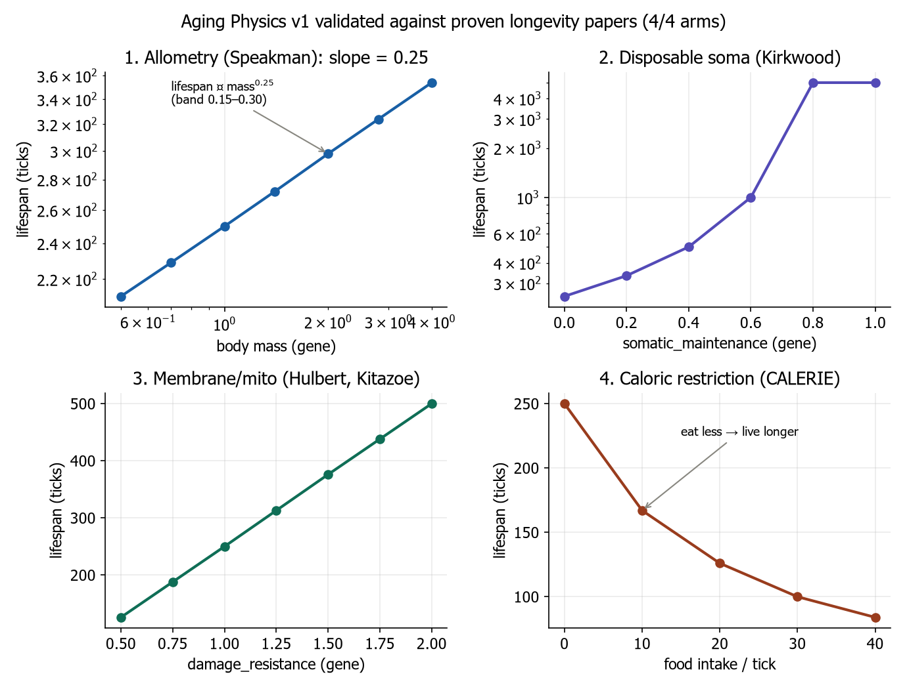
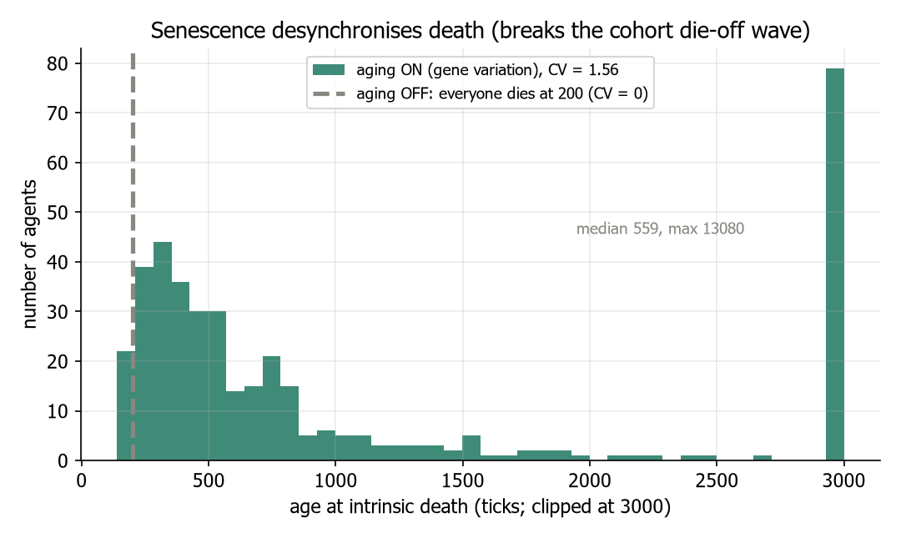
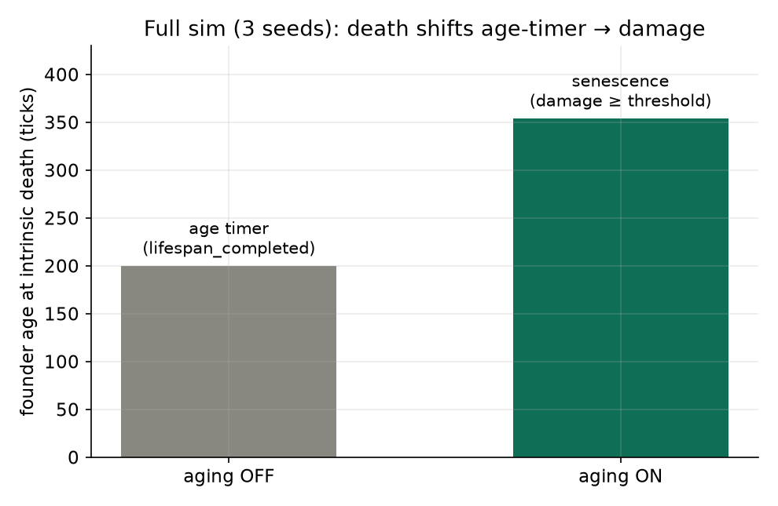
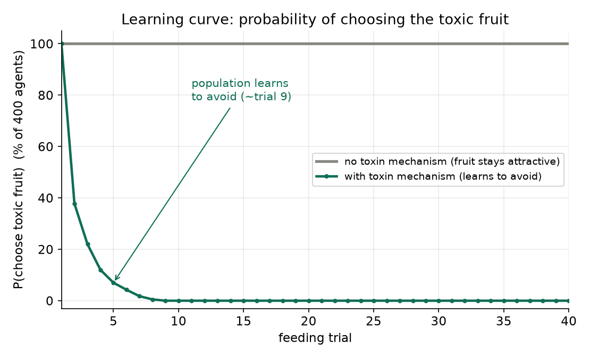
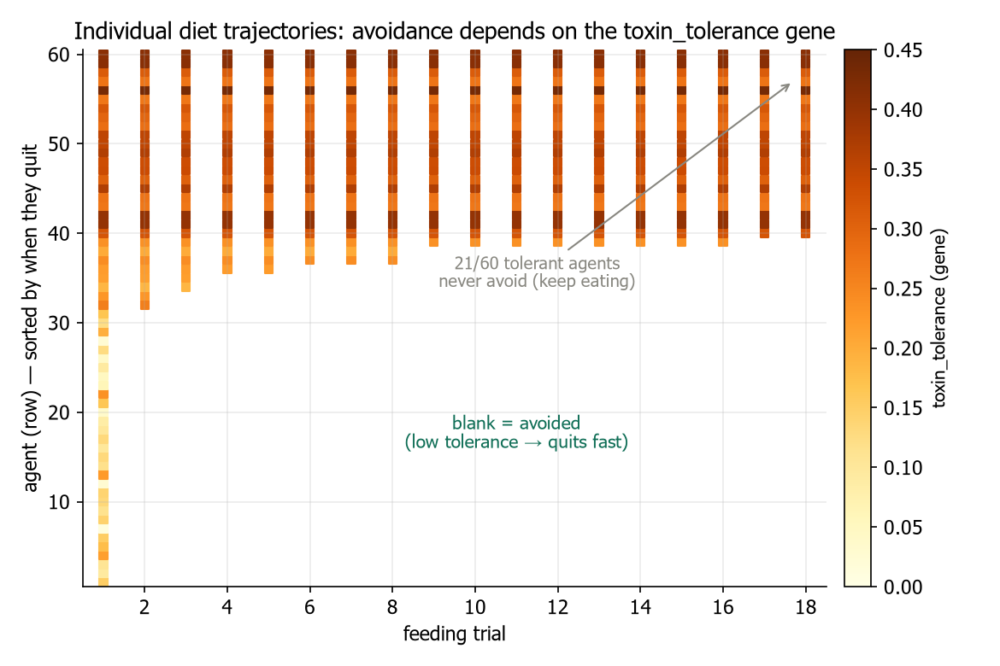
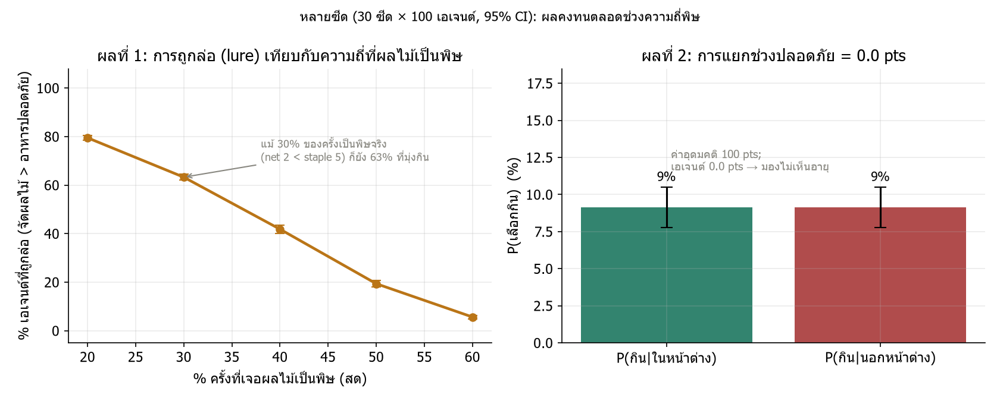
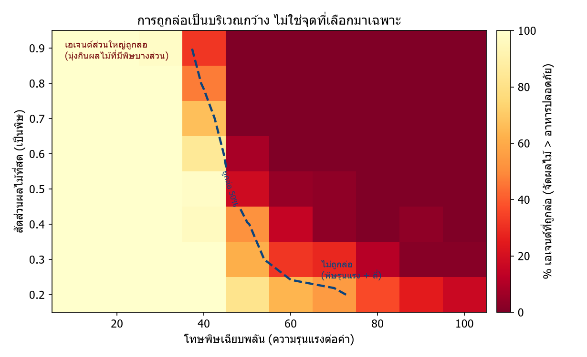
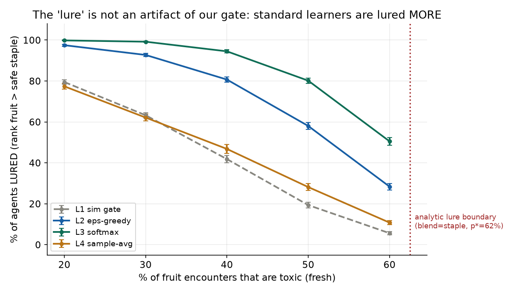
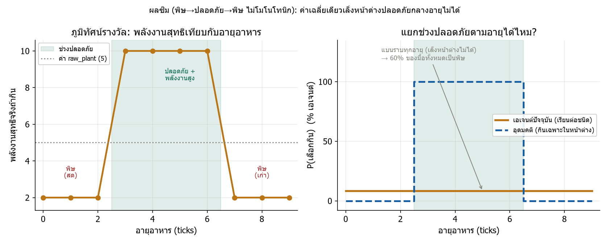

# รายงานฉบับสมบูรณ์ — วิวัฒนาการเทียม: ฟิสิกส์อายุขัย พิษ และการเรียนรู้การกินในโลกไร้ป้ายกำกับ

**Artificial Evolution: aging physics, toxicity, and diet learning in an uninformed world — a complete report**

ผู้วิจัย: ชิษณุพงศ์ อินจันทร์ (ที่ปรึกษา: อ. บพิตร มังกละ) · โรงเรียนดีบุกพังงาวิทยายน
วันที่: 2026-07-01 · สถานะ: รวบยอดทั้งโครงการ (ใช้ตัวเลข multi-seed ที่แก้แล้ว) · 93/93 tests · opt-in + byte-identical

> เอกสารนี้รวบทั้ง 3 สายงานของโครงการ (Aging Physics, Toxin Physics, พิษตามอายุ/store-to-detoxify) เป็นฉบับเดียว ใช้ตัวเลขที่ผ่าน red-team แล้ว — **แทนที่/รวม** รายงานย่อยก่อนหน้า ทุกกราฟสร้างจากโค้ดจริง เอกสารนี้เป็นแหล่งอ้างอิงหลักที่ทั้ง ALIFE 2026 (`proposal/alife2026_late_breaking_abstract_v2.en.md`) และ NSRU (`proposal/nsru_summary_2026-07-01.th.md`) ดึงไปใช้

---

## สารบัญ
1. [บทคัดย่อ](#1-บทคัดย่อ)
2. [บทนำ](#2-บทนำ)
3. [ภูมิหลังและงานที่เกี่ยวข้อง](#3-ภูมิหลังและงานที่เกี่ยวข้อง)
4. [วิธีการ](#4-วิธีการ)
5. [ผลการทดลอง](#5-ผลการทดลอง)
6. [อภิปราย](#6-อภิปราย)
7. [ข้อจำกัด (ความซื่อสัตย์)](#7-ข้อจำกัด-ความซื่อสัตย์)
8. [งานต่อ](#8-งานต่อ)
9. [สรุป](#9-สรุป)
10. [อ้างอิง](#10-อ้างอิง)
11. [ภาคผนวก: การทำซ้ำ](#11-ภาคผนวก-การทำซ้ำ)

---

## 1. บทคัดย่อ

โครงการนี้สร้าง **โลกจำลองวิวัฒนาการเทียม (Artificial Life)** ที่ตัวละคร AI ต้องหากินเพื่ออยู่รอด **โดยไม่มีป้ายบอกว่าอะไรกินได้/มีพิษ** — ทุกอย่างเป็นฟิสิกส์ล้วน สิ่งมีชีวิตต้องเรียน/วิวัฒน์เอง งานแบ่งเป็น 3 สาย:

1. **Aging Physics (โครงพื้นฐานของแพลตฟอร์ม)** — เปลี่ยนการตายภายในจาก "นาฬิกาจับเวลา" เป็น **"ความเสียหายสะสมข้ามเกณฑ์" (senescence)** ที่ emerge จากฟิสิกส์ โมเดล**สร้างกฎอายุขัย 4 รูปแบบออกมาโดยโครงสร้าง** (allometry, Disposable Soma, membrane/mitochondria, caloric restriction) — เป็น **self-consistent sanity-check ว่าโมเดลทำตามที่ออกแบบ ไม่ใช่การยืนยันอิสระ** (เช่น exponent 0.25 เป็น knob) *(ไม่ใช่ผลเด่นของงานนี้ — ผลหลักคือ toxin/lure)*
2. **Toxin Physics** — อาหารมีพิษสร้างทั้งโทษพลังงานเฉียบพลันและความเสียหายเรื้อรัง โดยไม่บอก agent → agent **เรียนรู้เลี่ยงอาหารพิษได้เอง**
3. **พิษตามอายุ (age-dependent toxicity)** — เมื่อพิษเปลี่ยนตามอายุอาหาร (สดพิษ/เก่าปลอดภัย และแบบไม่โมโนโทนิก) พบว่าการเรียนรู้แบบง่าย (ต่อชนิด) **แพ้** และเกิดปรากฏการณ์ **"lure"**: การหายพิษกลับทำให้อาหารพิษ *น่ากินขึ้นโดยเฉลี่ย* จนล่อ agent เข้าหาพิษ

ผลหลักคือ **negative + counterintuitive ที่ซื่อสัตย์**: การหายพิษตามเวลาอันตรายกว่าพิษคงที่ต่อผู้เรียนที่มองไม่เห็น "สภาพ" ของอาหาร ผลทั้งหมดรัน 30 seeds × 100 agents (95% CI) และทุกกลไกเป็นแบบเปิด-ปิดได้ (ปิด = byte-identical)

---

## 2. บทนำ

### 2.1 วิทยานิพนธ์หลัก
โครงการยึดหลักว่า พฤติกรรมและสิ่งมีชีวิตควร **emerge จากฟิสิกส์** ไม่ใช่จากกฎที่ผู้ออกแบบเขียนมือ โลกจำลองจึง **"ไร้ป้ายกำกับ" (uninformed)**: ไม่มีการบอกว่าอะไรกินได้/มีพิษ/มีค่าเท่าไร สิ่งมีชีวิตต้องเรียนจากผลจริง (พลังงานที่ได้) หรือถูกคัดเลือกข้ามรุ่น

### 2.2 สามสายงานและคำถามวิจัย
- **Aging:** ถ้าเปลี่ยนการตายเป็น "ความเสียหายสะสม" กฎชีววิทยาอายุขัยที่พิสูจน์แล้ว (allometry, Disposable Soma, CR) จะ emerge เองไหม?
- **Toxin:** agent เรียนเลี่ยงอาหารพิษได้เองไหม โดยไม่ถูกบอก?
- **พิษตามอายุ:** เมื่ออันตรายของอาหารเปลี่ยนตามเวลา (สด/เก่า/เน่า) การเรียนรู้แบบง่ายรับมือได้ไหม เกิดอะไรขึ้น?

---

## 3. ภูมิหลังและงานที่เกี่ยวข้อง

**ฝั่งอายุขัย (ชีววิทยา):** อายุขัยจริงถูกกำหนดโดยการสะสมความเสียหายระดับเซลล์ (Hallmarks; López-Otín), การจัดสรรพลังงานสืบพันธุ์↔ซ่อมแซม (Disposable Soma; Kirkwood 1977), เมตาบอลิซึม/ขนาดตัว (allometry; Speakman 2005), และการจำกัดแคลอรี (CALERIE; Ravussin/Waziry) — สรุปครบใน `papers/longevity/human_lifespan_determinants_review.md` (13 เปเปอร์)

**ฝั่งการเรียนรู้/นิเวศ:** สิ่งมีชีวิตในโลกฟิสิกส์ที่หากิน/วิวัฒน์เป็นแกนของ ALife (Sims 1994 [3]) ความล้มเหลวของการเรียนรู้ในงานนี้เป็นกรณีของหลักการคลาสสิก 2 ข้อ: **perceptual aliasing / partial observability** (Whitehead & Ballard 1991 [4]; Kaelbling et al. 1998 [5]) และ **temporal credit assignment** (Sutton & Barto 2018 [6]) โดยมีคู่ขนานทางชีววิทยาคือ **discriminative taste aversion** (Garcia & Koelling 1966 [7]) — สัตว์เรียน "ปลอดภัยแบบมีเงื่อนไข" ได้ก็ต่อเมื่อมีสัญญาณจำแนก **ของใหม่ในงานนี้คือปรากฏการณ์ "lure" และการวางกรอบเป็นคำถาม emergence ไม่ใช่ตัวหลักการที่รู้กันแล้ว**

---

## 4. วิธีการ

### 4.1 หลักการออกแบบ (ยึดตลอด)
- **opt-in + byte-identical:** ทุกกลไกใหม่ปิดเป็นค่าเริ่มต้น; ยีนใหม่ถูกสุ่มท้าย RNG แบบ gated → เมื่อปิด สตรีมสุ่มของงานเดิมไม่เปลี่ยนแม้แต่บิตเดียว
- **no oracle:** โลกไม่บอกว่าอะไรมีพิษ/ค่าเท่าไร — ต้อง emerge จากผล
- **นามธรรมที่ซื่อตรง:** ไม่จำลองชีวเคมีระดับโมเลกุล แต่แปลงหลักการเป็นสมการ แล้วพิสูจน์ว่าผลที่เปเปอร์รายงาน emerge

### 4.2 Aging Physics v1
ทุก tick (เปิด aging, ไม่ immortal) ตัวแปร `damage` สะสมตาม (โค้ด `Agent._apply_aging`):
```
mass_specific_metab = metabolism_rate × body_mass^(−aging_mass_exponent)   # Kleiber (Speakman)
gross  = aging_damage_rate × mass_specific_metab / damage_resistance        # rate-of-living
repair = min(0.95 × gross, somatic_maintenance × repair_efficiency × repair_gain)
damage += gross − repair          # > 0 เสมอ → ความแก่หลีกเลี่ยงไม่ได้
energy −= somatic_maintenance × aging_maintenance_cost                     # ราคา Disposable Soma
ตาย "senescence" เมื่อ damage ≥ aging_damage_threshold
```
ยีนอายุ 4 ตัวใน `BodyPlan` (ถ่ายทอด+กลายพันธุ์ได้): `body_mass, somatic_maintenance, repair_efficiency, damage_resistance` การซ่อมแซมจ่ายด้วยพลังงาน (แย่งกับสืบพันธุ์ = Kirkwood); เพดานซ่อม 95% → ไม่มีอมตะ

### 4.3 Toxin Physics v1
เพิ่มอาหาร `raw_fruit` (พลังงานสูง ~2× ผัก แต่ toxin สูง) เมื่อ toxin เกินยีน `toxin_tolerance` (โค้ด `Agent._apply_toxin`):
- **เฉียบพลัน:** หักพลังงานสุทธิของคำนั้น → ไหลเข้า `food_value_memory` → **เรียนเลี่ยงได้เอง** (ไม่ต้องเขียนโค้ดเรียนเพิ่ม)
- **เรื้อรัง:** เพิ่ม `damage` (ช่อง aging) → ต้นทุนอายุขัย + selection บน `toxin_tolerance`

### 4.4 พิษตามอายุ (age-dependent toxicity)
ฟังก์ชัน `metabolism.toxin_age_potency(age, ...)` คุม 3 โหมด (opt-in, ปิด=byte-identical): (ก) คงที่, (ข) **detox เชิงเส้น** (`toxin_detox_ticks` — พิษจางตามอายุ), (ค) **หน้าต่างปลอดภัยไม่โมโนโทนิก** (`toxin_safe_window` — พิษ→ปลอดภัย→พิษอีก: ดิบ→สุก→เน่า) อายุอาหารคำนวณจาก `created_tick` ที่มีอยู่แล้ว

### 4.5 การออกแบบการทดลอง
- **โหมดควบคุม (อิ่ม):** ให้ agent มีพลังงานพอ เพื่อ **แยกกลไกการเรียนรู้ออกจากคอขวด foraging** (ดู §6.1) — เป็นการแยกตัวแปรโดยตั้งใจ ไม่ใช่หลบปัญหา
- **โมเดล two-state (พิษตามอายุ):** สด (age 0 = พิษ net 2) หรือ เก่า (age ≥ detox = ปลอดภัย net 10) — ชัดเจน ไม่กำกวม
- **Metrics:** lifespan ที่ emerge, learned value, P(เลือกกิน) ต่ออายุ, % agent ถูก lure, % มื้อพิษ, discrimination (ใน−นอกหน้าต่าง), gap เทียบ optimal
- **สถิติ:** 30 seeds × 100 agents, รายงาน mean ± 95% CI

---

## 5. ผลการทดลอง

### 5.1 Aging (โครงพื้นฐาน): โมเดลสร้างกฎอายุขัย 4 รูปแบบโดยโครงสร้าง



**รูปที่ 1** ทั้ง 4 arm ให้รูปแบบตรงเปเปอร์: (1) **allometry** อายุ ∝ มวล^**0.25** (Speakman); (2) **Disposable Soma** ลงทุนซ่อมมากขึ้นยืดอายุ 250→5001; (3) **membrane/mito** damage_resistance สูงขึ้นยืดอายุ 126→500 แยกจากอัตราเผาผลาญ; (4) **CR** กินน้อยลงยืดอายุ 250→84 — **เป็น self-consistent sanity-check** (exponent 0.25 ถูกตั้งเป็น knob แล้ววัดได้ 0.25) **ไม่ใช่การทำนายอิสระ** จึงเป็น "โมเดลทำตามที่ออกแบบ" ไม่ใช่ "ยืนยันชีววิทยา"



**รูปที่ 2** โมเดลเดิมฆ่าทุกตัวที่อายุ 200 พร้อมกัน (CV=0 = คลื่นตายซิงโครไนซ์ → boom-bust); โมเดลใหม่ที่มีความแปรผันยีน อายุตายกระจายกว้าง (**CV=1.56**, median 536) — desynchronize การตาย ⚠️ **caveat:** ใช้ยีน**สุ่ม uniform (ไม่ได้วิวัฒน์)** และ **ยังไม่มีการทดลองว่าเปิด aging ทำให้ประชากรรอดดีกว่าปิด** — คำว่า "ช่วย boom-bust" จึงเป็นการ*ชี้ทาง* ไม่ใช่*พิสูจน์* (untested)



**รูปที่ 3** ซิมเต็ม 3 seed เหมือนกัน: ปิด aging ตายที่เพดานอายุ 200 (ตัวนับ); เปิด aging ตาย **"senescence"** ที่อายุ 354 (ความเสียหายถึงเกณฑ์)

### 5.2 Toxin: agent เรียนเลี่ยงอาหารพิษได้เอง

> **regime อาหาร (ต้องแยกจาก §5.3):** หัวข้อนี้ใช้อาหาร **พิษคงที่** (toxin ไม่เปลี่ยนตามอายุ) เป็น **baseline** — เพื่อโชว์ว่าการเรียนรู้ทำงานถูกต้องในกรณีง่าย ส่วน §5.3–5.4 ใช้ **พิษตามอายุ** (คนละ regime) ซึ่งการเรียนรู้เดียวกันนี้กลับ**พัง**



**รูปที่ 4** ประชากรเริ่มกินอาหารพิษ (ต้องชิม) แล้ว **เรียนเลี่ยงเอง**: ความน่าจะเป็นที่เลือกกินลดจาก ~100% เหลือ ~0% ภายใน ~9 รอบ (ไม่มีกลไก = คงที่ 100%) — optimal diet ที่ emerge จากการเรียนรู้ล้วน โดยโลกไม่บอกว่ามีพิษ



**รูปที่ 5** ระดับรายตัว: ทุกตัวชิมพิษก่อนแล้วเลี่ยงคนละเวลาตามยีน `toxin_tolerance` — ทนต่ำเลี่ยงเร็ว, ทนสูง (21/60) กินต่อ = พฤติกรรมถูกกำหนดโดยยีน จึงเป็นฐานให้ selection

### 5.3 พิษตามอายุ — ปรากฏการณ์ "lure"



**รูปที่ 6 (30 seeds × 100 agents, 95% CI)** เมื่ออาหารสด=พิษ (net 2 < ผักปลอดภัย 5) แต่เก่า=ปลอดภัย (net 10) ผู้เรียนที่มองไม่เห็นอายุ **เฉลี่ยสองสภาพเป็นค่าเดียวที่สูงกว่าอาหารปลอดภัย** → จัดผลไม้พิษเป็น "อาหารดีสุด" แล้วมุ่งกิน (**ซ้าย**): แม้พิษโผล่ถึง 30% ของครั้ง ก็ยัง **63% ที่ถูก lure** (80% ที่ 20%) เทียบ optimal ที่กินเฉพาะของเก่า (0% พิษ, 10 พลังงาน/มื้อ) ผู้เรียน **กินพิษ 30% ของมื้อ แต่ได้พลังงานแค่ 76% ของ optimal**



**รูปที่ 7** sweep ทั่ว (ความรุนแรงพิษ × ความถี่พิษ) ยืนยัน lure เป็น **บริเวณกว้าง ไม่ใช่จุดที่จูนมา** — ครอบเกือบครึ่งซ้ายทั้งหมด (lured ~100%) พังเฉพาะเมื่อพิษ **ทั้งรุนแรงและถี่พร้อมกัน**

**ข้อค้นพบสำคัญ:** การหายพิษตามเวลา **ทำให้อาหารพิษน่ากินขึ้นโดยเฉลี่ย → กลับด้านการเลี่ยงเป็นการมุ่งเข้าหา** — "ความปลอดภัยแบบมีบางช่วง อันตรายกว่าพิษคงที่ (ในแง่*ค่าที่รับรู้*)" (พิษคงที่ agent เลี่ยงได้ถูกต้อง)

**ทดสอบความทั่วไปของ lure (แก้ R2-1; `run_toxin_learner_comparison.py`):**



**รูปที่ 7ก** เทียบ 4 กฎเรียนรู้ — **lure ไม่ใช่ artifact ของ gate เรา**: เกิดกับทุก learner (ต่ำกว่าขอบเขต analytic p\*=62.5%) และ **แข็งขึ้น** กับ learner ที่สำรวจต่อ (softmax ~99% ที่พิษ 30% เทียบ gate เดิม 63%) — **gate เดิมที่แช่แข็งกลับประเมิน lure ต่ำเกินไป**

> **ขอบเขตคำเคลม:** ✅ *อ้างได้* — (1) discrimination=0 เป็น analytic/rule-independent (§5.4); (2) lure เป็นทั่วไปข้าม 4 learner (มีหลักฐาน). ⚠️ *ยังไม่อ้าง* — ผลรันโหมด**อิ่ม** → **ยังไม่พิสูจน์ต้นทุน fitness จริง** ("อันตรายกว่า" = ค่าที่รับรู้ ไม่ใช่การตายที่วัดได้); *ขนาด*แม่นยำยัง learner-specific

### 5.4 พิษไม่โมโนโทนิก — เล็งหน้าต่างปลอดภัยไม่ได้



**รูปที่ 8** เมื่อพิษ→ปลอดภัย(3–7)→พิษอีก reward landscape เป็น "เมซา" (2/10/2) ผู้เรียน (รูปที่ 6 ขวา) มีโอกาสกิน **ในและนอกหน้าต่างเท่ากัน (discrimination 0.0 ± 0.0 pts vs ideal 100)** → เล็งหน้าต่างปลอดภัยไม่ได้เลย, 60% ของมื้อเป็นพิษ กรณีนี้ "แก่กว่า=ปลอดภัยกว่า" ก็ใช้ไม่ได้ → ต้องรู้ทั้งเส้นโค้ง value(age)

> **ผลที่แข็งที่สุด (rule-independent / analytic):** discrimination = 0 **ไม่ได้ขึ้นกับกฎการเรียนรู้** — ตัวประมาณค่าใด ๆ ที่ key ด้วย "ชนิด" ให้ค่าเดียวต่อชนิด → การตัดสินใจต้องเท่ากันทุกอายุ**โดยโครงสร้าง** (ไม่ว่าจะ EMA, ε-greedy, softmax ฯลฯ) นี่คือขีดจำกัดเชิงตัวแทน (representation) ที่พิสูจน์ได้ **ตรงข้ามกับ** *ขนาด* ของ "lure" (§5.3) ที่เป็น **rule-dependent** (ดู §7 ข้อ 7)

### 5.5 ความน่าเชื่อถือ
ชุดทดสอบ **93/93 ผ่าน** · ทุกกลไกปิดแล้ว **byte-identical** (รันไม่เปิดต่างกันแค่ `elapsed_seconds`) · ทุกผล multi-seed + CI · ทุกกราฟสร้างจาก script ที่ commit + self-contained (§11)

---

## 6. อภิปราย

### 6.1 ข้อค้นพบเชิงระบบ: ทุกเส้นทางลงรากเดียวกัน
ผลสำคัญทุกอัน (aging, การเลี่ยงพิษในประชากร, การเล็งหน้าต่าง) **ถูกบดบังในซิมเต็มด้วยคอขวด foraging เชิงพื้นที่เดียวกัน**: agent หิวเรื้อรัง (`mean_energy ≈ 1–2` แม้เพิ่มพลังงานอาหาร 3×) → กฎ "หิวจัดกินทุกอย่าง" กลบการเลือก จึง**รันในโหมดอิ่มเพื่อแยกกลไกการเรียนรู้ออกจาก confound นี้** — และยืนยันว่า foraging access คือ binding constraint ที่ต้องแก้ก่อน

### 6.2 การเรียนรู้ทำอะไรได้/ไม่ได้
การเรียนรู้แบบรางวัลทันทีต่อชนิด **ทำได้: การเลี่ยง** (§5.2) **ทำไม่ได้: แยกสภาพที่ซ่อน (พิษตามอายุ)** เพราะ (ก) aliasing — ชนิดเดียวมีหลายสภาพที่ดูเหมือนกัน (ข) credit ล่าช้า — การ "เก็บรอ" ให้รางวัลทีหลัง ผู้เรียนทันทีให้เครดิตไม่ได้ → **การเลื่อน/แปรรูปอาหารต้องอาศัย representation ต่อสภาพ หรือ selection ข้ามรุ่น** ไม่ใช่การเรียนรู้เดี่ยว

### 6.3 ปรากฏการณ์ "lure" (ของใหม่)
เรา **ไม่เคลม** aliasing/credit-assignment เป็นของใหม่ (คลาสสิก [4,6]) ของใหม่คือ: การหายพิษไม่ได้แค่ *หลบ* การเลี่ยง แต่ **กลับด้าน** มัน — ทำให้อาหารพิษเป็นตัวเลือกอันดับหนึ่ง (lure) ในโลกไร้ป้ายกำกับ + การวางกรอบ store-to-detoxify เป็นคำถาม emergence

---

## 7. ข้อจำกัด (ความซื่อสัตย์)

1. **เป็นโมเดลนามธรรม ไม่ใช่ชีวเคมีจริง** — 1 tick ≠ เวลาจริง, หน่วยนามธรรม, ค่าคงที่ยังไม่ calibrate กับสัตว์จริง
2. **exponent 0.25 เป็น knob** ที่แสดง self-consistent ไม่ใช่ทำนายจากหลักการอิสระ — เคลมปลอดภัย: "สร้าง power-law ที่ควบคุมได้ ตรงรูปแบบ Speakman"
3. **ผลอยู่ในโหมดควบคุม (อิ่ม)** — ยังไม่ใช่ผล emerge จากประชากรวิวัฒน์เต็ม (ติดคอขวด foraging §6.1)
4. **การเลื่อน/เก็บ (deferral) ยังไม่ implement** — เป็น design + predicted; ต้อง larder ระดับชิ้น + selection
5. **⚠️ แก้ตัวเลข (red-team):** ตัวเลข lure เดิม "88%/53%" มาจาก harness เดี่ยว+linear detox ที่นับพิษเกินจริง — **ยกเลิก ใช้ตัวเลข two-state ในรายงานนี้** (63% @ พิษ 30%)
6. **CR ในคน** พิสูจน์แค่ชะลอมาร์กเกอร์ (Waziry) ไม่ใช่ยืดอายุจริง — ห้ามเคลมเกิน
7. **ขอบเขตคำเคลม lure (แก้แล้ว — §5.3ก):** discrimination=0 เป็น analytic/rule-independent; และ lure **ทดสอบข้าม 4 learner แล้ว** (gate, ε-greedy, softmax, sample-avg) — เกิดกับทุกตัว, แข็งขึ้นกับ exploration-based (softmax ~99%) → **ไม่ใช่ artifact ของ gate** เหลือเพียง *ขนาดแม่นยำ* ที่ยัง learner-specific (เคลมเชิงคุณภาพ+ทิศทาง)
8. **fitness cost ของ lure ยังไม่พิสูจน์:** ผลรันโหมดอิ่ม → การถูกล่อกินพิษ**ยังไม่มีผลต่อการรอด/การถูกคัดที่แสดงให้เห็น** ("อันตรายกว่า" = ค่าที่รับรู้ ไม่ใช่การตายที่วัดได้) — ต้องทดสอบในประชากรหิว/วิวัฒน์
9. **aging ยังไม่พิสูจน์ว่าช่วย boom-bust** ที่มันถูกสร้างมาแก้ (desync ใช้ยีนสุ่ม, ไม่มี on-vs-off survival)

---

## 8. งานต่อ
1. **แก้ foraging access** (blocker หลัก) → วัด heritability ของ lifespan + วิวัฒนาการของ `somatic_maintenance`/`toxin_tolerance` ในประชากรจริง
2. **store-to-detoxify:** เพิ่ม cue ความสด + ค่าแบบ (ชนิด×สภาพ) [R3] และ larder ระดับชิ้น + selection [R2] เพื่อทดสอบว่า "เก็บไว้ให้หายพิษก่อนกิน" emerge เองไหม
3. **immune/parasite layer:** parasite→damage, ภูมิคุ้มกันกินพลังงานเหมือน maintenance → trade-off ซ้อนชั้น
4. **calibrate** ค่าคงที่กับข้อมูลสัตว์จริง เพื่อยกจาก self-consistent → predictive

---

## 9. สรุป
โครงการแสดงว่า (ก) การตายและกฎอายุขัยที่พิสูจน์แล้ว **emerge จากฟิสิกส์ได้** เมื่อผูกการตายกับความเสียหายสะสม; (ข) agent **เรียนเลี่ยงอาหารพิษได้เอง** ในโลกไร้ป้ายกำกับ; และ (ค) เมื่ออันตรายเปลี่ยนตามเวลา การเรียนรู้แบบง่าย **แพ้และถูกล่อเข้าหาพิษ** — "ความปลอดภัยแบบมีบางช่วงอันตรายกว่าพิษคงที่" ผลหลักเป็น negative + counterintuitive ที่ตรวจสอบซ้ำได้ และวางกรอบชัดว่าพฤติกรรมซับซ้อนขึ้น (การแปรรูปอาหารเชิงเวลา) ต้องอาศัยการรับรู้สภาพหรือวิวัฒนาการ ไม่ใช่การเรียนรู้เดี่ยว จุดแข็งคือความซื่อสัตย์ในการแยก "พิสูจน์แล้ว" ออกจาก "ทำนายไว้"

---

## 10. อ้างอิง
1. Langton, C. G. (1989). Artificial Life. Addison-Wesley.
2. Bedau, M. A., et al. (2000). Open Problems in Artificial Life. *Artificial Life* 6(4).
3. Sims, K. (1994). Evolving Virtual Creatures. *SIGGRAPH '94*, 15–22. *(ยืนยันในโปรเจกต์: `papers/siggraph94.pdf`)*
4. Whitehead, S. D., & Ballard, D. H. (1991). Learning to perceive and act by trial and error. *Machine Learning* 7(1).
5. Kaelbling, L. P., Littman, M. L., & Cassandra, A. R. (1998). Planning and acting in partially observable stochastic domains. *Artificial Intelligence* 101.
6. Sutton, R. S., & Barto, A. G. (2018). *Reinforcement Learning: An Introduction* (2nd ed.). MIT Press.
7. Garcia, J., & Koelling, R. A. (1966). Relation of cue to consequence in avoidance learning. *Psychonomic Science* 4.
8. ฝั่งอายุขัย (Kirkwood 1977; Speakman 2005; Hulbert 2007; Kitazoe 2017; López-Otín 2013/2023; Ravussin 2015; Waziry 2023) — รายละเอียด+ลิงก์ใน `papers/longevity/human_lifespan_determinants_review.md`

*(⚠️ อ่าน [4] และ [6] จริงก่อนอ้างในฉบับส่ง — do not cite unread)*

---

## 11. ภาคผนวก: การทำซ้ำ (Reproducibility)

ทุกกราฟสร้างจาก script ที่ **commit แล้วและ self-contained** (ขับ engine จริงโดยตรง ไม่พึ่ง CLI/ไฟล์ WIP):

| กราฟ | สคริปต์ |
|---|---|
| aging_fig1–3 (validation/desync/death) | `scripts/make_aging_toxin_figures.py` |
| toxin_fig3/4 (learning curve/raster) | `scripts/make_aging_toxin_figures.py` |
| toxin_multiseed_ci (lure + window, CI) | `scripts/run_toxin_multiseed.py` |
| toxin_lure_sweep (robustness) | `scripts/run_toxin_lure_sweep.py` |
| toxin_window_sim (landscape) | `scripts/run_toxin_window_sim.py` |
| validation ตัวเลข 4 arm | `scripts/run_aging_validation.py` |

โค้ดกลไก: `agents/agent.py` (`_apply_aging`, `_apply_toxin`), `agents/body.py` (ยีนอายุ), `world/metabolism.py` (`toxin_age_potency`), `world/environment.py` (knobs) · tests: `tests/test_aging_physics.py`, `tests/test_toxin.py` (รวม 93/93)
รายงานที่เกี่ยวข้อง: audit (`physics_realism_audit_aging_2026-07-01`), design (`design_store_to_detoxify_2026-07-01`, `design_age_dependent_toxicity_2026-07-01`), red-team (`red_team_pre_submission_2026-07-01`)

---

*รายงานฉบับสมบูรณ์ — วิวัฒนาการเทียม (aging + toxin + พิษตามอายุ): การตายและการเลี่ยงพิษ emerge จากฟิสิกส์, พิษที่หายได้ล่อผู้เรียนเข้าหาพิษ (63% @ พิษ 30%), พิษไม่โมโนโทนิกเล็งหน้าต่างไม่ได้ (discrimination 0.0). Multi-seed 95% CI, opt-in byte-identical, 93/93 tests. จุดแข็ง = ความซื่อสัตย์.*
