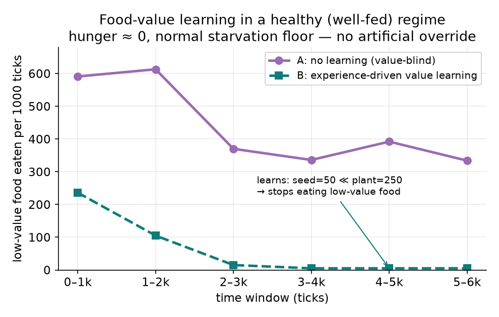
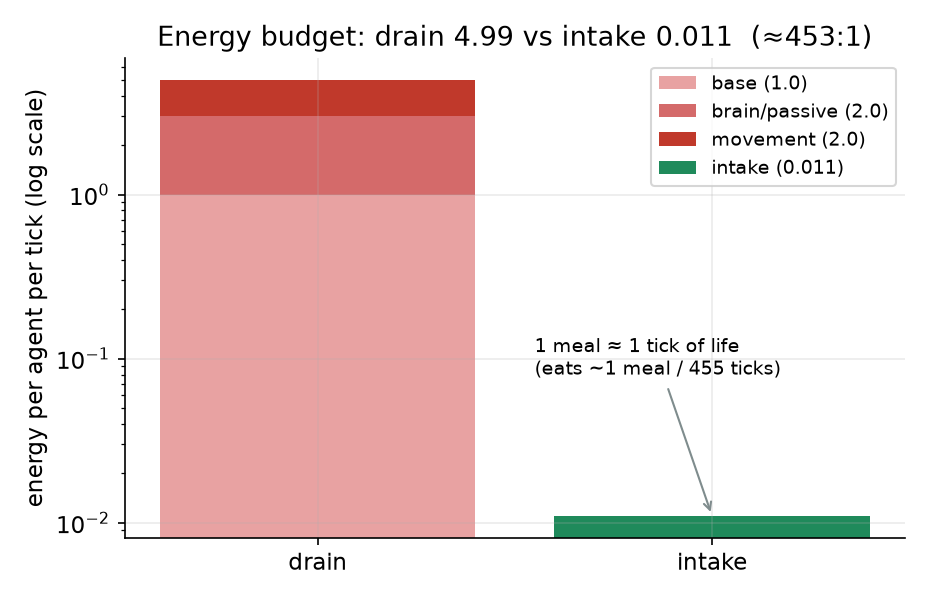
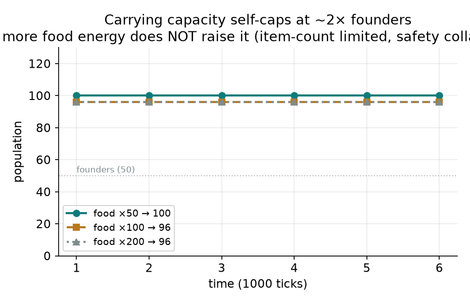

# ปก

## รายงานโครงงานวิทยาศาสตร์

**ถ้าไม่มีใครสอน AI จะเรียนรู้ "คุณค่า" ของสิ่งรอบตัวได้ไหม:**
**การเรียนรู้จากประสบการณ์ล้วนของเอเจนต์ในโลกจำลองที่ไม่มีป้ายกำกับความหมาย (Artificial Evolution)**

เนื่องในการแข่งขันวิทยาศาสตร์วิชาการ ครั้งที่ 5 ชิงถ้วยพระราชทาน
สมเด็จพระกนิษฐาธิราชเจ้า กรมสมเด็จพระเทพรัตนราชสุดาฯ สยามบรมราชกุมารี

จัดทำโดย

นายชิษณุพงศ์ อินทร์จันทร์

ครูที่ปรึกษาโครงงาน

นายบพิธ มังคะลา

โรงเรียนดีบุกพังงาวิทยายน
สำนักงานเขตพื้นที่การศึกษามัธยมศึกษาพังงา ภูเก็ต ระนอง

รายงานฉบับนี้เป็นส่วนประกอบของโครงงานวิทยาศาสตร์
ประเภท **ทดลอง** ระดับมัธยมศึกษาตอนปลาย

---

# ปกใน

## รายงานโครงงานวิทยาศาสตร์

**ถ้าไม่มีใครสอน AI จะเรียนรู้ "คุณค่า" ของสิ่งรอบตัวได้ไหม:**
**การเรียนรู้จากประสบการณ์ล้วนของเอเจนต์ในโลกจำลองที่ไม่มีป้ายกำกับความหมาย (Artificial Evolution)**

เนื่องในการแข่งขันวิทยาศาสตร์วิชาการ ครั้งที่ 5 ชิงถ้วยพระราชทาน
สมเด็จพระกนิษฐาธิราชเจ้า กรมสมเด็จพระเทพรัตนราชสุดาฯ สยามบรมราชกุมารี

โดย

นายชิษณุพงศ์ อินทร์จันทร์

ครูที่ปรึกษาโครงงาน

นายบพิธ มังคะลา

รายงานฉบับนี้เป็นส่วนประกอบของโครงงานวิทยาศาสตร์
ประเภท **ทดลอง** ระดับมัธยมศึกษาตอนปลาย

---

# คำนำ

รายงานฉบับนี้เป็นส่วนหนึ่งของโครงงานวิทยาศาสตร์ ประเภททดลอง ระดับมัธยมศึกษาตอนปลาย จัดทำขึ้นเพื่อนำเสนอในการแข่งขันวิทยาศาสตร์วิชาการ ครั้งที่ 5 ชิงถ้วยพระราชทานสมเด็จพระกนิษฐาธิราชเจ้า กรมสมเด็จพระเทพรัตนราชสุดาฯ สยามบรมราชกุมารี

โครงงาน Artificial Evolution เริ่มต้นจากคำถามง่าย ๆ แต่ลึกว่า ปัญญาประดิษฐ์ที่ถูกปล่อยลงในโลกที่ "ไม่มีใครบอกอะไรเลย" จะเรียนรู้ได้เองหรือไม่ ในขณะที่ปัญญาประดิษฐ์ส่วนใหญ่ทุกวันนี้เก่งได้เพราะมนุษย์เตรียมคำตอบและป้ายกำกับไว้ให้ล่วงหน้า รายงานฉบับนี้พยายามทดสอบคำถามนั้นในเวอร์ชันที่เล็กที่สุดและวัดผลได้จริง คือเอเจนต์จะเรียนรู้ได้ไหมว่าอาหารชนิดใดมีคุณค่ามากกว่า ทั้งที่ไม่มีป้ายบอกล่วงหน้า

เนื้อหาของรายงานแบ่งเป็น 5 บท ได้แก่ บทนำซึ่งอธิบายที่มาและคำถามวิจัย เอกสารและทฤษฎีที่เกี่ยวข้อง วิธีดำเนินการทดลอง ผลการทดลอง และบทสรุปพร้อมการอภิปรายและข้อเสนอแนะ จุดยืนสำคัญที่ผู้จัดทำยึดตลอดทั้งเล่มคือ การสรุปเฉพาะเท่าที่หลักฐานรองรับ และระบุอย่างชัดเจนว่าสิ่งใดยัง "ยังไม่ควรอ้าง" เพื่อให้รายงานนี้ซื่อตรงต่อข้อมูลมากที่สุด

ผู้จัดทำหวังว่ารายงานฉบับนี้จะเป็นประโยชน์ต่อผู้ที่สนใจการเรียนรู้ของปัญญาประดิษฐ์ในสภาพแวดล้อมที่ไม่มีการกำกับความหมาย และยินดีรับคำแนะนำเพื่อพัฒนาโครงงานในลำดับต่อไป

นายชิษณุพงศ์ อินทร์จันทร์

---

# บทคัดย่อ

ปัญญาประดิษฐ์ที่ใช้กันในปัจจุบันมักเก่งได้เพราะมนุษย์ป้อนคำตอบ ป้ายกำกับ และรางวัลที่ออกแบบไว้ล่วงหน้า แต่ในโลกจริงหลายแห่ง เช่น สภาพแวดล้อมบนดาวดวงอื่น ใต้ทะเลลึก หรือพื้นที่ภัยพิบัติ มนุษย์เองก็ไม่รู้คำตอบล่วงหน้าและออกแบบป้ายกำกับให้ไม่ได้ โครงงาน Artificial Evolution จึงตั้งคำถามพื้นฐานว่า ถ้าวางเอเจนต์ปัญญาประดิษฐ์ลงในโลกที่ไม่มีป้ายบอกว่าอะไรคืออะไร ไม่มี oracle เฉลย และไม่ได้สอนกลยุทธ์ใด ๆ ล่วงหน้า เอเจนต์จะเรียนรู้คุณค่าของทรัพยากรจากประสบการณ์ตรงของตนเองได้หรือไม่

รายงานนี้ทดสอบคำถามดังกล่าวในเวอร์ชันที่วัดผลได้ชัด โดยวางเอเจนต์ในโลกจำลองที่มีอาหารสองชนิดซึ่งไม่มีป้ายบอกคุณค่า คือ `raw_seed` ที่กินได้แต่ให้พลังงานต่ำ และ `raw_plant` ที่ให้พลังงานสูงกว่าประมาณ 5 เท่า เอเจนต์ไม่ได้ถูกบอกว่าอาหารชนิดใดคุ้มกว่า การทดลองเปรียบเทียบระบบเดิมที่กินแบบไม่สนใจคุณค่า (value-blind) กับระบบที่เปิดกลไกจดจำคุณค่าอาหารจากพลังงานที่ได้รับจริง (food-value memory) ทั้งในระดับประชากรและระดับรายตัว

ผลพบว่าในระบบเดิม เอเจนต์ยังคงกินอาหารค่าต่ำต่อเนื่อง แต่เมื่อเปิดกลไกเรียนรู้คุณค่าและจัดสภาพพลังงานไม่ให้อดอยากจนต้องกินทุกอย่าง การกิน `raw_seed` ลดลงจาก 236 ครั้งในช่วงต้น เหลือเพียง 5 ครั้งในช่วงท้ายของการรัน หลักฐานที่สำคัญที่สุดมาจากการวิเคราะห์รายตัว จากเอเจนต์ 12 ตัว มี 10 ตัวเริ่มเมิน `raw_seed` และทั้ง 10 ตัวล้วนเคยกินทั้ง `raw_seed` และ `raw_plant` ด้วยตนเองมาก่อน ส่วน 2 ตัวที่ยังไม่เคยชิม `raw_plant` ก็ยังไม่เมิน `raw_seed` และไม่มีเอเจนต์แม้แต่ตัวเดียวที่เมิน `raw_seed` โดยไม่เคยชิมเอง (เท่ากับ 0) ซึ่งยืนยันว่าการเปลี่ยนพฤติกรรมมาจากประสบการณ์ตรงของแต่ละตัว ไม่ได้ถูกกำหนดไว้ในโค้ด

รายงานนี้สรุปอย่างระมัดระวังว่า เอเจนต์เรียนรู้คุณค่าทรัพยากรรายตัวจากประสบการณ์ตรงได้โดยไม่ต้องมีป้ายกำกับล่วงหน้า แต่ยังไม่อ้างว่าเกิดการถ่ายทอดความรู้ระหว่างเอเจนต์ การทำฟาร์มอย่างตั้งใจ หรือวิวัฒนาการข้ามรุ่น ผลที่ได้จึงเป็นหลักฐานขั้นแรกที่หนักแน่นของเส้นทางจากโลกจำลองไร้ป้ายกำกับ ไปสู่พฤติกรรมที่มีความหมายสูงขึ้นในระบบ artificial life

**คำสำคัญ:** Artificial Life, การจำลองแบบเอเจนต์ (Agent-Based Simulation), การเรียนรู้จากประสบการณ์, การเลือกทรัพยากร, พฤติกรรมเกิดเอง, การเรียนรู้แบบไม่มีป้ายกำกับ

---

# กิตติกรรมประกาศ

โครงงานนี้สำเร็จได้ด้วยการสนับสนุนของครูที่ปรึกษา โรงเรียนดีบุกพังงาวิทยายน และผู้ที่ให้คำแนะนำด้านการตั้งคำถามวิจัย การออกแบบการทดลอง และการตรวจสอบข้อสรุปให้ตรงกับหลักฐาน ผู้จัดทำขอขอบคุณทุกท่านที่ช่วยให้โครงงานพัฒนาจากการสร้างระบบจำลอง ไปสู่การทดลองที่มีสมมติฐาน ตัวแปร กลุ่มควบคุม และข้อจำกัดที่ตรวจสอบได้ และขอบคุณเป็นพิเศษสำหรับคำเตือนเรื่องการไม่ตีความผลเกินกว่าที่ข้อมูลรองรับ ซึ่งเป็นหัวใจของรายงานฉบับนี้

---

# สารบัญ

- คำนำ
- บทคัดย่อ
- กิตติกรรมประกาศ
- สารบัญ
- สารบัญตาราง
- สารบัญภาพ
- บทที่ 1 บทนำ
- บทที่ 2 เอกสารและทฤษฎีที่เกี่ยวข้อง
- บทที่ 3 วิธีดำเนินการทดลอง
- บทที่ 4 ผลการทดลอง
- บทที่ 5 สรุป อภิปรายผล และข้อเสนอแนะ
- บรรณานุกรม
- ภาคผนวก

---

# สารบัญตาราง

| ตาราง | รายการ |
| --- | --- |
| ตารางที่ 1 | คำถามใหญ่ของโครงการและคำถามทดลองที่รายงานนี้ทดสอบ |
| ตารางที่ 2 | สรุปหลักฐานจากรายงานเก่าของโครงการ |
| ตารางที่ 3 | ตัวแปรในการทดลองหลัก |
| ตารางที่ 4 | คอนฟิกการทดลอง food-value learning รายตัว |
| ตารางที่ 5 | ผล baseline value-blind จากรายงาน food-value learning |
| ตารางที่ 6 | ผลการเรียนรู้ค่าอาหารในสภาพพลังงานเพียงพอ |
| ตารางที่ 7 | ผลรายตัวของเอเจนต์จาก per-agent telemetry |
| ตารางที่ 8 | ข้อสรุปที่อ้างได้และข้อสรุปที่ยังไม่ควรอ้าง |

---

# สารบัญภาพ

| ภาพ | รายการ |
| --- | --- |
| ภาพที่ 1 | เส้นโค้งการเรียนรู้ค่าอาหารของกลุ่ม control และกลุ่มเปิด food-value learning |
| ภาพที่ 2 | งบพลังงานของระบบและคอขวดด้านพลังงาน |
| ภาพที่ 3 | trajectory รายตัวของเอเจนต์ในการกิน plant, กิน seed และข้าม seed |
| ภาพที่ 4 | เวลาเรียนรู้รายตัวหลังเอเจนต์ได้ชิมอาหารที่ให้คุณค่าสูงกว่า |
| ภาพที่ 5 | carrying capacity และข้อจำกัดของประชากร |

---

# บทที่ 1 บทนำ

## 1.1 ที่มาและความสำคัญของโครงงาน

ระบบปัญญาประดิษฐ์ส่วนใหญ่ในปัจจุบันเรียนรู้จากข้อมูลที่มนุษย์เตรียมไว้ให้ ไม่ว่าจะเป็นชุดข้อมูลที่ติดป้ายกำกับว่าอะไรคืออะไร หรือสภาพแวดล้อมที่ผู้สร้างออกแบบรางวัลไว้อย่างละเอียดว่าพฤติกรรมใดถูกหรือผิด วิธีนี้ได้ผลดีมากเมื่อมนุษย์รู้คำตอบอยู่แล้วและสามารถสอนล่วงหน้าได้ เช่น การจำแนกภาพ การแปลภาษา หรือการเล่นเกมที่มีกติกาชัดเจน

แต่ยังมีคำถามที่ลึกกว่านั้น คือ ถ้าโลกที่ต้องไปสำรวจเป็นโลกที่มนุษย์เองก็ไม่รู้กติกาล่วงหน้า เช่น สภาพแวดล้อมบนดาวดวงอื่น ใต้ทะเลลึก หรือพื้นที่ภัยพิบัติที่เปลี่ยนรูปไปจากเดิม เราจะออกแบบป้ายกำกับหรือรางวัลให้ปัญญาประดิษฐ์ล่วงหน้าไม่ได้เลย เพราะตัวเราเองก็ยังไม่รู้ว่าอะไรสำคัญ ในสถานการณ์เช่นนี้ สิ่งที่ต้องการคือปัญญาประดิษฐ์ที่เรียนรู้โลกได้ด้วยตัวเองจากผลของการกระทำ ไม่ใช่ปัญญาประดิษฐ์ที่รอให้มนุษย์มาเฉลย คำถามว่า "เอเจนต์จะเรียนรู้โลกที่ไม่มีใครสอนได้หรือไม่" จึงเป็นโจทย์แนวหน้า (frontier) ที่สำคัญของปัญญาประดิษฐ์

โครงงาน Artificial Evolution ใช้แนวคิด artificial life สร้างโลกจำลองที่มีพลังงาน อาหาร พืช เมล็ด การเคลื่อนที่ ความหิว การสืบพันธุ์ และข้อจำกัดทางกายภาพของร่างกาย แล้วตั้งคำถามว่าเอเจนต์ที่ไม่ได้รับการบอกความหมายของสิ่งใดเลย จะเรียนรู้กติกาและคุณค่าของทรัพยากรจากประสบการณ์ได้หรือไม่ อย่างไรก็ตาม คำถามใหญ่นี้กว้างเกินกว่าจะพิสูจน์ทั้งหมดในคราวเดียว รายงานฉบับนี้จึงเลือกก้าวแรกที่แคบและพิสูจน์ได้ชัดเจนที่สุด คือ **เอเจนต์เรียนรู้ได้หรือไม่ว่าอาหารชนิดใดให้คุณค่ามากกว่า ทั้งที่ไม่มีใครบอกล่วงหน้า**

คำถามนี้สำคัญเพราะเป็นรากฐานของทุกอย่างที่ตามมา ถ้าเอเจนต์ยังแยกไม่ได้ว่าอาหารที่ให้พลังงานน้อยกว่าควรถูกข้ามเมื่อมีทางเลือกที่ดีกว่า การคาดหวังพฤติกรรมซับซ้อนอย่างการจัดการทรัพยากรหรือการใช้เครื่องมือย่อมเร็วเกินไป และสิ่งที่ทำให้รายงานนี้ต่างจากการ "ดูเหมือนเรียนรู้" คือการตรวจระดับรายตัวว่าเอเจนต์ที่เปลี่ยนพฤติกรรมนั้นเคยมีประสบการณ์จริงมาก่อนหรือไม่ เพื่อแยก "การเรียนรู้จากประสบการณ์" ออกจาก "การที่ความรู้ถูกฝังไว้ในโค้ดตั้งแต่ต้น" ความเข้มงวดในการตรวจสอบตรงนี้คือสิ่งที่ทำให้ผลของโครงงานเชื่อถือได้

## 1.2 คำถามวิจัย

ตารางที่ 1 แยกคำถามใหญ่ของโครงการออกจากคำถามทดลองที่รายงานนี้ทดสอบโดยตรง

| ระดับคำถาม | คำถาม |
| --- | --- |
| คำถามใหญ่ของโครงการ | เอเจนต์ที่ไม่ได้รับป้ายกำกับความหมายของสิ่งต่าง ๆ ในโลก จะเรียนรู้กติกา คุณค่าของทรัพยากร ความเสี่ยง และโอกาสได้เองหรือไม่ และความรู้นั้นจะค่อย ๆ สะสมไปสู่ความสามารถใหม่ระดับเทคโนโลยีได้หรือไม่ |
| คำถามของรายงานฉบับนี้ | เอเจนต์สามารถเรียนรู้คุณค่าของอาหารจากพลังงานที่ได้รับจริง และเปลี่ยนพฤติกรรมการเลือกกินโดยไม่ต้องมีป้ายกำกับว่าอาหารชนิดใดดีหรือไม่ดีได้หรือไม่ |
| คำถามย่อย | การลดการกินอาหารค่าต่ำเกิดจากการเรียนรู้รายตัว หรือเกิดจากการบอกต่อ/เลียนแบบกันระหว่างเอเจนต์ |

## 1.3 วัตถุประสงค์ของโครงงาน

1. เพื่อสร้างและใช้ระบบจำลอง artificial life ที่เอเจนต์ต้องปฏิสัมพันธ์กับทรัพยากร พลังงาน และวงจรนิเวศ โดยไม่มี oracle บอกความหมายของสิ่งต่าง ๆ
2. เพื่อทดสอบว่าเอเจนต์สามารถเรียนรู้คุณค่าของอาหารจากประสบการณ์การกินจริงได้หรือไม่
3. เพื่อเปรียบเทียบพฤติกรรมของระบบเดิมที่กินอาหารแบบไม่สนใจคุณค่า กับระบบที่มี food-value memory
4. เพื่อวิเคราะห์ผลรายตัวว่าเอเจนต์ที่เปลี่ยนพฤติกรรมเคยมีประสบการณ์ตรงมาก่อนหรือไม่
5. เพื่อวางข้อสรุปอย่างระมัดระวังว่าผลที่พบสนับสนุนการเรียนรู้ในระดับใด และอะไรยังเป็นงานต่อไป

## 1.4 สมมติฐาน

**สมมติฐานที่ 1:** หากระบบไม่มี memory ของคุณค่าอาหาร เอเจนต์จะกินอาหารที่ปากรับได้อย่างต่อเนื่อง แม้อาหารนั้นให้พลังงานต่ำกว่าอาหารชนิดอื่น

**สมมติฐานที่ 2:** หากเอเจนต์มี memory ที่อัปเดตจากพลังงานที่ได้รับจริงต่อชนิดอาหาร เอเจนต์จะค่อย ๆ ลดการกินอาหารค่าต่ำเมื่อได้เรียนรู้อาหารชนิดที่ให้พลังงานสูงกว่า

**สมมติฐานที่ 3:** หากการเปลี่ยนพฤติกรรมเป็นการเรียนรู้รายตัว เอเจนต์ที่ข้ามอาหารค่าต่ำควรมีประวัติว่าเคยกินทั้งอาหารค่าต่ำและอาหารค่าดีกว่าด้วยตนเองก่อน

**สมมติฐานที่ 4:** หากมีการถ่ายทอดความรู้ทางสังคม เอเจนต์บางตัวอาจข้ามอาหารค่าต่ำทั้งที่ยังไม่มีประสบการณ์ชิมอาหารชนิดนั้น หรือยังไม่มี memory เปรียบเทียบของตนเอง

## 1.5 ขอบเขตการศึกษาค้นคว้า

รายงานฉบับนี้ใช้ข้อมูลจากรายงานเก่าและผลการทดลองภายในโครงการ Artificial Evolution โดยเน้นการทดลอง food-value learning และ per-agent telemetry เป็นผลหลัก ส่วนผลด้าน reward-place learning, seed causality, patch productivity, site selection, energy economy และ population sustainability ถูกนำมาใช้เป็นบริบทและข้อจำกัด ไม่ใช่ผลพิสูจน์หลักของรายงานฉบับนี้

ขอบเขตที่รายงานนี้อ้างได้คือ

- เอเจนต์สามารถเรียนรู้ค่าอาหารรายตัวจากพลังงานที่ได้รับจริงในเงื่อนไขทดลองที่กำหนด
- การข้ามอาหารค่าต่ำในรันรายตัวเกิดเฉพาะเอเจนต์ที่มีประสบการณ์เปรียบเทียบอาหาร
- ยังไม่พบหลักฐาน social transmission ในรันนี้

ขอบเขตที่รายงานนี้ยังไม่อ้างคือ

- เอเจนต์เข้าใจความหมายของอาหารแบบมนุษย์
- เอเจนต์ตั้งใจทำฟาร์ม
- เอเจนต์ถ่ายทอดความรู้ให้กันแล้ว
- เกิดวิวัฒนาการข้ามรุ่นที่ยั่งยืน
- เกิดเทคโนโลยีที่สะสมอย่างสมบูรณ์

ทั้งนี้ ปัญหาความยั่งยืนของประชากร — เหตุที่ประชากรยังไม่สามารถดำรงอยู่ข้ามรุ่นได้ด้วยตนเอง หรือภาวะ "สูญพันธุ์" ในโลกจำลอง — เป็นโจทย์ที่ใหญ่และซับซ้อนในตัวเองมากพอที่จะเป็นงานวิจัยอีกชิ้นหนึ่งต่างหาก โครงการจึงเลือกศึกษาแยกออกไป และจงใจกำหนดให้อยู่นอกขอบเขตของรายงานฉบับนี้ ข้อสรุปเรื่องการเรียนรู้คุณค่าอาหารรายตัวในรายงานนี้เป็นผลภายในเงื่อนไขการทดลองที่กำหนด และไม่ได้ขึ้นกับว่าประชากรจะอยู่รอดในระยะยาวได้หรือไม่

---

# บทที่ 2 เอกสารและทฤษฎีที่เกี่ยวข้อง

## 2.1 Artificial Life

Artificial Life หรือ ALife เป็นสาขาที่ศึกษาว่าพฤติกรรมที่ดูซับซ้อนของสิ่งมีชีวิตหรือสังคมสามารถเกิดจากกฎพื้นฐานที่เรียบง่ายได้อย่างไร แทนที่จะเขียนพฤติกรรมระดับสูงโดยตรง นักวิจัยจะสร้างโลก กฎฟิสิกส์ และเงื่อนไขการอยู่รอด แล้วสังเกตว่าพฤติกรรมใดเกิดขึ้นเองจากการปฏิสัมพันธ์ขององค์ประกอบจำนวนมาก

แนวคิดนี้เหมาะกับโครงงาน Artificial Evolution เพราะคำถามหลักไม่ใช่การเขียนกฎให้เอเจนต์ดูฉลาด แต่เป็นการตรวจว่าเมื่อเอเจนต์อยู่ในโลกที่มีข้อจำกัดจริง เช่น พลังงาน อาหาร ตำแหน่ง และการตาย มันจะค่อย ๆ สร้างพฤติกรรมที่มีประโยชน์จากประสบการณ์ได้หรือไม่

## 2.2 Agent-Based Simulation

Agent-based simulation เป็นการจำลองที่ประกอบด้วยหน่วยย่อยจำนวนมาก แต่ละหน่วยมีสถานะและกฎการตัดสินใจของตนเอง พฤติกรรมระดับประชากรจึงเกิดจากการกระทำของเอเจนต์รายตัว ไม่ใช่จากการกำหนดสมการรวมเพียงอย่างเดียว ในโครงงานนี้เอเจนต์มีพลังงาน ตำแหน่ง อายุ เพศ ร่างกาย ความจำ และประวัติการกินของตนเอง ทำให้สามารถวิเคราะห์ได้ทั้งระดับประชากรและระดับรายตัว

การวิเคราะห์รายตัวมีความสำคัญมากในรายงานนี้ เพราะกราฟรวมอาจทำให้ดูเหมือนประชากรเรียนรู้พร้อมกัน ทั้งที่จริงอาจเป็นเอเจนต์แต่ละตัวเรียนรู้ไม่พร้อมกัน หรือบางตัวอาจไม่ได้เรียนรู้เลย การเพิ่ม per-agent telemetry จึงช่วยแยกข้อสรุปว่าเป็น individual learning หรือ social transmission

## 2.3 การเรียนรู้จากประสบการณ์และ reward feedback

การเรียนรู้จากประสบการณ์หมายถึงการที่ระบบเปลี่ยนพฤติกรรมจากผลลัพธ์ที่ได้รับหลังการกระทำ เช่น กินอาหารแล้วได้พลังงานมากหรือน้อย กลับไปตำแหน่งเดิมแล้วเจออาหารอีก หรือหลีกเลี่ยงพื้นที่ที่ทำให้บาดเจ็บ ในรายงานนี้ผลย้อนกลับที่ใช้คือพลังงานที่ได้รับจริงจากอาหารแต่ละชนิด

สิ่งที่ต้องแยกให้ชัดคือ "การมีสัญญาณทันที" กับ "การเรียนรู้จากประสบการณ์" ตัวอย่างเช่น ถ้าอาหารพลังงานสูงส่งกลิ่นแรงกว่า เอเจนต์อาจเดินเข้าหามากกว่าได้ตั้งแต่ครั้งแรกโดยยังไม่ได้เรียนรู้ แต่ถ้าเอเจนต์เคยกินอาหารแล้วบันทึกค่าพลังงาน จากนั้นเปลี่ยนพฤติกรรมในอนาคต นั่นจึงเป็นการเรียนรู้ในความหมายของรายงานนี้

## 2.4 Optimal Foraging และคุณค่าทรัพยากร

ในธรรมชาติ สัตว์ไม่ได้เลือกอาหารจากคำสั่งที่บอกว่าอาหารชนิดใดดี แต่เรียนรู้จากผลของการกิน เช่น พลังงานที่ได้รับ ความเสี่ยง เวลาที่ใช้ และโอกาสที่จะได้อาหารชนิดอื่น การเลือกกินจึงเกี่ยวข้องกับแนวคิด optimal foraging คือสิ่งมีชีวิตควรเลือกทรัพยากรที่ให้ผลคุ้มค่ากับต้นทุนมากที่สุดภายใต้ข้อจำกัดของสภาพแวดล้อม

การทดลอง food-value learning ในรายงานนี้จำลองคำถามอย่างง่ายว่า ถ้าอาหารชนิดหนึ่งกินได้แต่ให้พลังงานต่ำกว่าอาหารอีกชนิดอย่างชัดเจน เอเจนต์จะเรียนรู้ที่จะข้ามอาหารค่าต่ำนั้นเมื่อมีประสบการณ์พอหรือไม่

## 2.5 ระบบ Artificial Evolution ที่ใช้ในโครงงาน

โครงงาน Artificial Evolution เป็นโลกจำลอง 2 มิติที่มีขนาดพื้นฐาน 100x100 ช่อง แบ่งเป็นโซนที่มีอาหารและความเสี่ยงต่างกัน เอเจนต์มีร่างกายประกอบด้วย sensor, muscle, armor และ brain ภายใต้งบต้นทุนคงที่ มีพลังงาน อายุ life stage การสืบพันธุ์ ความทรงจำเกี่ยวกับอาหาร พื้นที่ปลอดภัย และรัง รวมถึงระบบครอบครัวหรือกลุ่มบางส่วน

เอกสารสถานะปัจจุบันของโครงการระบุว่าระบบมีองค์ประกอบสำคัญ เช่น วงจรพืช เมล็ด ผลไม้ การเกิดอาหาร พลังงาน รัง การเก็บเสบียง เครื่องมือพื้นฐาน และ telemetry สำหรับการทดลอง อย่างไรก็ตาม หลายระบบยังอยู่ในสถานะกำลังพัฒนา โดยเฉพาะวิวัฒนาการข้ามรุ่นที่ยั่งยืน เศรษฐกิจที่ซับซ้อน และเทคโนโลยีที่สะสมเป็นลำดับ ดังนั้นรายงานนี้จึงเลือกทดสอบเฉพาะส่วนที่มีหลักฐานชัดที่สุด

## 2.6 สรุปหลักฐานจากรายงานเก่า

ตารางที่ 2 สรุปรายงานเก่าที่ถูกนำมาใช้ในการเขียนรายงานฉบับนี้

| กลุ่มรายงาน | ผลหลัก | บทบาทในรายงานฉบับนี้ |
| --- | --- | --- |
| Proposal 2026 | วางคำถามเรื่องเอเจนต์เรียนรู้ในโลกที่ไม่มีข้อมูลตั้งต้น | ใช้วางกรอบคำถามใหญ่ |
| Phase 1 Ecology Gate | โลกสร้างวงจร `seed -> plant -> fruit -> consumed` ได้ 5/5 seeds | ใช้เป็นหลักฐานว่าโลกมีสัญญาณนิเวศให้เรียนรู้ |
| Phase 2 Reward-Place Learning | return lift เฉลี่ย 41.7x เทียบ random baseline | ใช้เป็นหลักฐานเดิมว่าเอเจนต์มี place-based learning |
| Phase 3 Seed Causality | เมล็ดที่เอเจนต์ย้ายกลับเข้าสู่วงจรพืชได้ moved/control lift 1.40x | ใช้เป็นบริบทว่าการกระทำของเอเจนต์มี delayed ecological consequence |
| Phase 4 Managed Patch | มี patch productivity ใน 100x100 แต่ claim เรื่อง ownership ถูกลดลงหลัง falsification | ใช้เป็นตัวอย่างความระมัดระวังในการตีความ |
| Phase 5 Site Selection | ยังไม่พบหลักฐานว่าเอเจนต์เลือกตำแหน่งปล่อยเมล็ดที่ดีกว่าควบคุม | ใช้เป็น negative result และข้อจำกัด |
| Metabolism Physics v2 | วางหลักฟิสิกส์การกิน/ย่อย/กระจายเมล็ด และพบ endozoochory | ใช้เป็นฐานแนวคิดว่าโลกไม่ควร hard-code ความหมาย |
| Energy Economy Diagnosis | พบว่า drain/intake และ durability/social gates เป็นคอขวดสำคัญ | ใช้อธิบายว่าทำไมต้องควบคุมพลังงานในการทดลอง learning |
| Food-Value Learning 2026-06-18/19 | ระบบเดิม value-blind; เปิด learning แล้วเกิด curve ลดการกิน seed | ใช้เป็นผลหลักระดับประชากร |
| Per-Agent Tracking 2026-06-23 | 10/10 เอเจนต์ที่ข้าม seed เคยชิม seed และ plant เอง; ไม่มี skip without taste | ใช้เป็นผลหลักระดับรายตัว |
| Population Sustainability 2026-06-20 | ประชากรยังไม่ self-sustain เพราะ dynamics และ social gates | ใช้จำกัด claim เรื่องวิวัฒนาการข้ามรุ่น |

---

# บทที่ 3 วิธีดำเนินการทดลอง

## 3.1 ภาพรวมวิธีวิจัย

รายงานนี้ดำเนินการใน 2 ส่วนหลัก

1. **สังเคราะห์รายงานเก่า:** อ่านรายงานเดิมของโครงการเพื่อเลือกข้อสรุปที่มีหลักฐานสนับสนุน และข้อสรุปที่ต้องลด claim
2. **นำเสนอการทดลองหลัก:** ใช้การทดลอง food-value learning และ per-agent telemetry เป็นแกนหลักของรายงานฉบับส่งประกวด

โครงสร้างการนำเสนอเป็นไปตามรูปแบบรายงานโครงงานวิทยาศาสตร์ คือบทนำและทฤษฎี (บทที่ 1-2) วิธีดำเนินการ (บทที่ 3) ผลการทดลอง (บทที่ 4) และการสรุปอภิปราย (บทที่ 5)

## 3.2 วัสดุ อุปกรณ์ และซอฟต์แวร์

1. คอมพิวเตอร์สำหรับรัน simulation
2. ภาษา Python
3. โค้ดโครงการ Artificial Evolution ใน `C:\artificial-evolution`
4. ไฟล์รายงานเดิมในโฟลเดอร์ `reports`
5. โปรแกรมและสคริปต์ที่เกี่ยวข้อง
   - `agents/agent.py`
   - `world/metabolism.py`
   - `world/environment.py`
   - `scripts/food_value_study_driver.py`
   - `scripts/run_long_emergence_watch.py`
   - `scripts/plot_agent_diet_trajectory.py`
   - `scripts/make_food_value_figures.py`
6. ไฟล์ผลลัพธ์และกราฟ
   - `reports/figures/fig4_learning_curve.png`
   - `reports/figures/fig1_energy_budget.png`
   - `reports/figures/agent_food_value_individual_tracking_2026-06-23.png`
   - `reports/figures/agent_food_value_learning_events_2026-06-23.png`
   - `reports/figures/fig6_carrying_capacity.png`

## 3.3 โครงสร้างระบบที่เกี่ยวข้องกับการทดลอง

เอเจนต์มีตัวแปรสำคัญดังนี้

- `meals_by_type`: จำนวนครั้งที่กินอาหารแต่ละชนิด
- `skipped_food_by_type`: จำนวนครั้งที่ข้ามอาหารแต่ละชนิด
- `food_value_memory`: ค่าเฉลี่ยเคลื่อนที่ของพลังงานที่ได้จริงจากอาหารแต่ละชนิด
- `agent_id`, `lineage_id`, `generation`: ใช้แยก trajectory รายตัว

กลไกกินอาหารมี 2 กรณี

1. **ระบบเดิม (value-blind):** ถ้าอาหารอยู่ใต้ตำแหน่งและปากรับได้ เอเจนต์จะกินทันที โดยไม่มีการเปรียบเทียบความคุ้มค่า
2. **ระบบเปิด food-value learning:** เอเจนต์จะชิมอาหารชนิดที่ยังไม่รู้ค่าอย่างน้อยหนึ่งครั้ง จากนั้นใช้ค่าใน `food_value_memory` เปรียบเทียบกับอาหารที่ดีที่สุดที่เคยรู้ หากอาหารปัจจุบันมีค่าต่ำกว่า `diet_pickiness` x best known value จะข้ามอาหารนั้น เว้นแต่พลังงานต่ำกว่าระดับ starvation floor

ค่าอาหารมาจาก metabolism physics

- `raw_plant`: พลังงานประมาณ 5 หน่วยในค่าเดิม
- `raw_seed`: พลังงานประมาณ 1 หน่วยในค่าเดิม เพราะมีส่วน shell สูงและย่อยไม่ได้

ในการรันรายตัวใช้ `food_energy_multiplier = 50` จึงได้ค่าเรียนรู้ `raw_plant = 250` และ `raw_seed = 50` แต่สัดส่วนยังเท่าเดิมคือ seed ให้พลังงานเพียง 20% ของ plant

## 3.4 ตัวแปรในการทดลอง

ตารางที่ 3 แสดงตัวแปรหลักของการทดลอง

| ประเภทตัวแปร | รายละเอียด |
| --- | --- |
| ตัวแปรต้น | การเปิด/ปิด food-value learning, เวลา, การพบ `raw_seed` และ `raw_plant`, regime พลังงาน |
| ตัวแปรตาม | จำนวนครั้งที่กิน `raw_seed`, จำนวนครั้งที่กิน `raw_plant`, จำนวนครั้งที่ข้าม `raw_seed`, ค่า learned food value, learning speed |
| ตัวแปรควบคุม | ขนาดโลก, จำนวนเอเจนต์เริ่มต้น, ticks, ชนิดอาหาร, food spawn rate, body index, drain multiplier, food energy multiplier |
| ตัวชี้วัดหลัก | การลดลงของการกิน seed ตามเวลา, จำนวนเอเจนต์ที่ข้าม seed หลังมีประสบการณ์ตรง, `agents_skipped_seed_without_recorded_taste` |
| เกณฑ์สนับสนุน individual learning | เอเจนต์ที่ข้าม seed ต้องเคยกิน seed และ plant เองก่อน |
| เกณฑ์สนับสนุน social transmission | พบเอเจนต์ที่ข้าม seed โดยไม่มี record ว่าเคยชิมอาหารที่เกี่ยวข้อง |

## 3.5 การทดลองระดับประชากร

การทดลองจากรายงาน food-value learning มี 2 ชุดหลัก

**Experiment A: value-blind baseline**

- เพิ่มอาหารค่าต่ำ `raw_seed`
- ไม่เปิด food-value memory
- วัดว่าเอเจนต์กิน seed ลดลงเองหรือไม่

**Experiment B: food-value learning**

- เปิดกลไก `food_value_memory`
- เอเจนต์เรียนรู้ค่าจากพลังงานที่ได้รับจริง
- วัดว่าอัตราการกิน seed ลดลงเมื่อมีข้อมูลเปรียบเทียบหรือไม่

มีการควบคุมเรื่อง energy economy เพราะรายงานก่อนหน้าพบว่า หากเอเจนต์อยู่ในภาวะอดอยากถาวร กฎ "ใกล้ตายก็กินทุกอย่าง" จะกลบพฤติกรรมเลือกกิน ทำให้มองไม่เห็นการเรียนรู้แม้ memory จะถูกต้อง

## 3.6 การทดลองรายตัว

การทดลองรายตัวเพิ่ม telemetry โดยไม่เปลี่ยนกฎการตัดสินใจหลัก เพื่อดูว่าเอเจนต์แต่ละตัวกินหรือข้ามอาหารอย่างไร ตารางที่ 4 แสดงคอนฟิกรันรายตัว

| parameter | value |
| --- | ---: |
| seed | 20260610 |
| metabolism model | v2 |
| body index | 37 |
| ticks | 600 |
| initial population | 12 |
| final population | 12 |
| births | 0 |
| world | 40x40 |
| low-value food | raw_seed |
| low-value spawn | 6 per tick |
| value learning | enabled |
| food energy multiplier | 50 |
| drain multiplier | 0.1 |
| mean energy | 1384.03 |
| min energy | 160.5 |
| max energy | 2988.4 |
| deficit per agent tick | 0.0 |

คำสั่งที่ใช้

```powershell
python scripts\food_value_study_driver.py --model v2 --ticks 600 --output .codex-temp\food_tag_smoke_run --low-value-food 6 --value-learning --food-energy-mult 50 --drain-mult 0.1 --population 12 --world 40 --max-pop 40 --dump .codex-temp\food_tag_smoke.json
python scripts\plot_agent_diet_trajectory.py .codex-temp\food_tag_smoke.json --output reports\figures\agent_food_value_individual_tracking_2026-06-23.png --event-output reports\figures\agent_food_value_learning_events_2026-06-23.png --max-agents 12
```

## 3.7 การวิเคราะห์ข้อมูล

การวิเคราะห์มี 3 ระดับ

1. **ระดับประชากร:** เปรียบเทียบจำนวนการกิน seed ในแต่ละช่วงเวลา ระหว่าง baseline และ food-value learning
2. **ระดับรายตัว:** ดูว่าเอเจนต์แต่ละตัวเคยกิน seed/plant เมื่อไร เริ่มข้าม seed เมื่อไร และมีค่า learning speed เท่าไร
3. **ระดับข้อสรุป:** ตรวจว่าหลักฐานสนับสนุน individual learning, social transmission หรือ aggregate artifact

นิยาม learning speed

```text
delta_learning_ticks = first_raw_seed_skip_tick - first_raw_plant_tick
```

ความหมายคือ หลังจากเอเจนต์ได้ชิม `raw_plant` ครั้งแรกแล้ว ใช้เวลากี่ tick จึงเริ่มข้าม `raw_seed` ครั้งแรก

---

# บทที่ 4 ผลการทดลอง

## 4.1 ผลจากรายงานเก่า: โลกมีสัญญาณให้เรียนรู้

ก่อนทดสอบ food-value learning โครงการได้สร้างหลักฐานพื้นฐานว่าโลกจำลองไม่ได้เป็นเพียงพื้นที่สุ่ม แต่มีสัญญาณนิเวศที่เอเจนต์สามารถปฏิสัมพันธ์ได้

**Phase 1 Ecology Gate:** โลกสร้างวงจร `seed -> plant -> fruit -> consumed` ได้ใน 5/5 seeds โดยมีค่าเฉลี่ย seed germinated 139.0, plant matured 33.6, plant fruited 68.6 และ plant food consumed 47.8

**Phase 2 Reward-Place Learning:** เอเจนต์ที่กินอาหารจากพืชกลับไปยังตำแหน่งรางวัลเดิมสูงกว่าความบังเอิญ โดยมี return lift เฉลี่ย 41.7x

**Phase 3 Seed Causality:** เมล็ดที่เอเจนต์เคลื่อนย้ายสามารถเข้าสู่วงจรพืชและกลายเป็นอาหารในภายหลัง โดยมี moved/control completed-chain lift เฉลี่ย 1.40x

**Phase 4-5:** มี patch productivity ในโลก 100x100 แต่การทดสอบ falsification ทำให้ต้องลด claim เรื่อง agent-specific ownership และ Phase 5 ยังไม่พบหลักฐานว่าเอเจนต์เลือกตำแหน่งปล่อยเมล็ดที่ดีกว่าจุดควบคุม ผลนี้แสดงความสำคัญของการไม่ตีความเกินหลักฐาน

## 4.2 ผล baseline: ระบบเดิมไม่เรียนรู้คุณค่าอาหาร

ในระบบเดิม เอเจนต์กินอาหารที่ปากรับได้โดยไม่มีการเปรียบเทียบความคุ้มค่า ตารางที่ 5 แสดงผล Experiment A จากรายงาน food-value learning

| window | seed กิน | seed_frac | plant กิน | plant_frac | seed_share |
| --- | ---: | ---: | ---: | ---: | ---: |
| 0-1000 | 513 | 0.092 | 93 | 0.274 | 0.847 |
| 1000-2000 | 507 | 0.091 | 141 | 0.691 | 0.782 |
| 2000-3000 | 351 | 0.063 | 322 | 0.465 | 0.522 |
| 3000-4500 | 409 | 0.050 | 1114 | 0.471 | 0.269 |
| 4500-6000 | 375 | 0.046 | 1699 | 0.361 | 0.181 |

แม้ seed_share ลดลง แต่รายงานเดิมวิเคราะห์ว่าไม่ได้แปลว่าเกิดการเรียนรู้ เพราะ plant availability เพิ่มขึ้นมาก และ seed_frac ไม่ได้ดิ่งสู่ศูนย์ เอเจนต์ยังคงกิน seed หลายร้อยครั้งต่อช่วงเวลา จึงสนับสนุนสมมติฐานที่ว่า หากไม่มี memory ของค่าอาหาร ระบบจะกินแบบ value-blind

## 4.3 ผล food-value learning: การกินอาหารค่าต่ำลดลง

เมื่อเปิดกลไก food-value learning และจัด regime พลังงานให้เอเจนต์ไม่อยู่ในภาวะอดอยากถาวร ผลระดับประชากรแสดงว่าเอเจนต์ลดการกิน `raw_seed` อย่างชัดเจน ตารางที่ 6 แสดงผลเปรียบเทียบกลุ่ม A และ B ในสภาพพลังงานเพียงพอ

| window | A: ไม่เรียนรู้ (value-blind) | B: เปิด food-value learning |
| --- | ---: | ---: |
| 0-1000 | 591 | 236 |
| 1000-2000 | 613 | 105 |
| 2000-3000 | 370 | 15 |
| 3000-4000 | 336 | 5 |
| 4000-5000 | 392 | 5 |
| 5000-6000 | 334 | 5 |



ภาพที่ 1 แสดง acquisition curve คือช่วงแรกเอเจนต์ยังชิมหรือกินอาหารค่าต่ำ แต่เมื่อเรียนรู้ว่าค่าของ `raw_seed` ต่ำกว่า `raw_plant` อย่างมาก การกิน seed ลดลงจนเกือบเป็นศูนย์ (จาก 236 เหลือ 5 ครั้งต่อช่วงเวลา) ขณะที่กลุ่มไม่เรียนรู้ยังคงกิน seed ในระดับสูงหลายร้อยครั้งตลอดการรัน ความแตกต่างระหว่างสองกลุ่มในเงื่อนไขพลังงานเดียวกันคือหลักฐานระดับประชากรว่ากลไกเรียนรู้คุณค่าทำให้พฤติกรรมเปลี่ยนจริง

## 4.4 ผลด้านพลังงาน: ทำไมต้องควบคุม regime พลังงาน

รายงาน energy economy diagnosis พบว่าใน baseline เดิม drain รวมประมาณ 4.99 หน่วยต่อ agent ต่อ tick แต่ intake เฉลี่ยเพียง 0.011 หน่วยต่อ agent ต่อ tick หรืออัตราส่วน drain:intake ประมาณ 453:1 ผลนี้ทำให้เอเจนต์อยู่ในภาวะหิวเกือบตลอด และหากเอเจนต์กำลังอดอยาก กฎที่สมเหตุผลคือกินทุกอย่างที่เจอ ไม่ว่าคุณค่าจะต่ำกว่าอาหารอื่นหรือไม่



ภาพที่ 2 อธิบายว่าทำไมในรันที่พลังงานไม่พอ กลไก food-value memory แม้จะเรียนค่าถูกต้อง แต่พฤติกรรมเลี่ยงอาหารไม่ปรากฏ เพราะ starvation override กลบการเลือกกิน เมื่อปรับให้เอเจนต์มีพลังงานเพียงพอ การเรียนรู้จึงแสดงออกมาในพฤติกรรมจริง การควบคุมตัวแปรพลังงานจึงเป็นเงื่อนไขจำเป็นเพื่อให้เห็นการเรียนรู้ ไม่ใช่การ "เลือกผลให้สวย"

## 4.5 ผลรายตัว: เอเจนต์ที่ข้าม seed มีประสบการณ์ตรง

ผลรายตัวจากรายงาน `agent_food_value_individual_tracking_2026-06-23.th.md` เป็นหลักฐานสำคัญที่สุดของรายงานฉบับนี้ เพราะตอบคำถามว่าเอเจนต์ "เรียนรู้เอง" หรือ "ถูกตั้งค่าไว้" ตารางที่ 7 แสดงผลสรุปของเอเจนต์ 12 ตัว

| agent | seed meals | plant meals | seed skips | first seed | first plant | first skip | delta learning | state |
| ---: | ---: | ---: | ---: | ---: | ---: | ---: | ---: | --- |
| 3 | 3 | 12 | 354 | 14 | 32 | 35 | 3 | self tasted both then skipped seed |
| 2 | 1 | 5 | 340 | 6 | 3 | 8 | 5 | self tasted both then skipped seed |
| 0 | 4 | 7 | 314 | 3 | 28 | 31 | 3 | self tasted both then skipped seed |
| 6 | 1 | 8 | 314 | 13 | 16 | 22 | 6 | self tasted both then skipped seed |
| 1 | 2 | 6 | 246 | 14 | 100 | 116 | 16 | self tasted both then skipped seed |
| 9 | 10 | 2 | 177 | 7 | 179 | 181 | 2 | self tasted both then skipped seed |
| 8 | 1 | 1 | 138 | 160 | 192 | 207 | 15 | self tasted both then skipped seed |
| 7 | 1 | 4 | 118 | 19 | 30 | 54 | 24 | self tasted both then skipped seed |
| 5 | 3 | 3 | 94 | 134 | 151 | 159 | 8 | self tasted both then skipped seed |
| 4 | 4 | 4 | 68 | 3 | 123 | 182 | 59 | self tasted both then skipped seed |
| 10 | 28 | 0 | 0 | 169 | - | - | - | seed only, no plant taste |
| 11 | 50 | 0 | 0 | 2 | - | - | - | seed only, no plant taste |

ผลสรุป

- เอเจนต์ทั้งหมด 12 ตัวเคยกิน `raw_seed`
- 10 ตัวเคยกิน `raw_plant`
- 10 ตัวเริ่มข้าม `raw_seed`
- ทั้ง 10 ตัวที่ข้าม seed เคยกินทั้ง seed และ plant มาก่อน
- 2 ตัวที่ยังไม่เคยกิน plant ยังไม่ข้าม seed
- `agents_skipped_seed_without_recorded_taste = 0`


ภาพที่ 3 และภาพที่ 4 แสดง trajectory และเวลาเรียนรู้รายตัว ค่าเฉลี่ย learning speed คือ 14.1 ticks หลังจากได้ชิม `raw_plant` ครั้งแรก โดยเร็วสุด 2 ticks และช้าที่สุด 59 ticks จุดที่สำคัญที่สุดคือ เลข `agents_skipped_seed_without_recorded_taste = 0` หมายความว่าไม่มีเอเจนต์ตัวใดเลยที่เมินอาหารค่าต่ำโดยไม่เคยชิมด้วยตัวเองก่อน การเปลี่ยนพฤติกรรมจึงผูกกับประสบการณ์ตรงของแต่ละตัวอย่างเป็นระบบ ไม่ใช่กฎที่เขียนฝังไว้ล่วงหน้า

## 4.6 learned food value และเหตุผลการข้ามอาหาร

ค่า food value ที่เอเจนต์เรียนรู้ในรันรายตัวคือ

| food kind | learned value |
| --- | ---: |
| raw_seed | 50.0 |
| raw_plant | 250.0 |

เพราะ `diet_pickiness = 0.5` เอเจนต์จะข้ามอาหารที่มีค่าน้อยกว่า 50% ของอาหารดีที่สุดที่รู้จัก เมื่อ `raw_plant = 250` threshold จึงเท่ากับ 125 แต่ `raw_seed = 50` ต่ำกว่า threshold จึงถูกข้าม ตัวอย่าง event ในรายงานเดิมคือ

```text
food_skipped -> agent=2 source=low_value_study x=33 y=19 kind=raw_seed energy=1 learned_value=50.000 best_known=250.000 pickiness=0.500 reason=low_value
```

ตัวอย่างนี้แสดงว่าการข้ามอาหารไม่ได้เกิดจากป้ายกำกับว่า seed "ไม่ดี" แต่เกิดจากค่าที่เอเจนต์เรียนจากพลังงานที่เคยได้รับจริง

## 4.7 Food availability: ไม่ใช่เพราะ seed หมด

ในรันรายตัวมี `raw_seed` spawned 2445 และยังเหลือ standing `raw_seed` ที่ final 537 ชิ้น แปลว่าการกิน seed ลดลงหรือการข้าม seed ไม่ได้เกิดเพราะ seed หมดจากโลก แต่เกิดขณะ seed ยังมีอยู่ให้กินได้ ซึ่งตัดความเป็นไปได้ที่ว่าพฤติกรรมเปลี่ยนเพราะอาหารหมด

## 4.8 สรุปผลตามสมมติฐาน

| สมมติฐาน | ผล |
| --- | --- |
| H1: ไม่มี memory จะไม่เรียนรู้ค่าอาหาร | สนับสนุน: baseline ยังกิน seed ต่อเนื่อง |
| H2: เปิด memory จากพลังงานจริงจะลดการกินอาหารค่าต่ำ | สนับสนุน: seed consumption ลดลงชัดเจนในกลุ่ม B |
| H3: การข้าม seed เกิดจากประสบการณ์รายตัว | สนับสนุน: 10/10 ตัวที่ข้าม seed เคยกิน seed และ plant เอง |
| H4: มี social transmission | ยังไม่สนับสนุน: ไม่พบ skipped without recorded taste |

---

# บทที่ 5 สรุป อภิปรายผล และข้อเสนอแนะ

## 5.1 สรุปผลการทดลอง

รายงานฉบับนี้ตอบคำถามว่า เอเจนต์ในโลกจำลองที่ไม่ได้รับป้ายกำกับความหมายของทรัพยากร สามารถเรียนรู้คุณค่าของอาหารจากประสบการณ์ตรงได้หรือไม่ ผลที่ได้สนับสนุนว่า **สามารถเรียนรู้ได้ในระดับรายตัว** ภายใต้เงื่อนไขที่พลังงานไม่กลบการตัดสินใจ

ข้อสรุปหลักมี 4 ข้อ

1. ระบบเดิมกินอาหารแบบ value-blind จึงไม่ลดการกินอาหารค่าต่ำตามเวลา
2. เมื่อเปิด food-value memory ที่เรียนจากพลังงานจริง การกิน `raw_seed` ลดลงอย่างชัดเจนเมื่อเอเจนต์รู้จัก `raw_plant`
3. การข้าม seed ในรันรายตัวเกิดเฉพาะเอเจนต์ที่เคยชิมทั้ง seed และ plant มาก่อน
4. ยังไม่พบหลักฐานว่าเอเจนต์บอกต่อหรือเลียนแบบกันเรื่องค่าอาหาร

ประโยคสรุปที่เหมาะสมคือ

> เอเจนต์สามารถเรียนรู้คุณค่าของอาหารรายตัวจากประสบการณ์ตรงได้ โดยไม่ได้รับป้ายกำกับล่วงหน้าว่าอาหารชนิดใดมีค่ามากกว่า แต่หลักฐานปัจจุบันยังไม่สนับสนุนว่าความรู้นั้นถูกถ่ายทอดระหว่างเอเจนต์หรือสะสมข้ามรุ่นแล้ว

## 5.2 อภิปรายผล

ผลนี้มีความสำคัญเพราะเป็นการพิสูจน์ขั้นแรกของแนวคิด "โลกไม่บอกความหมาย" ในระดับที่วัดผลได้ หากเอเจนต์เรียนรู้ได้ว่าอาหารชนิดหนึ่งให้พลังงานต่ำกว่าอาหารอีกชนิดจากผลของการกินจริง ก็แปลว่าโลกจำลองสามารถให้ feedback ที่มีความหมายต่อพฤติกรรม โดยไม่ต้องเขียนคำสั่งระดับสูงว่า "อย่ากิน seed" หรือ "เลือก plant"

อย่างไรก็ตาม ผลนี้ไม่ควรถูกตีความเกินว่าเอเจนต์เข้าใจอาหารแบบมนุษย์ คำว่า "เรียนรู้" ในรายงานนี้หมายถึงการเปลี่ยนพฤติกรรมตามค่า feedback ที่บันทึกใน memory ไม่ใช่ความเข้าใจเชิงภาษา สัญลักษณ์ หรือแนวคิด การแยกแยะตรงนี้สำคัญมากในงาน artificial life เพราะพฤติกรรมที่ดูฉลาดอาจมาจากกลไกที่เรียบง่ายกว่าที่คิด

รายงานเก่าของโครงการช่วยให้เห็นว่าเส้นทางจากการเรียนรู้รายตัวไปสู่เทคโนโลยีซับซ้อนยังมีด่านสำคัญหลายชั้น

- โลกต้องมีวงจรนิเวศที่เสถียรพอ
- เอเจนต์ต้องจำตำแหน่งและใช้ประโยชน์จากรางวัลได้
- การกระทำของเอเจนต์ต้องมีผลย้อนกลับต่อโลก
- พฤติกรรมต้องไม่ถูก confound เช่น ความหิววิกฤตครอบงำ
- ประชากรต้องอยู่รอดและสืบพันธุ์ได้ข้ามรุ่น
- ความรู้หรือ trait ที่เป็นประโยชน์ต้องถูกถ่ายทอดหรือคัดเลือกต่อ

ผล food-value learning อยู่ในขั้นที่ 2-3 ของเส้นทางนี้ คือพิสูจน์ว่าเอเจนต์รายตัวใช้ผลตอบแทนจากโลกเพื่อเปลี่ยนพฤติกรรมได้ แต่ยังไม่ถึงขั้นพิสูจน์การสะสมความรู้ข้ามรุ่น

## 5.3 ความหมายต่อคำถามใหญ่ของ Artificial Evolution

คำถามใหญ่ของโครงการคือ การเรียนรู้แบบไม่มีป้ายบอกจะพาไปสู่ความสามารถใหม่ระดับเทคโนโลยีได้หรือไม่ รายงานนี้ยังตอบคำถามใหญ่นั้นไม่ครบ แต่ให้หลักฐานขั้นแรกว่า

- โลกจำลองสามารถให้ผลย้อนกลับที่เอเจนต์ใช้เรียนรู้ได้
- เอเจนต์ไม่จำเป็นต้องได้รับป้ายกำกับ "อาหารดี/อาหารไม่ดี" ล่วงหน้าเพื่อเปลี่ยนพฤติกรรมการเลือกอาหาร
- การวิเคราะห์รายตัวสามารถแยก individual learning ออกจากข้ออ้างที่ใหญ่กว่า เช่น social transmission

ดังนั้นผลนี้ควรถูกวางเป็น foundation ของงานระยะถัดไป ไม่ใช่บทสรุปสุดท้ายของเทคโนโลยีหรือวิวัฒนาการ

## 5.4 ข้อจำกัดของการทดลอง

1. **ผลหลักยังมาจากรันแบบ pilot (n=1 ต่อเงื่อนไข):** การรันรายตัวเป็น smoke run ที่มีเป้าหมายเพื่อ validate telemetry และดู pattern เบื้องต้น ยังไม่ใช่การทดลองยืนยันแบบหลายซีด นอกจากนี้ ในการตรวจสอบโค้ดพบว่าเดิมการเคลื่อนที่แบบเล็งเป้า (targeted movement) สุ่มจาก `Random(agent_id + age)` ซึ่งไม่ผูกกับ seed ของการทดลอง ทำให้รันที่ดูเหมือนหลายซีดอาจไม่ใช่ replicate ที่แท้จริง ผู้วิจัยได้แก้ไขจุดนี้แล้ว (26 มิ.ย. 2569) ให้การเคลื่อนที่ใช้ RNG ระดับรันเดียวกัน และได้เพิ่มโครงสร้างสถิติระดับวารสาร (ค่าเริ่มต้น 30 ซีด พร้อม SD, SE, 95% CI และ effect size) ไว้ในระบบแล้ว แต่ยังไม่ได้รันชุดยืนยันใหม่ภายใต้การแก้ไขนี้ จึงยังไม่รายงานค่าเฉลี่ย ± SD หรือ CI ในฉบับนี้
2. **energy-surplus regime เป็นเงื่อนไขทดลอง:** ตั้งใจใช้เพื่อไม่ให้ starvation กลบการตัดสินใจ แต่ยังไม่ใช่โลกธรรมชาติเต็มรูปแบบ
3. **ไม่มี births ในรันรายตัว:** จึงยังไม่ได้ทดสอบ parent-child transmission หรือ cultural carryover
4. **ยังไม่มี social exposure design:** ยังไม่ได้แยกกลุ่ม naive/knowledgeable เพื่อทดสอบการเลียนแบบอย่างเป็นระบบ
5. **`raw_seed` เป็น proxy ของอาหารค่าต่ำ:** ไม่ใช่การพิสูจน์ว่าเมล็ดจริงในระบบนิเวศทั้งหมดถูกเข้าใจหรือจัดการแล้ว
6. **ยังไม่พิสูจน์เทคโนโลยี:** การใช้เครื่องมือ การแปรรูปอาหาร และการจัดการทรัพยากรยังควรถูกนำเสนอเป็นระบบที่มีอยู่หรือเป้าหมายต่อยอด ไม่ใช่ผลหลักที่พิสูจน์แล้วในรายงานนี้



ภาพที่ 5 สรุปข้อจำกัดด้าน carrying capacity จากรายงานเดิม ซึ่งชี้ว่าการเพิ่มพลังงานอาหารเพียงอย่างเดียวไม่ทำให้ประชากรยั่งยืน หากระบบยังติดข้อจำกัดด้านจำนวนชิ้นอาหาร ความปลอดภัย และ dynamics ของประชากร

## 5.5 ข้อเสนอแนะและงานต่อไป

1. **รันชุดยืนยันแบบหลายซีด:** ภายใต้ RNG ที่แก้ไขแล้ว รัน 20-30 ซีดต่อเงื่อนไข เพื่อรายงานค่าเฉลี่ย ความแปรปรวน 95% CI และ effect size โครงสร้างสถิติพร้อมแล้ว เหลือเพียงการรันและสรุปผล
2. **ทำ memory-disabled control:** ปิด food-value memory เพื่อยืนยันว่า seed skip หายไปเมื่อไม่มีกลไกเรียนรู้
3. **ทำ social exposure experiment:** แยกเอเจนต์ที่รู้ค่าอาหารแล้วกับเอเจนต์ naive แล้ววัดว่า naive เปลี่ยนพฤติกรรมจากการอยู่ใกล้หรือสังเกตตัวอื่นหรือไม่
4. **ทำ parent-child transmission test:** เปิด births แล้วดูว่าลูกเกิดมาพร้อม memory ว่างหรือมี bias จากพ่อแม่/กลุ่ม
5. **ขยายชนิดทรัพยากร:** เพิ่มอาหารหลายระดับคุณค่า ความเสี่ยง หรือ toxin เพื่อทดสอบการจัดอันดับทรัพยากรที่ซับซ้อนขึ้น
6. **เชื่อมกับเทคโนโลยี:** หลังพิสูจน์ resource-value learning หลายชนิดแล้ว ค่อยทดสอบว่าความรู้นี้ช่วยการใช้เครื่องมือ การแปรรูปอาหาร หรือการจัดการทรัพยากรหรือไม่
7. **ศึกษาความยั่งยืนของประชากรเป็นงานวิจัยแยกอีกชิ้น:** ปัญหาที่ประชากรยังไม่ self-sustain หรือเกิดการสูญพันธุ์ มีความซับซ้อนระดับที่ควรเป็นรายงานของตัวเอง โดยจะพัฒนาระบบประชากรให้ยั่งยืนก่อนนำไปสู่การอ้างวิวัฒนาการข้ามรุ่น

## 5.6 ข้อสรุปที่อ้างได้และไม่ควรอ้าง

ตารางที่ 8 ช่วยกำหนดภาษาในรายงานและการนำเสนอ

| อ้างได้ | ยังไม่ควรอ้าง |
| --- | --- |
| เอเจนต์เรียนรู้ค่าอาหารรายตัวจากประสบการณ์ตรงได้ | เอเจนต์เข้าใจความหมายของอาหารแบบมนุษย์ |
| การกิน seed ลดลงเมื่อเปิด food-value learning ใน regime ที่เหมาะสม | ระบบพิสูจน์การทำฟาร์มอย่างตั้งใจแล้ว |
| เอเจนต์ที่ข้าม seed ในรันรายตัวมีประสบการณ์กิน seed และ plant เอง | เกิด social transmission แล้ว |
| ยังไม่พบ skipped seed without recorded taste | พิสูจน์ว่าไม่มี social learning ในทุกเงื่อนไข |
| งานนี้เป็นฐานของคำถามใหญ่เรื่องการเรียนรู้ในโลกไร้ป้ายกำกับ | เกิด open-ended evolution หรือเทคโนโลยีข้ามรุ่นแล้ว |

## 5.7 บทสรุปสุดท้าย

Artificial Evolution เป็นโครงงาน artificial life ที่ตั้งคำถามว่าเอเจนต์ซึ่งไม่ได้รับป้ายกำกับความหมายของโลก จะเรียนรู้จากประสบการณ์และค่อย ๆ พัฒนาไปสู่ความสามารถระดับสูงได้หรือไม่ รายงานฉบับนี้พิสูจน์ส่วนแรกของคำถามนั้นในขอบเขตที่วัดได้ คือการเรียนรู้คุณค่าทรัพยากรจากผลพลังงานที่ได้รับจริง

ผลการทดลองแสดงว่า เอเจนต์ไม่ได้เพียงเดินสุ่มหรือกินทุกอย่างอย่างถาวร เมื่อมี memory จากประสบการณ์และไม่ถูกภาวะอดอยากกลบ เอเจนต์สามารถลดการกินอาหารที่ให้พลังงานต่ำกว่าได้ และการวิเคราะห์รายตัวพบว่าการเปลี่ยนพฤติกรรมดังกล่าวเกิดในเอเจนต์ที่มีประสบการณ์เปรียบเทียบอาหารด้วยตนเอง โดยไม่มีเอเจนต์ตัวใดข้ามอาหารค่าต่ำโดยไม่เคยชิมก่อนเลย

ดังนั้นข้อสรุปที่เหมาะสมที่สุดคือ

> การเรียนรู้แบบไม่มีป้ายกำกับสามารถเกิดขึ้นได้ในระดับคุณค่าทรัพยากรรายตัว และเป็นก้าวแรกที่สำคัญสู่การศึกษาว่าความรู้จากประสบการณ์จะสะสมไปสู่พฤติกรรมระดับเทคโนโลยีและวิวัฒนาการข้ามรุ่นได้หรือไม่

---

# บรรณานุกรม

## เอกสารภายในโครงการ

1. ชิษณุพงศ์ อินทร์จันทร์. `reports/proposal/TURC2026_Concept_Proposal_Chisanuong_Injun.md`.
2. ชิษณุพงศ์ อินทร์จันทร์. `reports/phase1/phase1_ecology_gate_2026-06-12.md`.
3. ชิษณุพงศ์ อินทร์จันทร์. `reports/phase2/phase2_learning_probe_strict_return01_2026-06-12.th.md`.
4. ชิษณุพงศ์ อินทร์จันทร์. `reports/phase3/phase1_to_phase3_research_success_report_2026-06-13.th.md`.
5. ชิษณุพงศ์ อินทร์จันทร์. `reports/phase4/phase4_managed_patch_summary_2026-06-13.th.md`.
6. ชิษณุพงศ์ อินทร์จันทร์. `reports/phase4/phase4_1_falsification_summary_2026-06-13.th.md`.
7. ชิษณุพงศ์ อินทร์จันทร์. `reports/phase5/phase5_site_selection_analysis_2026-06-13.th.md`.
8. ชิษณุพงศ์ อินทร์จันทร์. `reports/metabolism_physics_v2_design_2026-06-15.th.md`.
9. ชิษณุพงศ์ อินทร์จันทร์. `reports/metabolism_physics_v2_tier1_results_2026-06-18.th.md`.
10. ชิษณุพงศ์ อินทร์จันทร์. `reports/food_value_learning_full_report_2026-06-18.th.md`.
11. ชิษณุพงศ์ อินทร์จันทร์. `reports/food_value_learning_paper_2026-06-19.th.md`.
12. ชิษณุพงศ์ อินทร์จันทร์. `reports/energy_economy_diagnosis_2026-06-19.th.md`.
13. ชิษณุพงศ์ อินทร์จันทร์. `reports/realistic_economy_carrying_capacity_2026-06-20.th.md`.
14. ชิษณุพงศ์ อินทร์จันทร์. `reports/population_sustainability_investigation_2026-06-20.th.md`.
15. ชิษณุพงศ์ อินทร์จันทร์. `reports/agent_food_value_individual_tracking_2026-06-23.th.md`.
16. ชิษณุพงศ์ อินทร์จันทร์. `reports/journal_readiness/` (seed independence fix, sample-size statistics, claim scope, 2026-06-26).

## เอกสารทฤษฎีที่เกี่ยวข้อง

1. Langton, C. G. (1989). *Artificial Life*. Addison-Wesley.
2. Holland, J. H. (1975). *Adaptation in Natural and Artificial Systems*. University of Michigan Press.
3. Mitchell, M. (1998). *An Introduction to Genetic Algorithms*. MIT Press.
4. Sutton, R. S., & Barto, A. G. (2018). *Reinforcement Learning: An Introduction* (2nd ed.). MIT Press.
5. Bonabeau, E. (2002). Agent-based modeling: Methods and techniques for simulating human systems. *Proceedings of the National Academy of Sciences*, 99(suppl 3), 7280-7287.
6. Stephens, D. W., & Krebs, J. R. (1986). *Foraging Theory*. Princeton University Press.
7. Russell, S., & Norvig, P. (2021). *Artificial Intelligence: A Modern Approach* (4th ed.). Pearson.

---

# ภาคผนวก

## ภาคผนวก ก: แผนที่หลักฐานจากรายงานเก่า

รายงานฉบับนี้ไม่ได้ใช้ผลทุกชิ้นเป็น claim หลัก แต่สรุปและจัดระดับหลักฐานตามความแข็งแรง ดังนี้

| รายงาน | สิ่งที่ยืนยัน | สิ่งที่ยังไม่ยืนยัน |
| --- | --- | --- |
| Phase 1 Ecology Gate | โลกมีวงจรพืชที่กินได้ในเงื่อนไขทดลอง | ยังไม่ใช่การเรียนรู้ของเอเจนต์ |
| Phase 2 Reward-Place Learning | เอเจนต์กลับตำแหน่งรางวัลสูงกว่าสุ่ม | ยังไม่ใช่ความเข้าใจเมล็ดหรือ farming |
| Phase 3 Seed Causality | การย้ายเมล็ดของเอเจนต์มี delayed consequence | ยังไม่พิสูจน์การเลือกพื้นที่ |
| Phase 4 Managed Patch | patch productivity เกิดในโลก 100x100 | ownership/intentional patch ยังไม่ผ่าน |
| Phase 5 Site Selection | control ใหม่หักล้างการตีความเกิน | ยังไม่พบ learned site selection |
| Energy Economy | พลังงานและ access เป็นคอขวดสำคัญ | regime ที่สมจริงและยั่งยืนยังไม่จบ |
| Population Sustainability | พบปัญหา structural dynamics | ยังไม่มี self-sustaining population |
| Food-Value Learning | เรียนรู้คุณค่าอาหารระดับประชากร | ยังต้องยืนยัน multi-seed หลังแก้ RNG |
| Per-Agent Tracking | สนับสนุน individual learning | ยังไม่พิสูจน์ social transmission |

## ภาคผนวก ข: คำสั่งและไฟล์ที่ใช้สร้างกราฟหลัก

```powershell
python scripts\food_value_study_driver.py --model v2 --ticks 6000 --body 37 --drain-mult 0.05 --food-energy-mult 50 --low-value-food 6 --dump A.json
python scripts\food_value_study_driver.py --model v2 --ticks 6000 --body 37 --drain-mult 0.05 --food-energy-mult 50 --low-value-food 6 --value-learning --dump B.json
python scripts\make_food_value_figures.py
```

```powershell
python scripts\food_value_study_driver.py --model v2 --ticks 600 --output .codex-temp\food_tag_smoke_run --low-value-food 6 --value-learning --food-energy-mult 50 --drain-mult 0.1 --population 12 --world 40 --max-pop 40 --dump .codex-temp\food_tag_smoke.json
python scripts\plot_agent_diet_trajectory.py .codex-temp\food_tag_smoke.json --output reports\figures\agent_food_value_individual_tracking_2026-06-23.png --event-output reports\figures\agent_food_value_learning_events_2026-06-23.png --max-agents 12
```

## ภาคผนวก ค: ตัวเลขสำคัญจาก per-agent run

```json
{
  "agents_observed": 12,
  "agents_tasted_raw_seed": 12,
  "agents_tasted_raw_plant": 10,
  "agents_skipped_raw_seed": 10,
  "agents_skipped_seed_without_recorded_taste": 0,
  "total_raw_seed_meals": 108,
  "total_plant_meals": 52,
  "total_raw_seed_skips": 2163,
  "agents_with_learning_speed": 10,
  "mean_delta_learning_ticks": 14.1,
  "min_delta_learning_ticks": 2,
  "max_delta_learning_ticks": 59,
  "food_value_learning_state_counts": {
    "seed_only_no_plant_taste": 2,
    "self_tasted_both_then_skipped_seed": 10
  }
}
```

## ภาคผนวก ง: หมายเหตุเรื่องจำนวนหน้าและการจัดรูปแบบ

แบบฟอร์มการแข่งขันกำหนดให้บทที่ 1-5 รวมกันไม่เกิน 30 หน้า และภาคผนวกไม่เกิน 10 หน้า (รวมไม่เกินประมาณ 40 หน้า) เมื่อนำ Markdown ฉบับนี้ไปจัดหน้าในเอกสารฉบับส่งจริง ต้องใช้การตั้งค่าตามเกณฑ์ทุกข้อ ได้แก่

- กระดาษ A4 พิมพ์หน้าเดียว
- ตัวอักษร TH SarabunPSK ขนาด 16
- ระยะขอบ บน 3.18 ซม. (1.5 นิ้ว), ล่าง 2.54 ซม. (1 นิ้ว), ซ้าย 3.18 ซม. (1.5 นิ้ว), ขวา 2.54 ซม. (1 นิ้ว)

ควรตรวจจำนวนหน้าจริงอีกครั้งหลังใส่รูป ตาราง และหน้าปก หากบทที่ 1-5 เกิน 30 หน้า ให้ย้ายตารางบางส่วน (เช่น ตารางผลรายตัวฉบับเต็มในหัวข้อ 4.5) ไปไว้ในภาคผนวก แล้วคงเฉพาะค่าสรุปไว้ในเนื้อเรื่อง

## ภาคผนวก จ: วิธีนำรายงานเก่ามาสังเคราะห์

รายงานเก่าของโครงการมีทั้งรายงานผลทดลอง รายงานวิเคราะห์หลังทดลอง แผนก่อนทดลอง เอกสารวางตำแหน่งการแข่งขัน และเอกสารออกแบบระบบ รายงานฉบับนี้ไม่ได้คัดลอกทุกส่วนเข้ามาโดยตรง แต่ใช้วิธีจัดกลุ่มหลักฐานดังนี้

| กลุ่มเอกสาร | บทบาทในการสังเคราะห์ |
| --- | --- |
| Concept proposal และ manuscript draft | ใช้สกัดคำถามใหญ่ของโครงการและภาษาที่สื่อสารกับกรรมการได้ |
| Phase 1-3 | ใช้เป็นเส้นทางพัฒนาการ: ecology signal, reward-place learning, seed causality |
| Phase 4-5 | ใช้เป็นหลักฐานว่าผู้วิจัยทำ falsification และลด claim เมื่อ control เข้มขึ้น |
| Metabolism v2 และ energy economy | ใช้อธิบายหลักการโลกไม่ปักป้ายความหมาย และเหตุผลที่ต้องควบคุมพลังงานในการทดลอง learning |
| Food-value learning reports | ใช้เป็นผลหลักระดับประชากร |
| Per-agent tracking report | ใช้เป็นผลหลักระดับรายตัวและเป็นหลักฐานที่แข็งที่สุดของ individual learning |
| Journal-readiness fixes (2026-06-26) | ใช้ระบุสถานะการแก้ RNG และโครงสร้างสถิติ เพื่อกำหนดข้อจำกัดและงานต่อไปอย่างซื่อตรง |

หลักการคัดเลือกเข้าสู่รายงานฉบับส่งประกวดคือ เลือกผลที่มีตัวแปรชัด มี baseline หรือ control และมีข้อจำกัดที่อธิบายได้ ส่วนรายงานที่เป็นแผนก่อนทดลองหรือ negative diagnosis จะถูกใช้เพื่อเขียนข้อจำกัดและงานต่อไป มากกว่านำมาเป็นผลพิสูจน์หลัก
