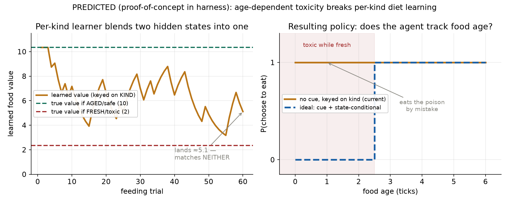

# การออกแบบการทดลอง — พิษที่ขึ้นกับอายุของอาหาร (Age-Dependent Toxicity)

**Experiment design: when a food is toxic while fresh but detoxifies with age, can an agent learn a state-dependent diet — and what does that require?**

ผู้ออกแบบ: Chisanupong · โครงการ Artificial Evolution (ALife → YSC/ISEF)
วันที่: 2026-07-01 · สถานะ: **design เท่านั้น (ยังไม่ implement)** · ต่อยอดจาก `toxin_physics_v1_2026-07-01`

> เอกสารนี้เป็น **แบบร่างการทดลอง** ตาม skill `experiment-design` + `hypothesis-testing` ยังไม่แตะโค้ดหลัก มีเพียงกราฟ **proof-of-concept ในhar­ness** (จากโค้ดเรียนรู้จริง) เพื่อยืนยันสัญชาตญาณว่า "กราฟจะออกมาแปลก" — ไม่ใช่ผลจากซิมเต็ม

---

## 1. ที่มา (จากไอเดียผู้วิจัย)

โจทย์: ถ้าอาหารพิษ (`raw_fruit`) **เก็บไว้ ~3 วันแล้วหายพิษ** — agent จะรู้ไหม? ผู้วิจัยตั้งข้อสังเกตว่า:
- ตัวที่เคยกินตอนสด → ติดพิษ; ตัวที่กินตอนเก่า → ไม่ติด
- แม้แต่ผลเดียวกัน: กินตอนนี้ (สด) มีพิษ, รอ 3 วัน (เก่า) ไม่มี
- "กราฟน่าจะออกมาแปลก"

**นี่คือปรากฏการณ์ที่ลึกกว่าที่เห็น** และคุ้มค่าออกแบบให้ดี เพราะมันทดสอบขีดจำกัดของระบบเรียนรู้การกินที่เรามีอยู่

ในธรรมชาติเรื่องนี้จริง: ผลไม้ดิบหลายชนิดมีสารพิษ/แทนนิน/ไซยาโนเจน ที่ลดลงเมื่อสุก; การหมัก/บ่มลดพิษ (มันสำปะหลังต้องแช่, อาหารหมัก) — **ความเป็นพิษเป็นฟังก์ชันของอายุ/สภาพ ไม่ใช่คุณสมบัติตายตัวของ "ชนิด"**

---

## 2. ทำไมมันทำลายระบบเรียนรู้ปัจจุบัน (แก่นของการทดลอง)

ระบบตอนนี้เรียนรู้ **ค่าเดียวต่อชนิดอาหาร**: `food_value_memory[kind]` = EMA ของพลังงานสุทธิที่ได้จากการกิน `kind` นั้น

แต่พอพิษขึ้นกับอายุ → `raw_fruit` **ชนิดเดียว** บางครั้งพิษ (สด) บางครั้งปลอดภัย (เก่า) ถ้า agent **มองไม่เห็นอายุ** อาหาร มันจะเจอ:
> "กิน raw_fruit" → ได้พลังงานสุทธิที่เป็น **ตัวแปรสุ่ม** ขึ้นกับอายุ (ที่ซ่อนอยู่) ของผลที่บังเอิญกิน

นี่คือปัญหาคลาสสิก **perceptual aliasing / partial observability (POMDP)**: สองสถานะที่ต่างกัน (สด/เก่า) ให้ "สัญญาณที่สังเกตได้" เหมือนกัน (ต่างก็คือ "raw_fruit") → ตัวเรียนรู้ที่ key ด้วย "ชนิด" อย่างเดียว **บีบสองสถานะให้เหลือค่าเดียว = ค่าเฉลี่ยผสม (blend)** ที่ไม่ตรงกับความจริงทั้งสองด้าน → ทำ policy ที่ดีที่สุดไม่ได้

**ประเด็นสำคัญ 2 ชั้น (ต้องแยกให้ออก):**
1. **สังเกตได้ไหม (observability):** มี cue ให้แยกสด/เก่าหรือไม่ (เช่น สี/กลิ่นที่เปลี่ยนตามอายุ)
2. **ตัวแทนการเรียนรู้ใช้ cue ไหม (representation):** แม้มี cue ถ้ายัง key ด้วย "ชนิด" อย่างเดียวก็ใช้ไม่ได้ ต้อง key ด้วย (ชนิด × สภาพ)

---

## 3. คำถามวิจัย + สมมติฐาน (พร้อมการทำนาย)

**คำถามหลัก:** ระบบเรียนรู้การกินแบบ emergent รับมือกับพิษที่ขึ้นกับสภาพ (non-stationary ภายในชนิด) ได้ไหม และต้องมีอะไร?

| # | สมมติฐาน | ทำนาย (รูปกราฟ/ผล) | ทำให้ falsify ยังไง |
|---|---|---|---|
| **H1** | ไม่มี cue + เรียนรู้ต่อชนิด → แยกสด/เก่าไม่ได้ | learned value ลงเอยเป็น blend (ไม่ตรงทั้งคู่); P(กิน) **แบนราบไม่ขึ้นกับอายุ**; toxin damage ระดับกลาง | ถ้า P(กิน) กลับเป็นขั้นตามอายุเอง = ผิด |
| **H2** | มี cue แต่ยังเรียนรู้ต่อชนิด → **ยังแยกไม่ได้** | เหมือน H1 (เพราะไม่ได้ใช้ cue) — พิสูจน์ว่า "representation" สำคัญ ไม่ใช่แค่ "มองเห็น" | ถ้าแยกได้ทั้งที่ยัง key ด้วยชนิด = ผิด |
| **H3** | มี cue + เรียนรู้ต่อ (ชนิด×สภาพ) → **แยกได้** | P(กิน) เป็น **ขั้นบันไดที่ T_detox** (เลี่ยงสด, กินเก่า); toxin damage ≈ 0; พลังงานสูง | ถ้าไม่มีการแยก = ผิด |
| **H4** *(สำรวจ)* | ถ้าเก็บอาหารเป็นชิ้นได้ → lineage ที่ "เก็บสด รอ 3 วัน กินตอนหายพิษ" ได้เปรียบ | เกิดพฤติกรรม **ถนอม/แปรรูปอาหาร** (food processing) โดยไม่ถูกสอน | ถ้าไม่มีใครเก็บรอ = ผิด/ยังไม่ถึงเงื่อนไข |

**เหตุผลของ "กราฟแปลก" (ตอบผู้วิจัยตรง ๆ):** ใน H1/H2 พลังงานสุทธิที่ agent ได้รับต่อการกิน raw_fruit มี **ความแปรปรวนสูง** (บางครั้ง 2 บางครั้ง 10) → ค่าเรียนรู้ **เหวี่ยง/ไม่นิ่ง** และลงเอยกลางๆ ที่ผิดทั้งคู่ → พฤติกรรมสับสน ("เคยกินติดพิษ กินอีกครั้งไม่ติด") ตรงกับสัญชาตญาณผู้วิจัยเป๊ะ

---

## 4. ตัวแปร (Variables)

**ตัวแปรอิสระ (Independent):**
- **ฟังก์ชันพิษตามอายุ** `toxin(age)`: ค่าเริ่มต้น = ขั้น (สด: พิษเต็ม เมื่อ `age < T_detox`; เก่า: พิษ 0) — ทางเลือก: ลดแบบเชิงเส้น/เอกซ์โพเนนเชียล
- **T_detox** (อายุที่หายพิษ) = "3 วัน" แปลงเป็น ticks
- **cue การรับรู้อายุ** (มี/ไม่มี): agent สังเกต "ความสด" ได้หรือไม่
- **ตัวแทนการเรียนรู้:** key ด้วย `kind` เท่านั้น vs key ด้วย `(kind × freshness-bin)`

**ตัวแปรตาม (Dependent):**
- P(เลือกกิน) เป็นฟังก์ชันของอายุอาหาร (อุดมคติ = ขั้นที่ T_detox)
- toxin damage / จำนวน "มื้อพิษ" (bite ที่กินตอนสด) ต่อ agent
- ค่าอาหารที่เรียนรู้ (ค่าเดียว blend vs สองค่าแยกสด/เก่า)
- (H4) การเกิดพฤติกรรมเก็บ-รอ-กิน

**ตัวแปรควบคุม (Control):** ยีน `toxin_tolerance` (คงที่หรือกระจายเท่ากันทุก arm), ความหนาแน่นการ spawn fruit, อัตราเรียนรู้ EMA, pickiness, ระดับความอิ่ม (ให้ agent อิ่มเพื่อแยกจากคอขวด foraging), seed

---

## 5. เมทริกซ์เงื่อนไข (2×2 + baselines)

แกนที่แยก "มองเห็น" ออกจาก "ใช้เป็น":

| | เรียนรู้ต่อชนิด (kind-only) | เรียนรู้ต่อ (ชนิด×สภาพ) |
|---|---|---|
| **ไม่มี cue** | **A** (ปัจจุบัน) → คาด fail (H1) | — (ไม่มีสภาพให้ condition) |
| **มี cue** | **B** → คาด fail (H2, ไม่ใช้ cue) | **C** → คาด success (H3) |

**Baselines:** (D) fruit ไม่มีพิษเลย = เพดานพลังงาน; (E) fruit พิษคงที่ (ไม่หายพิษ = Toxin v1 เดิม) = กรณีที่ระบบปัจจุบันแก้ได้; (F) กินสุ่ม = พื้น

---

## 6. Metrics + เกณฑ์ผ่าน/ไม่ผ่าน

| Metric | ผ่าน (success) | ไม่ผ่าน (failure) |
|---|---|---|
| discrimination = P(กิน\|เก่า) − P(กิน\|สด) | **> 0.6** (arm C) | ≈ 0 (arm A/B) |
| toxin damage เทียบ baseline สุ่ม | arm C ลด **> 80%** | arm A/B ลดน้อย |
| learned value | arm C แยกเป็นสองค่า (สด≈2, เก่า≈10) | arm A/B ได้ค่า blend เดียว |
| (H4) สัดส่วน lineage เก็บ-รอ-กิน | เกิดขึ้น > พื้นสุ่มอย่างมีนัย | ไม่ต่างจากพื้น |

**เกณฑ์เชิงกลไก:** arm B ต้อง fail แม้มี cue → ยืนยันว่า **representation** (ไม่ใช่แค่ observability) เป็นตัวชี้ขาด (ถ้า B ผ่าน = สมมติฐานเรื่อง representation ผิด)

---

## 7. การทำนายรูปกราฟ ("กราฟจะออกมาแปลกยังไง")

**รูป (PREDICTED, proof-of-concept ในharness — ขับด้วย EMA จริง + สูตร toxin จริง):**
- **ซ้าย:** ตัวเรียนรู้ต่อชนิดเจอผลไม้อายุสุ่ม → ค่าที่เรียนรู้ **เหวี่ยงระหว่างค่าจริงสองเส้น** (เก่า=10, สด=2) แล้วลงเอย ≈5 = **ไม่ตรงกับความจริงทั้งสองสถานะ** (นี่คือ "กราฟแปลก")
- **ขวา:** policy ที่ได้ — ไม่มี cue (เส้นทึบ) **แบนราบไม่ขึ้นกับอายุ** → กินหมดรวมทั้งผลสดมีพิษ ("eats the poison by mistake"); อุดมคติ (เส้นประ) เป็น **ขั้นบันได** เลี่ยงสด กินเก่า

**กราฟที่จะทำเมื่อรันจริง (ตามเมทริกซ์):**
1. learned value over trials — arm A/B: blend เหวี่ยง; arm C: สองเส้นแยกออก
2. P(กิน) vs อายุอาหาร — arm A/B: แบน; arm C: ขั้นที่ T_detox
3. toxin damage ต่อ arm (bar) — C ≈ 0, A/B กลาง, สุ่มสูง
4. raster รายตัว (แบบรูปที่ 7 เดิม) — arm A จะ **"เลอะ"**: agent เลี่ยงแล้วกลับมากิน (เพราะบังเอิญเจอผลเก่าปลอดภัย) = ภาพที่ผู้วิจัยคาดไว้

---

## 8. แผน implement (feasibility — ทำได้ด้วยโครงที่มี)

- **อายุอาหารมีพร้อมแล้ว:** `FoodResource.created_tick` มีอยู่ และ `_decay_food_resources` คำนวณ `age_ticks = tick_count − created_tick` อยู่แล้ว → ใช้ซ้ำได้ทันที
- **พิษตามอายุ:** ใน `_apply_toxin` คูณ toxin ด้วย `detox(age)` (ต้องส่ง `resource.created_tick` + `env.tick_count` เข้าไป) + knob `toxin_detox_ticks` (0 = ปิด → byte-identical)
- **cue การรับรู้:** เพิ่ม observation "freshness bin" (เช่น สด/กลาง/เก่า จาก age) — ทางเลือกเปิด/ปิด
- **ตัวแทนการเรียนรู้:** ขยาย key ของ `food_value_memory` จาก `kind` เป็น `(kind, freshness_bin)` — เป็น flag เพื่อเทียบ arm B vs C
- **หลักการเดิม:** opt-in ทุก knob (default = พฤติกรรมเดิม, byte-identical), no oracle (ไม่บอกว่าสด/เก่า "พิษ" — ให้ cue เป็นแค่สัญญาณกลาง ๆ ที่ต้องเรียนความหมายเอง)

---

## 9. คำอธิบายทางเลือก + confound (hypothesis-testing)

- **Confound คอขวด foraging:** ถ้า agent หิวเรื้อรัง (ปัญหาเดิม) starvation floor จะบังคับกินทุกอย่าง → บดบังการแยก **ต้องรัน arm นี้ในโหมด "อิ่ม"** (controlled) ก่อน แล้วค่อยลองประชากรเต็มหลังแก้ foraging
- **ทางเลือกอธิบายผล H1 (ไม่ใช่ aliasing?):** ถ้า P(กิน) แบน อาจเป็นเพราะอัตราเรียนรู้ต่ำ ไม่ใช่ aliasing → คุม: เทียบกับ arm C ที่ representation ต่างเท่านั้น (ตัวแปรอื่นเท่ากัน) ถ้า C แยกได้แต่ A ไม่ = aliasing จริง
- **การกระจายอายุที่ agent เจอ** ขึ้นกับ spawn rate vs T_detox vs การบริโภค → ต้องบันทึกและคุม (ไม่งั้น blend เลื่อน)
- **Missing evidence:** ยังไม่รู้ว่า freshness-bin ควรละเอียดแค่ไหน (2 bin พอไหม หรือต้อง 3+) — เป็นพารามิเตอร์ที่ต้อง sweep

**ระดับความเชื่อมั่นของการทำนาย:** H1/H2 (fail) = **สูง** (เป็นผลของ aliasing ที่รู้จักดีใน RL + PoC ยืนยัน); H3 (success) = **กลาง-สูง** (ขึ้นกับ cue คุณภาพดีพอ); H4 (food processing emerge) = **ต่ำ** (ต้องมี item-level storage ที่ยังไม่มี)

---

## 10. ความเชื่อมโยงหลักการจริง

- **การหายพิษเมื่อสุก/บ่ม** (ripening/fermentation detox) — พิษเป็นฟังก์ชันของสภาพจริงในธรรมชาติ
- **discriminative taste aversion** — สัตว์เรียน "ปลอดภัยแบบมีเงื่อนไข" ได้ **ถ้ามี cue จำแนก** (สี/กลิ่น) ตรงกับแกน observability
- **perceptual aliasing / POMDP** — ตัวเรียนรู้ที่ key ผิด (ต่อชนิด) ทำ optimal policy ไม่ได้เมื่อสถานะซ่อน
- **food processing / caching** — การ "รอให้หายพิษ" เป็นการแปรรูปอาหารรูปแบบหนึ่ง (H4)

---

## 11. ผลที่คาดหวัง + งานต่อ

**ผลเชิงวิทยาศาสตร์ที่จะได้ (ไม่ว่าออกทางไหน):**
- ถ้า A/B fail, C success → บทเรียนชัด: **"การเรียนรู้อาหารที่ดีต้อง key ที่สภาพ ไม่ใช่แค่ชนิด" + "ต้องมี cue + ใช้ cue เป็น"** — เป็นผลที่น่าสนใจสำหรับ ISEF (เชื่อม ALife กับ RL/นิเวศการรับรู้)
- เปิดทาง **selection บนการรับรู้**: lineage ที่มี cue ดี + ใช้เป็น จะได้เปรียบ → วิวัฒนาการของ "การเลือกอาหารตามสภาพ"

**ลำดับทำ:** (1) implement detox(age) + arm A vs E (ยืนยัน PoC ในซิม) → (2) เพิ่ม cue + representation flag → arm B vs C → (3) วัด 4 metrics → (4) (ถ้าถึง) item-level storage สำหรับ H4
**Blocker เดิม:** ประชากรเต็มยังติดคอขวด foraging — arm ควบคุม (อิ่ม) ทำได้เลย, arm ประชากรรอแก้ foraging

---

*รายงานออกแบบการทดลอง — age-dependent toxicity: ทดสอบว่าการเรียนรู้การกินรับมือพิษที่ขึ้นกับสภาพได้ไหม, แยก observability ออกจาก representation ด้วยเมทริกซ์ 2×2, พร้อม PoC ยืนยันว่า per-kind learning จะ "เบลนด์" สองสถานะเข้าด้วยกัน (กราฟแปลกตามที่คาด). ยังไม่ implement — เป็น design.*
