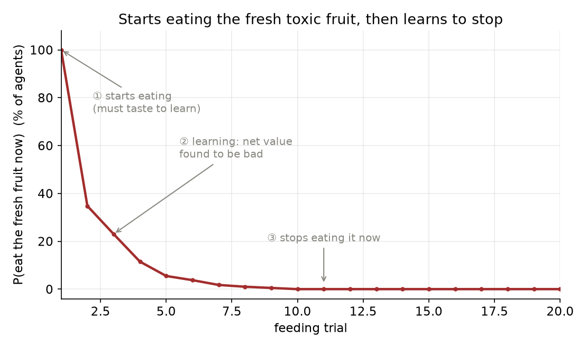
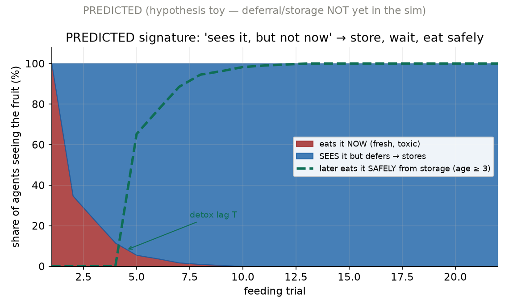
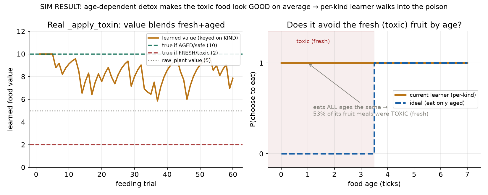

# การออกแบบการทดลอง — "เห็นแต่ไม่กินตอนนี้": เก็บอาหารพิษไว้ให้หายพิษก่อนกิน (Store-to-Detoxify)

**Experiment design: does the agent go beyond avoidance to DEFERRED consumption — see the toxic fruit, choose not to eat it now, store it, wait for it to detoxify, then eat it safely?**

ผู้ออกแบบ: Chisanupong · โครงการ Artificial Evolution (ALife → YSC/ISEF)
วันที่: 2026-07-01 · สถานะ: **design + ขั้นแรก implement แล้ว (detox-by-age) + ผลจริง** · แก้ไข/ต่อยอดจาก `design_age_dependent_toxicity_2026-07-01` (H4)

> เอกสารนี้ยกระดับ "ไม่กิน" จาก **การเลี่ยงถาวร (avoid)** เป็น **การเลื่อน (defer): เห็น → ไม่กินตอนนี้ → เก็บ → รอหายพิษ → กินทีหลัง** ซึ่งเป็นการ **แปรรูปอาหาร (food processing)** ที่ควร emerge เอง ไม่ใช่ถูกสอน มีกราฟ 2 แบบ: (1) onset จริงจากharness, (2) predicted signature ของ deferral

---

## 1. โจทย์ที่แก้ไข (จากผู้วิจัย)

เดิมเราถามแค่ "agent เลี่ยงอาหารพิษไหม" ผู้วิจัยชี้ประเด็นที่ลึกกว่า:
> ถ้า agent เรียนรู้จากการกินอาหารพิษ **มันอาจได้ข้อสรุปว่าให้เก็บไว้ก่อนกิน** — คือ "เห็นนะ แต่เลือกไม่กินตอนนี้" แล้วรอให้หายพิษ

นี่เปลี่ยนคำถามจาก "กิน vs ไม่กิน" (2 ทางเลือก) เป็น **3 ทางเลือกเมื่อเห็นอาหาร**:

| การกระทำเมื่อเห็นผลไม้สด (มีพิษ) | ความหมาย |
|---|---|
| **กินตอนนี้ (eat-now)** | ยังไม่รู้ / หิว → ติดพิษ |
| **เลี่ยงถาวร (avoid)** | รู้ว่าพิษ → ทิ้งไปเลย (เสียพลังงานที่ควรได้) |
| **เลื่อน+เก็บ (defer-store)** | เห็นคุณค่า แต่ "ไม่ใช่ตอนนี้" → เก็บ รอหายพิษ กินทีหลัง ✅ |

ทางเลือกที่ 3 คือ **optimal จริง** (ได้พลังงานสูงโดยไม่ติดพิษ) และเป็นพฤติกรรมที่น่าสนใจที่สุด

---

## 2. แก่นที่ยาก: นี่คือปัญหา "รางวัลล่าช้า" (delayed reward)

การเลื่อน+เก็บ ต่างจากการเลี่ยงตรงที่ **รางวัล (พลังงานปลอดภัย) มาทีหลัง** หลังจาก "เก็บ + รอ T ticks" ระบบเรียนรู้ปัจจุบันคือ **EMA ของพลังงานที่ได้ทันทีต่อชนิด** ([`_learn_food_value`](agents/agent.py:1183)) → มัน **ให้เครดิตรางวัลล่าช้าไม่ได้** (temporal credit assignment) จึงเรียน "เก็บตอนนี้เพื่อกินตอนหน้า" ด้วยตัวเองไม่ได้

**นี่คือหัวใจการออกแบบ:** ต้องระบุว่า deferral จะ emerge ได้ทาง **กลไกไหน** เพราะการเรียนรู้แบบ immediate-reward อย่างเดียว **ทำนายว่าล้มเหลว**

---

## 3. สามเส้นทางที่ deferral อาจ emerge (+ การทำนาย)

| เส้นทาง | กลไก | ทำนาย | ความเชื่อมั่น |
|---|---|---|---|
| **R1 — individual learning** (ปัจจุบัน) | EMA รางวัลทันทีต่อชนิด | **fail** — ได้แค่ "เลี่ยง" ไม่ได้ "เลื่อน" (เครดิตล่าช้าไม่ได้) | สูง |
| **R2 — caching + selection** | agent เก็บอาหารตามพฤติกรรม cache เดิม + อาหารมีอายุ + lineage ที่บังเอิญเก็บนานพอให้หายพิษ อยู่รอดดีกว่า → ถูกคัด | **success ข้ามรุ่น** โดยไม่ต้องวางแผน — "ระยะเวลาเก็บ" วิวัฒน์ขึ้นจนคร่อม T_detox | กลาง |
| **R3 — cue + model** | เห็น cue ความสด + รู้ค่า (สด=แย่, เก่า=ดี) + heuristic "ของที่จะมีค่าให้เก็บ" | **success ในชั่วชีวิต** แต่ต้องมี cue + ค่าแบบ (ชนิด×สภาพ) + ตรรกะเก็บ | กลาง-ต่ำ |

**ข้อสรุปการออกแบบ:** deferral **ไม่น่า emerge จากการเรียนรู้ปัจจุบันเพียงอย่างเดียว (R1)** — ต้องเพิ่ม (ก) การเก็บระดับชิ้นที่มีอายุ และ (ข) **selection** (R2, ทางที่เป็นธรรมชาติสุด) หรือ (ค) cue + model (R3) การทดลองจึงต้องเทียบ R1/R2/R3

---

## 4. กราฟที่ต้องการ

### 4.1 "เริ่มกิน → เริ่มเรียนรู้" (จริง จากharness)

**รูปที่ 1 (REAL)** ประชากรเริ่มกินผลไม้สดมีพิษ (① ต้องชิมถึงรู้) → เรียนรู้ว่าค่าสุทธิแย่ (②) → หยุดกินตอนนี้ (③) นี่คือ "เริ่มกิน เริ่มเรียนรู้" ที่ระบบปัจจุบันทำได้จริง — **แต่จบแค่ "หยุดกิน" (เลี่ยง) ยังไม่ถึง "เลื่อน+เก็บ"**

### 4.2 "เห็นแต่ไม่กินตอนนี้" (predicted signature ที่จะตรวจจับ)

**รูปที่ 2 (PREDICTED)** ลายเซ็นพฤติกรรมที่การทดลองจะมองหา: พื้นที่**แดง (กินตอนนี้) หด** → **น้ำเงิน (เห็นแต่เลื่อน→เก็บ) โต** และ **เขียว (กินทีหลังตอนปลอดภัย) ขึ้นตามหลัง detox lag T** เส้นเขียวที่โผล่ **หลัง** น้ำเงินคือหลักฐานของ "store → wait → eat" (ยังไม่มีในซิม — เป็นสิ่งที่ต้องสร้างแล้ววัด)

---

## 5. ตัวแปร + เงื่อนไข + Metrics

**ตัวแปรอิสระ:** เส้นทางกลไก (R1/R2/R3); ความสามารถเก็บระดับชิ้น (มี/ไม่มี); T_detox; cue (มี/ไม่มี); โหมด individual-learning vs multi-generation-selection

**ตัวแปรตาม / Metrics (เน้นการ "ตรวจจับ deferral"):**
- **P(defer | เห็นผลไม้สด)** = สัดส่วนครั้งที่ "เห็นแต่ไม่กินตอนนี้ แล้วเก็บ" (= สัญญาณหลัก ตรง "เห็นนะแต่เลือกไม่กินตอนนี้")
- สัดส่วนมื้อที่กิน**จาก storage ตอนอายุ ≥ T** (ปลอดภัย) เทียบมื้อที่กินสด (ติดพิษ)
- toxin damage ต่อ agent (ควรตก)
- (R2) **ระยะเวลาเก็บเฉลี่ยวิวัฒน์เข้าหา T_detox** ข้ามรุ่นไหม
- แยก **deferral ออกจาก avoidance**: agent ที่ defer จะ **เก็บ + กินทีหลัง**; agent ที่ avoid จะ **ทิ้ง ไม่กินเลย**

**เกณฑ์ผ่าน/ไม่ผ่าน:**
| | ผ่าน | ไม่ผ่าน |
|---|---|---|
| R1 (learning เดี่ยว) | — (คาด fail: P(defer)≈0, ได้แค่ avoid) | ถ้า P(defer) สูงโดยไม่มี storage/selection = สมมติฐานผิด |
| R2 (selection) | ระยะเวลาเก็บ → คร่อม T_detox; มื้อปลอดภัยจาก storage > สุ่มอย่างมีนัย | ไม่มีวิวัฒน์ของการเก็บ |
| R3 (cue+model) | P(defer\|สด) > 0.6 ในชั่วชีวิต | ไม่แยก defer จาก avoid |

---

## 6. แผน implement (feasibility)

**ต้องสร้างอะไร (เรียงตามความจำเป็น):**
1. **พิษตามอายุ** `detox(age)` ใน `_apply_toxin` (ใช้ `resource.created_tick` + `env.tick_count` ที่มีอยู่แล้ว) + knob `toxin_detox_ticks`
2. **การเก็บระดับชิ้นที่มีอายุ (item-level larder)** — ปัจจุบันการเก็บเป็น**ก้อนพลังงานรวม** ([`_store_surplus_food`](agents/agent.py:2604)) เก็บ "ผลไม้ลูกนี้ที่มีอายุ" ไม่ได้ → **นี่คือ blocker หลักของ deferral** ต้องเพิ่มคลังเก็บชิ้น (kind, created_tick) ต่อ agent/รัง
3. **action "defer-store" ในประตูตัดสินใจ** — เพิ่มทางเลือกที่ 3 (เห็น→เก็บแทนกิน) + log "saw fruit, stored not eaten" เพื่อวัด P(defer)
4. **โหมด selection** (R2) — รันประชากรสืบพันธุ์ + ผูก chronic toxin damage เข้าการอยู่รอด แล้ววัดวิวัฒน์ของการเก็บ
5. (R3) cue ความสด + ค่าแบบ (ชนิด×สภาพ) จาก design ก่อนหน้า

**หลักการเดิม:** ทุก knob opt-in (default = พฤติกรรมเดิม byte-identical), no oracle (ไม่บอกว่า "เก็บแล้วหายพิษ" — ต้อง emerge จาก selection/model)

---

## 7. confound + คำอธิบายทางเลือก

- **คอขวด foraging (เดิม):** ถ้า agent หิวเรื้อรัง → กินสดทันที ไม่มีวันเลื่อน → ต้องรันโหมด "อิ่ม/อาหารพอ" ก่อน แล้วค่อยประชากรเต็มหลังแก้ foraging
- **deferral ปลอม:** ถ้าเห็น P(defer) สูงใน R1 (ไม่มี storage/selection) อาจเป็น artifact ของ pickiness (skip = ถูกนับเป็น defer ผิด ๆ) → ต้องแยก "skip แล้วทิ้ง" ออกจาก "skip แล้วเก็บ+กินทีหลัง" ให้ชัดใน log
- **selection ปลอม:** ระยะเวลาเก็บอาจวิวัฒน์ด้วยเหตุอื่น (กันอดอยาก) ไม่ใช่เพื่อ detox → ต้องมี control ที่อาหาร**ไม่หายพิษ** (เก็บนานก็ยังพิษ) เทียบ

---

## 8. ความเชื่อมโยงหลักการจริง

- **food caching + processing** (สัตว์เก็บ/หมัก/บ่มอาหาร; มันสำปะหลังต้องแช่ให้พิษออก) — deferral = การแปรรูปด้วยเวลา
- **delayed gratification / temporal credit assignment (RL)** — ทำไม immediate-reward learner ทำไม่ได้ ต้อง model-based หรือ selection
- **niche construction / behavior ที่วิวัฒน์** — "ระยะเวลาเก็บ" เป็น trait ที่ selection ปรับได้

---

## 9. ผลที่คาดหวัง

ถ้าเดินตามแผน จะได้ข้อสรุปที่ทรงพลัง (ดีสำหรับ ISEF):
> **"การเลี่ยง" (avoid) เรียนรู้ได้ในชั่วชีวิต แต่ "การเลื่อน+แปรรูป" (store-to-detoxify) ต้องอาศัยการเก็บระดับชิ้น + selection ข้ามรุ่น — เป็นตัวอย่างว่าพฤติกรรมที่ซับซ้อนขึ้น (การจัดการอาหารเชิงเวลา) emerge จากวิวัฒนาการ ไม่ใช่การเรียนรู้เดี่ยว**

**ลำดับทำ:** (1) detox(age) + วัด onset จริง (ยืนยันรูปที่ 1 ในซิม) → (2) item-level larder + action defer-store → (3) วัด P(defer) โหมดอิ่ม (R3) → (4) โหมด selection (R2) วัดวิวัฒน์ระยะเวลาเก็บ
**Blocker:** item-level storage (ยังไม่มี) + คอขวด foraging (สำหรับโหมดประชากร)

---

---

## 10. ผลการรันจริงในซิม (first sim results — ลงมือขั้นแรกแล้ว)

**สิ่งที่ implement:** ขั้นที่ 1 ของแผน §6 — **detox ตามอายุ** ใน core จริง (`_apply_toxin`): เพิ่ม knob `toxin_detox_ticks` (0 = ปิด → byte-identical). พิษของอาหารลดตามอายุแบบเชิงเส้น (potency = 1 ตอนสด → 0 ที่ `toxin_detox_ticks`) อายุคำนวณจาก `resource.created_tick` เทียบ `env.tick_count` ที่มีอยู่แล้ว · tests เพิ่ม 4 ตัว (สด=พิษเต็ม, เก่า=ปลอดภัย, ครึ่งอายุ=ครึ่งพิษ, ปิด=ไม่สนใจอายุ) · suite 90/90 ผ่าน

**ยังไม่ implement:** larder ระดับชิ้น + action "defer-store" (ขั้น 2–4) — จึงยังวัด "การเลื่อน" ไม่ได้ ขั้นนี้วัดว่า **ระบบเรียนรู้ปัจจุบันรับมือพิษตามอายุได้ไหม** (ทดสอบ R1 ในโค้ดจริง)

**ผล (ขับ `_apply_toxin` + อายุจริง + learner จริง, agent อิ่ม; `scripts/run_store_detox_sim.py`):**
- **ค่าเรียนรู้ = blend 7.9** (เหวี่ยงระหว่างสด=2 กับ เก่า=10) — เหมือน PoC เป๊ะ แต่ตอนนี้จากโค้ดจริง
- **P(เลือกกิน) แบน [1×8] ทุกอายุเท่ากัน** → **แยกสด/เก่าไม่ได้เลย** (key ด้วยชนิด ไม่ใช่สภาพ) → ยืนยัน **R1 = fail**
- **53% ของมื้อผลไม้เป็นพิษ (สด)** — กินทุกลูกไม่เลือกอายุ
- ซิมเต็ม (`--toxin-detox-ticks 20`) ให้ผลเดียวกัน: learned fruit = 5.95 (blend), กิน fruit 315 vs plant 93

**ข้อค้นพบที่ไม่คาดคิด (สำคัญ):** การหายพิษตามอายุ **ทำให้อาหารพิษ "ดูดีขึ้นโดยเฉลี่ย"** (blend 7.9 > plant 5 เพราะครึ่งหนึ่งปลอดภัย+พลังงานสูง) → per-kind learner ถูก **ดึงดูดเข้าหาพิษมากขึ้น** ไม่ใช่น้อยลง — แย่กว่าพิษคงที่ด้วยซ้ำ

**สรุป:** ผลจริงยืนยันคำทำนายหลักของ design — **การเรียนรู้ต่อชนิดรับมือพิษตามอายุไม่ได้** (แยกสภาพไม่ออก จึงเดินเข้าหาพิษ) ตอกย้ำว่าต้อง **cue + representation ต่อสภาพ (R3)** หรือ **larder + selection (R2)** ตามที่ออกแบบไว้ — ขั้นต่อไปคือสร้าง larder ระดับชิ้น

### 10.1 ขั้นถัดไป — พิษไม่โมโนโทนิก: toxic → safe → toxic (safe window)

ต่อยอดตามโจทย์ผู้วิจัย: อาหาร **พิษ 0–3, หายพิษ 3–7, พิษอีกรอบ 7+** (unripe → ripe/fermented → spoiled) implement เป็น knob `toxin_safe_window_start/end` ใน core (`metabolism.toxin_age_potency` + `_apply_toxin`; ปิด = byte-identical; tests เพิ่ม 3 ตัว; suite 93/93)

**ผล (ประชากร 300 ตัว, ขับโค้ดจริง; `scripts/run_toxin_window_sim.py`):**
- **ซ้าย:** reward landscape เป็น "เมซา" — net 2 (พิษ) ตอนอ่อน, **10 (ปลอดภัย+พลังงานสูง) ในหน้าต่าง 3–7**, กลับเป็น 2 ตอนแก่
- **ขวา:** P(เลือกกิน) ของประชากร **แบน ~8% ทุกอายุ** (ideal = กระโดดเป็น 100% เฉพาะในหน้าต่าง) → **เล็งหน้าต่างปลอดภัยไม่ได้เลย**
- **60% ของมื้อที่กินเป็นพิษ** (= base rate เพราะกินแบบไม่สนอายุ)

**ทำไมยากกว่าเดิม:** กรณีนี้ **"แก่กว่า = ปลอดภัยกว่า" ใช้ไม่ได้แล้ว** (พิษกลับมาตอนแก่) → แม้จะมี age-heuristic แบบง่ายก็พัง ต้องรู้ **ทั้งเส้นโค้ง value(age)** → ยกระดับความต้องการ representation ให้สูงขึ้นอีก (ต้อง key ด้วย freshness-bin ที่ละเอียดพอครอบทั้ง 3 เฟส) และตอกย้ำว่าการ **"เก็บรอหน้าต่าง"** ยิ่งต้องการ larder ระดับชิ้น + selection (จับจังหวะกินให้ตรงหน้าต่าง)

---

*รายงานออกแบบ + ผลขั้นแรก (store-to-detoxify) — ยกระดับ "ไม่กิน" เป็น "เห็นแต่เลื่อน→เก็บ→รอ→กินปลอดภัย" (ปัญหารางวัลล่าช้าที่ learning เดี่ยวทำไม่ได้). Implement detox-by-age จริงแล้ว (opt-in, 90/90 tests): ผลยืนยัน per-kind learner แยกสด/เก่าไม่ได้ → เดินเข้าหาพิษ (53% มื้อเป็นพิษ). ขั้นต่อไป: larder ระดับชิ้น + action defer-store + selection.*
