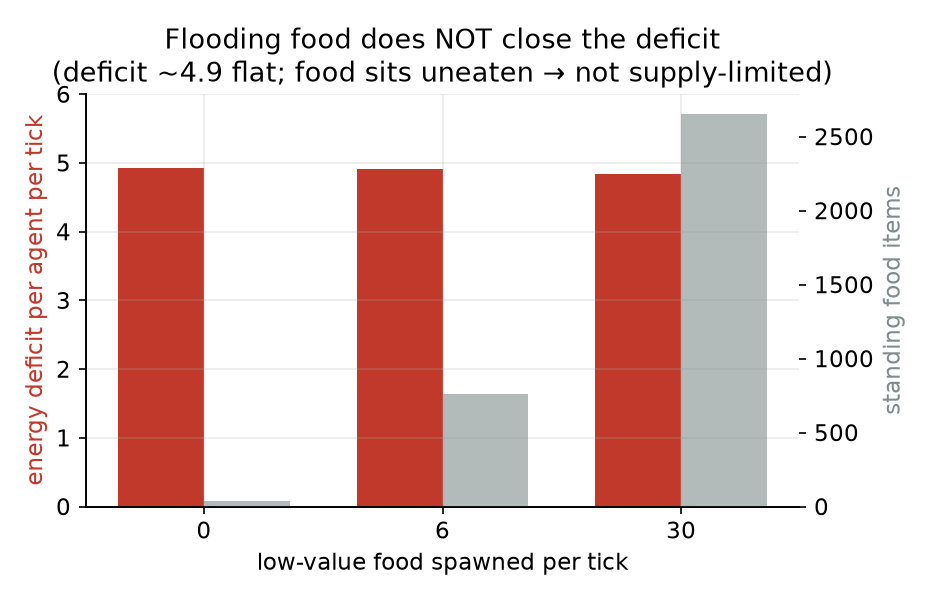
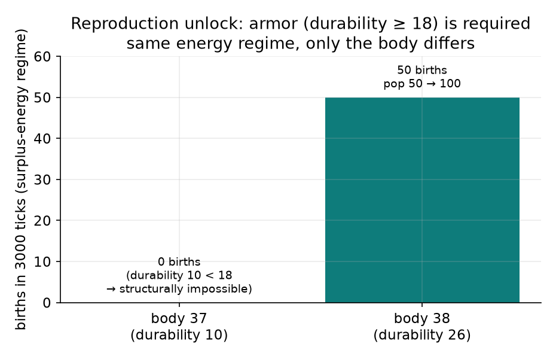
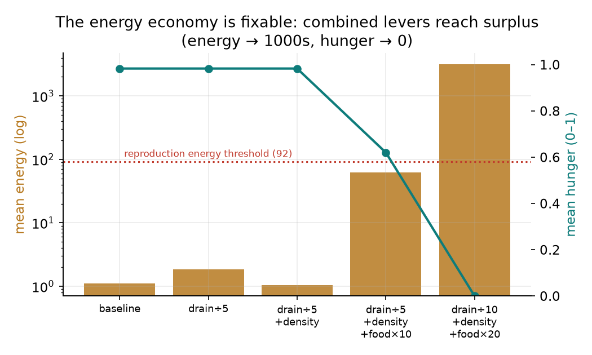

# การเรียนรู้คุณค่าอาหารแบบเกิดเอง และเศรษฐกิจพลังงานที่เป็นคอขวดร่วมของพฤติกรรมระดับสูงในระบบชีวิตเทียม

**Emergent food-value learning and the energy economy as a shared bottleneck for higher-order behaviour in an artificial-life simulation**

ผู้วิจัย: Chisanupong
โครงการ: Artificial Evolution — ข้อเสนอ TURC2026 (Artificial Life / AI)
วันที่: 2026-06-19
สถานะ: ฉบับเต็ม (.md) · เตรียมแปลงเป็น PDF เมื่อเนื้อหาครบ
โค้ดอ้างอิง: commit `fd47f3e` (ล่าสุด) — เครื่องมือทดลองทั้งหมด default-off และ v1 byte-identical

---

## บทคัดย่อ (Abstract)

โครงการนี้สร้างระบบชีวิตเทียมภายใต้หลักการ **"โลกไม่บอกความหมาย ปล่อยให้ฟิสิกส์/ประสบการณ์ตัดสิน"** (uninformed world) งานวิจัยนี้ตอบคำถามว่า agent **เรียนรู้ภายในช่วงชีวิต**ได้หรือไม่ว่าอาหารบางชนิด "กินได้แต่ไม่คุ้มค่าพลังงาน" ในเมื่อกลไกการกินปัจจุบันตัดสินด้วย *ขนาดปากเทียบขนาดอาหาร* เท่านั้น

เราพบว่า (1) การกินเป็น **value-blind** — agent กินทุกสิ่งที่ปากรับได้ทุก tick โดยไม่มีการตัดสิน "ความคุ้ม" และความจำเป็นเชิงตำแหน่งล้วน; (2) ความพยายามวัดการเรียนรู้ในตอนแรกถูกบดบังด้วย **ภาวะอดอยากถาวร** — การสอบสวนเศรษฐกิจพลังงานเชิงลึกเผยว่า drain ≈ 5 หน่วย/tick เทียบ intake ≈ 0.01 (อัตราส่วน ~453:1, [รูปที่ 1]) โดย *ไม่ใช่* ปัญหาปริมาณอาหาร (อาหารเหลือเพียบ, [รูปที่ 2]) และการตายในโหมด mortal คือ **อายุขัย ไม่ใช่การอดตาย**; (3) การสืบพันธุ์ถูกล็อกด้วย 3 เงื่อนไข (พลังงาน ≥ 92, durability ≥ 18, เงื่อนไขสังคม) ทำให้ **body ที่ไม่มีเกราะสืบพันธุ์ไม่ได้เชิงโครงสร้าง** — เมื่อใช้ body มีเกราะในเศรษฐกิจเกินดุล เกิด **การสืบพันธุ์ครั้งแรกของโครงการ** ([รูปที่ 3], [รูปที่ 5]); (4) **ผลหลัก:** เมื่อทำให้เศรษฐกิจพลังงาน "สุขภาพดี" (agent อิ่ม, hunger ≈ 0) แล้วเปิดกลไกเรียนรู้ค่าอาหารจากประสบการณ์ การกินอาหารค่าต่ำ **ลดลงเองจนเกือบเป็นศูนย์** (236 → 5 ต่อ 1000 ticks) ในขณะที่กลุ่มไม่มีกลไกยังกินคงที่ ([รูปที่ 4]) — เป็นการเรียนรู้แบบเกิดเอง ไม่ใช่กฎที่เขียนมือ และไม่ต้องใช้การบังคับเทียมใดๆ

ข้อสรุปเชิงระบบ: **เศรษฐกิจพลังงานเป็นคอขวดร่วม**ของพฤติกรรมระดับสูงทุกอย่าง (การเลือกกิน, การสืบพันธุ์, การคัดเลือกข้ามรุ่น) เมื่อแก้ให้ agent ไม่อดอยาก พฤติกรรมเรียนรู้ก็ปรากฏเอง

---

## 1. บทนำ (Introduction)

### 1.1 ที่มาและหลักการ
ระบบจำลองนี้ยึดหลัก **uninformed world**: โลกไม่ประกาศว่าอะไร "กินได้" หรือ "ดี" วัตถุจะกินได้ก็ต่อเมื่อ *ขนาดพอดีปาก* (`can_ingest`) และให้พลังงานเท่าที่ร่างกายย่อยองค์ประกอบได้ (`digestible_energy`) เป้าหมายคือให้พฤติกรรมที่ซับซ้อน (การกระจายเมล็ด, การเลือกกิน, วิวัฒนาการ) **เกิดขึ้นเอง** จากฟิสิกส์และประสบการณ์ ไม่ใช่จากกฎที่ฝังไว้

### 1.2 ช่องว่างงานวิจัย
ระบบมี **place-based learning** (จำตำแหน่งที่เคยได้รางวัลแล้วกลับไป — พิสูจน์ใน Phase 2, return lift 33–52×) แต่ยังไม่เคยตรวจว่ามี **value/diet learning** หรือไม่ — คือการเรียนรู้ "คุณค่าของชนิดอาหาร" ไม่ใช่แค่ "ตำแหน่ง" หากการกินตัดสินแค่ขนาด agent ปากใหญ่ย่อมกินทุกอย่าง รวมของที่แทบไม่คุ้ม **คำถามคือ มันจะฉลาดขึ้นจากการกินซ้ำๆ ได้ไหม?**

### 1.3 คำถามวิจัย
- **RQ1:** สถาปัตยกรรมปัจจุบันมี substrate ให้เรียนรู้คุณค่าอาหารหรือไม่?
- **RQ2:** ถ้าเพิ่มกลไกเรียนรู้จากพลังงานที่ได้จริง (ไม่ฮาร์ดโค้ด) การเลี่ยงอาหารค่าต่ำจะเกิดเองไหม?
- **RQ3 (เกิดระหว่างทาง):** เหตุใดพฤติกรรมระดับสูงทั้งหมดจึง "ติด" — รากร่วมคืออะไร?

### 1.4 ผลงานหลัก (Contributions)
1. ชี้ว่าการกินเป็น value-blind และความจำเชิงตำแหน่งล้วน (RQ1: ไม่มี substrate)
2. กลไกเรียนรู้ค่าอาหารจากประสบการณ์ที่ทำให้เกิดการเลี่ยงแบบ emergent (RQ2: ได้)
3. การสอบสวนเศรษฐกิจพลังงานที่ **แก้ความเชื่อผิด** (ตายเพราะอายุขัยไม่ใช่อด; ไม่ใช่ปัญหาปริมาณอาหาร) และระบุห่วงโซ่สืบพันธุ์ 3 ชั้น
4. การปลดล็อกการสืบพันธุ์ครั้งแรกของโครงการ
5. ข้อสรุปเชิงระบบ: เศรษฐกิจพลังงานเป็นคอขวดร่วม

---

## 2. ระบบและวิธีการ (System & Methods)

### 2.1 ภาพรวมการจำลอง
โลก 2 มิติ 100×100 ช่อง, ประชากรเริ่ม 50, agent มี body plan (sensor/muscle/armor/brain + ลักษณะต่อเนื่อง) เคลื่อนที่หาอาหารตามสัญญาณ ใช้พลังงาน สืบพันธุ์ และตายได้ (mortal) หรือไม่ตาย (immortal) ใช้ Metabolism Physics v2 (`metabolism_model="v2"`) ตลอดงานนี้

### 2.2 สถาปัตยกรรมการกิน/เรียนรู้ (จากโค้ดจริง)
| ชั้น | กลไก | ใช้ "ความคุ้ม"? | เรียนรู้? |
| --- | --- | --- | --- |
| เดินเข้าหา | `food_signal_at` ถ่วงด้วย `energy/(ระยะ+1)²` | ✅ (sensory ทันที) | ❌ |
| ตัดสินใจกิน | `_consume_current_food` → `_fits_mouth` (ขนาดเท่านั้น) เรียกทุก tick | ❌ | ❌ |
| ความจำ | `remembered_food` = พิกัด (x,y) | ❌ (ไม่จำชนิด/ค่า) | ✅ ตำแหน่งเท่านั้น |

### 2.3 โครงสร้างพลังงานอาหาร
พลังงานย่อยได้ = `mass × Σ(สัดส่วนสารอาหาร × เอนไซม์ × ความหนาแน่นพลังงาน)`

| food kind | องค์ประกอบเด่น | พลังงาน (body มาตรฐาน) |
| --- | --- | ---: |
| raw_plant (ผล) | sugar/fiber | 4.755 ≈ 5 |
| raw_meat (เนื้อ) | protein | ≈ 14 |
| **raw_seed (อาหารค่าต่ำ, เพิ่มเพื่อการศึกษา)** | shell 60% (ย่อยไม่ได้) | 0.873 ≈ **1** |

`raw_seed` ออกแบบให้ "กินได้แต่ไม่คุ้ม": ขนาดเล็ก (พอดีทุกปาก) แต่ให้พลังงานเพียง ~20% ของผล

### 2.4 กลไกเรียนรู้ค่าอาหาร (study B — จากประสบการณ์ ไม่ฮาร์ดโค้ด)
- `food_value_memory[kind]` — ค่าเฉลี่ยเคลื่อนที่ (EMA, α=0.3) ของ **พลังงานที่ได้จริง** เมื่อกินชนิดนั้น
- กฎ optimal-diet: ชิมชนิดที่ยังไม่รู้ค่า 1 ครั้งเสมอ; หลังรู้ค่า → ข้ามชนิดที่ค่า < `diet_pickiness`(0.5) × ค่าที่ดีที่สุดที่รู้จัก; มี starvation floor (กินทุกอย่างเมื่อพลังงานต่ำกว่าเกณฑ์) **ค่าเรียนจากประสบการณ์ ไม่ใช่ป้ายว่า "เมล็ดแย่"**

### 2.5 เครื่องมือวัด (commit ล่าสุด, default-neutral)
deficit จาก immortal-clamp injection · drain แยกองค์ประกอบ (base/brain/move) · `agent_death_reasons` · `diet_by_kind`/`learned_food_value` · **population & diet trajectory** ทุก 200 ticks · knob: `food_energy_multiplier`, `metabolic_drain_multiplier`, `low_value_food_spawn_per_tick`

### 2.6 การออกแบบการทดลอง
| | นิยาม |
| --- | --- |
| **IV** | กลไกเรียนรู้ (เปิด/ปิด), regime พลังงาน (drain/food multiplier, ความหนาแน่น), body (เกราะ), immortal |
| **DV** | การกินต่อชนิดตามเวลา, learned value, deficit/drain/intake, hunger/safety/comfort, births/deaths, วิถีประชากร |
| **Control** | seed/world/config เดียวกัน; กลุ่มไม่มีกลไก (A); body ไม่มีเกราะ (37) |
| **Success** | (เรียนรู้) การกินค่าต่ำลดตามเวลาในกลุ่ม B แต่คงที่ในกลุ่ม A |
| **Failure** | การกินไม่ต่างกัน = กลไกไม่ทำงาน |

### 2.7 หมายเหตุการทำซ้ำและ determinism
ผลทุก seed **เหมือนกันเป๊ะ** เพราะการเคลื่อนที่ใช้ `Random(agent_id+age)` ที่ไม่ผูกกับ `args.seed` → ระบบเป็น **deterministic n=1** ตัวเลขในรายงานนี้ reproducible เป๊ะ (ไม่ต้องหา CI) แต่ยังเคลม multi-seed replication ไม่ได้ (ดู §5)

---

## 3. ผลการทดลอง (Results)

### 3.1 การกินเป็น value-blind (RQ1)
`_consume_current_food` ถูกเรียก **ทุก tick โดยไม่มีเงื่อนไข** — ยืนทับอาหารที่ปากรับได้ = กินทันที แม้ไม่หิว แม้ไม่คุ้ม ความจำเก็บแค่พิกัด ไม่เก็บชนิด/ค่า → **ไม่มี substrate ให้เรียนรู้คุณค่าอาหาร**

### 3.2 งบพลังงาน: drain ท่วม intake
วัดตรง (body มาตรฐานไม่มีเกราะ, v2, immortal, 3000 ticks):


**รูปที่ 1.** drain = base 1.0 + brain 2.0 + movement 2.0 ≈ **4.99/agent/tick** เทียบ intake **0.011** (≈453:1) agent กินเพียง ~1 มื้อ/455 ticks มื้อหนึ่ง (~5 พลังงาน) อยู่ได้ ~1 tick

### 3.3 ไม่ใช่ปัญหาปริมาณอาหาร
เติมอาหารค่าต่ำ 0 → 30 ต่อ tick (อาหารคงค้าง 36 → 2,654 ชิ้น, กินไป 14,103 เม็ด) แต่การขาดดุล **แทบไม่ขยับ** (4.93 → 4.84):



**รูปที่ 2.** อาหารเหลือกองโต แต่ deficit คงที่ → คอขวดคือ *เมแทบอลิซึม/การเข้าถึง* ไม่ใช่ปริมาณ

### 3.4 การตายคืออายุขัย ไม่ใช่การอดตาย
โหมด mortal: ประชากรสูญพันธุ์ที่ tick **133 เป๊ะ** ทุกเงื่อนไข (รวม drain÷20, food×50) โดย `death_reason = lifespan_completed` ทั้ง 50 ตัว — เพราะ founder เกิดอายุเท่ากัน (67) ตายพร้อมกันที่ MAX_AGE (200) ใน `_resolve_life_state` พลังงาน ≤ 0 เพียง reset เป็น 1 (**ไม่เคยฆ่า**) → knob พลังงานไม่กระทบ tick 133

### 3.5 ประตูสืบพันธุ์ 3 ชั้น และการปลดล็อกด้วยเกราะ
`can_reproduce` ต้องครบ: **พลังงาน ≥ 92**, **durability ≥ 18**, และเงื่อนไขสังคม (คู่/pair-bond/safety streak/comfort) เนื่องจาก `durability = 10 + armor×8` → body ไม่มีเกราะ (durability 10) **สืบพันธุ์ไม่ได้เชิงโครงสร้าง** แม้พลังงานล้น



**รูปที่ 3.** ในเศรษฐกิจเกินดุลเดียวกัน body 37 (durability 10) → 0 births; body 38 (durability 26, มีเกราะ) → **50 births, ประชากร 50→100** = การสืบพันธุ์ครั้งแรกของโครงการ

### 3.6 เศรษฐกิจพลังงานแก้ได้
การลด drain ลดการขาดดุลตามสัดส่วน แต่ต้องใช้ **drain↓ + ความหนาแน่น↑ + พลังงานอาหาร↑ พร้อมกัน** จึงพลิกเป็นเกินดุล:



**รูปที่ 5.** เมื่อใช้คันโยกร่วมกัน พลังงานเฉลี่ยพุ่งเป็นหลักพันและ hunger → 0 (เกินเกณฑ์สืบพันธุ์ 92) แสดงว่าเศรษฐกิจ "ซ่อมได้"

### 3.7 carrying capacity จำกัดตัวเอง
ในโหมด immortal ประชากรโตจากการสืบพันธุ์แล้ว **จำกัดตัวเองที่ ~2× founder (≈100)** หลังรอบเดียว และ **การเพิ่มพลังงานอาหาร ×100/×200 ไม่ช่วย** (กลับหิวขึ้น) เพราะคอขวดคือ *จำนวนชิ้นอาหาร* ที่แย่งกัน ไม่ใช่พลังงานต่อมื้อ; ที่ความหนาแน่นนี้ safety ล่มเมื่อแออัด → หยุดสืบพันธุ์:


**รูปที่ 6.** ประชากร plateau ~96–100 ทุก throughput → เพดานมาจากการแย่งอาหาร + safety ไม่ใช่พลังงานต่อมื้อ

### 3.8 ผลหลัก: การเรียนรู้ค่าอาหารในสภาพอิ่ม (RQ2)
เมื่อจัดเศรษฐกิจให้ agent **อิ่มจริง** (hunger ≈ 0, instinct = balanced; ใช้ body ที่สืบพันธุ์ไม่ได้เพื่อให้ประชากรคงที่และตัด confound) แล้วเทียบ A (ไม่มีกลไก) กับ B (มีกลไก, **starvation floor ปกติ** ไม่มีการบังคับเทียม):


**รูปที่ 4 (ผลหลัก).** กลุ่ม A กินอาหารค่าต่ำคงที่ ~330–600 ต่อ 1000 ticks ตลอด แม้อิ่ม (value-blind); กลุ่ม B เรียนรู้ว่า seed=50 ≪ plant=250 แล้ว **การกินดิ่งจาก 236 → 5** (เลิกกินสนิท) = acquisition curve แบบตำรา **เกิดเองโดยไม่ต้องบังคับ** ในสภาพอิ่ม

| window | A (ไม่เรียนรู้) | B (เรียนรู้) |
| --- | ---: | ---: |
| 0–1k | 591 | 236 |
| 1–2k | 613 | 105 |
| 2–3k | 370 | 15 |
| 3–4k | 336 | 5 |
| 4–5k | 392 | 5 |
| 5–6k | 334 | 5 |

---

## 4. อภิปราย (Discussion)

### 4.1 คำตอบของคำถามวิจัย
- **RQ1:** สถาปัตยกรรมเดิม *ไม่มี* substrate ให้เรียนรู้คุณค่าอาหาร — กิน value-blind, จำเชิงตำแหน่ง
- **RQ2:** เพิ่มกลไกเรียนรู้จากพลังงานจริง → การเลี่ยงอาหารค่าต่ำ **เกิดเอง** (รูปที่ 4) ไม่ขัดหลัก uninformed world เพราะค่าเรียนจากประสบการณ์ ไม่ใช่ป้ายที่เขียนมือ
- **RQ3:** รากร่วมคือ **เศรษฐกิจพลังงาน** — มันกำหนดได้ว่า agent จะเลือกกิน, สืบพันธุ์, หรือคัดเลือกข้ามรุ่นได้หรือไม่

### 4.2 เรื่องราวเชิงระบบที่เชื่อมทุกผล
```
drain ≫ intake (รูป 1) → energy ตัน → hunger สูง
   → กลไกเรียนรู้ถูกกลบ ("กำลังอดตายก็กินทุกอย่าง")
   → สืบพันธุ์ไม่ได้ (energy<92) → ประชากรตายตามอายุขัย
แก้เศรษฐกิจให้อิ่ม (รูป 5) →
   → การเรียนรู้ปรากฏเอง (รูป 4)  ← ผลหลัก
   → สืบพันธุ์ปลดล็อก เมื่อ body มีเกราะ (รูป 3)
```

### 4.3 การแก้ความเชื่อผิด (ความซื่อสัตย์เชิงวิทยาศาสตร์)
- "agent อดตาย" → จริงๆ ตาย**ตามอายุขัย** (รูปไม่เกี่ยว energy)
- "อาหารในโลกไม่พอ" → อาหารเหลือเพียบ (รูปที่ 2); คอขวดคือเมแทบอลิซึม/การเข้าถึง
- "พลังงานคือตัวบล็อกเดียวของการสืบพันธุ์" → เป็น 1 ใน 3 (เพิ่ม durability + social)
ผลในตอนแรก (study B รุ่นแรก) ต้องใช้การบังคับเทียม (ปิด starvation floor) จึงเห็นการเรียนรู้ — รายงานนี้แสดงว่าเมื่อแก้เศรษฐกิจจริง **ไม่ต้องบังคับอีก** ผลหลัก (รูปที่ 4) จึงน่าเชื่อถือกว่ามาก

### 4.4 นัยต่อ thesis
v2 ย้ายการกระจายเมล็ดจากกฎที่เขียนมือไปเป็น gut transit ที่เกิดเอง และตอนนี้การเลือกกินก็เกิดจากการเรียนรู้ประสบการณ์ — สนับสนุนหลัก uninformed world ว่า "พฤติกรรมฉลาดเกิดได้โดยไม่ต้องสอนความหมาย ถ้าสภาพแวดล้อม (พลังงาน) เอื้อ"

---

## 5. ข้อจำกัด (Limitations)
1. **n=1 deterministic** — `args.seed` ไม่กระทบผล (movement RNG แยก) reproducible เป๊ะแต่ไม่ใช่ตัวอย่างสุ่ม ยังเคลม multi-seed ไม่ได้
2. **regime พลังงานใช้คันโยกหยาบ/เทียม** (food×50, drain÷20) — พิสูจน์หลักการได้ แต่ยังไม่ใช่ rebalance ที่สมจริง
3. raw_seed เป็นอาหารสังเคราะห์เพื่อการทดลอง (proxy ของ "ค่าต่ำที่กินได้") ไม่ใช่เมล็ดจริงในระบบ
4. ทดสอบการเรียนรู้ในกรอบ immortal/ประชากรคงที่ เพื่อตัด confound การตาย/การโต — ยังไม่ทดสอบภายใต้ mortality เต็มรูป
5. carrying capacity ยังไม่ steady-state แบบยั่งยืน (สืบพันธุ์ได้แต่ยังไม่ทดแทนตัวเองข้ามหลายรุ่น)

---

## 6. งานต่อไป (Future Work)

### 6.1 ศึกษาการเรียนรู้เชิงลึก (ต่อยอดผลหลักทันที)
- **อัตราการเรียนรู้** — กวาด `diet_learning_rate`/`diet_pickiness` → ความชันของ curve
- **re-learning** — สลับค่าอาหารกลางคัน agent ปรับตัวไหม
- **optimal diet หลายชนิด** — จัดอันดับและเลือกชุดอาหารที่คุ้มสุดได้ไหม
- **place × value** — ความจำตำแหน่ง (Phase 2) ทำงานร่วมกับค่าอาหารอย่างไร

### 6.2 ทำให้ระบบ "สมจริง" และยั่งยืน (สำหรับ Phase 6 / วิวัฒนาการ)
- **rebalance พลังงานแบบมีหลักการ** แทนคันโยกเทียม (1 มื้อควรอยู่ ~20–50 ticks)
- **เร่ง `food_signal_at`** O(n) → spatial grid เพื่อทดลองความหนาแน่นอาหารสูงได้จริง
- **carrying capacity ยั่งยืน** — กระจายอายุ founder + ปรับ throughput ให้ births ≈ deaths
- **มาตรฐาน body มีเกราะ** (durability ≥ 18) สำหรับงาน generation
- **ผูก `args.seed` เข้า movement RNG** → ได้ replication จริง + แหล่งความแปรผันสำหรับการคัดเลือก

### 6.3 ลำดับที่แนะนำ
ศึกษาการเรียนรู้เชิงลึก (6.1) ทำได้ทันทีบนผลปัจจุบัน — ส่วน (6.2) เป็นเส้นทางสู่ Phase 6 ที่ยาวกว่า

---

## 7. การทำซ้ำ (Reproducibility)
**commit หลัก:** `cef1af4` (telemetry+knobs), `fd47f3e` (diet trajectory + ผลการเรียนรู้) · driver: `.codex-temp/gate_run.py` · กราฟ: `.codex-temp/make_figures.py`

```bash
# งบพลังงาน (รูป 1)
python .codex-temp/gate_run.py --model v2 --ticks 3000 --dump base.json
# การปลดล็อกการสืบพันธุ์ (รูป 3)
python .codex-temp/gate_run.py --model v2 --ticks 3000 --body 38 --drain-mult 0.05 --food-energy-mult 50 --dump births.json
# ผลหลัก: A vs B การเรียนรู้ในสภาพอิ่ม (รูป 4)
python .codex-temp/gate_run.py --model v2 --ticks 6000 --body 37 --drain-mult 0.05 --food-energy-mult 50 --low-value-food 6 --dump A.json
python .codex-temp/gate_run.py --model v2 --ticks 6000 --body 37 --drain-mult 0.05 --food-energy-mult 50 --low-value-food 6 --value-learning --dump B.json
```

## ภาคผนวก: ค่าคงที่และอ้างอิงโค้ด
- `INITIAL_ENERGY=140`, `MAX_AGE=200`, `FOUNDER_START_AGE=67`, `ADULT_AGE=61` (ไม่มีเพดานพลังงาน)
- reproduction: floor energy 92, `MINIMUM_REPRODUCTION_HEALTH=18`, `HUNGER_PRIORITY_ENERGY=58`, safety ≥ 0.66, comfort ≥ 0.58
- `body.durability = 10 + armor_units×8`; `hunger_level = clamp01(1 − energy/58)`
- โค้ด: `_consume_current_food`/`_food_worth_eating`/`_learn_food_value`/`_resolve_life_state`/`can_reproduce`/`_update_affective_state` (`agents/agent.py`); `digestible_energy`/`COMPOSITION` (`world/metabolism.py`)

---

## เอกสารอ้างอิงภายในโครงการ (References)
- `reports/energy_economy_diagnosis_2026-06-19.th.md` — รายงานสอบสวนพลังงานฉบับเต็ม
- `reports/food_value_learning_full_report_2026-06-18.th.md` — study A/B รุ่นแรก
- `reports/metabolism_physics_v2_tier1_results_2026-06-18.th.md` — Tier 1 (heritability/endozoochory)
- `reports/metabolism_physics_v2_design_2026-06-15.th.md` — การออกแบบ v2
