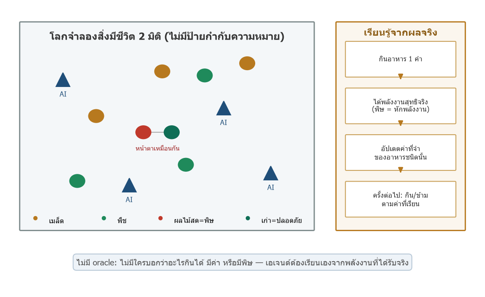
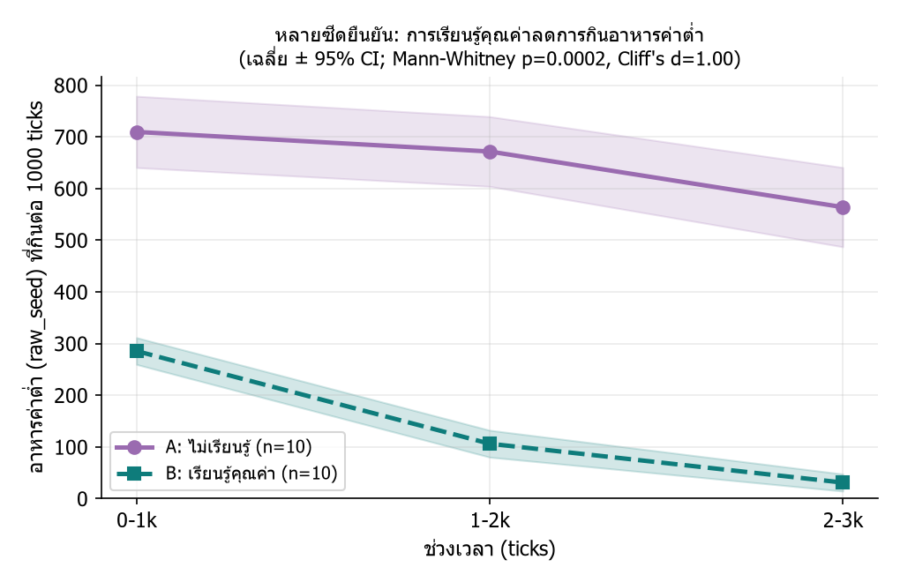
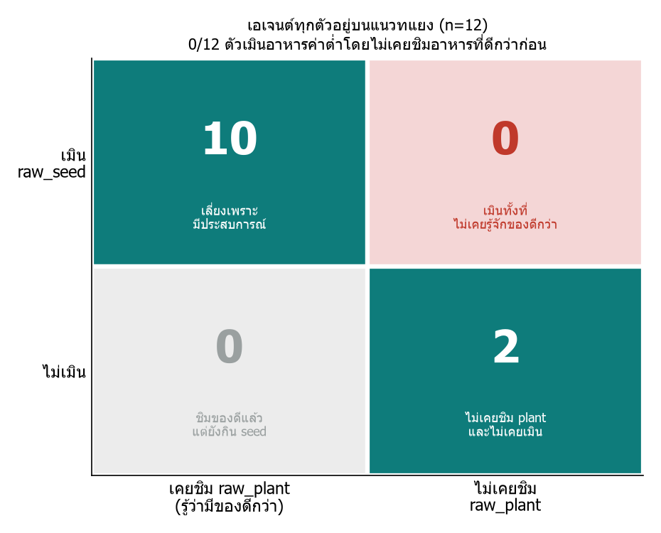
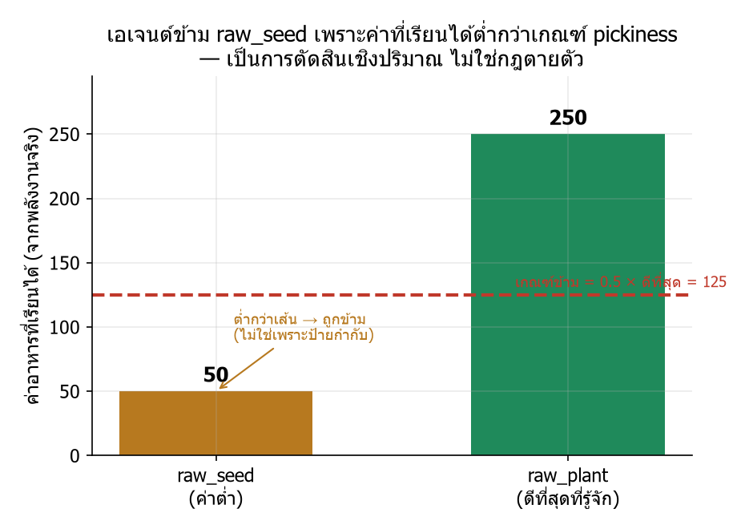

# ปก

## รายงานโครงงานวิทยาศาสตร์

**AI ที่เรียนรู้เองว่าอะไรกินได้และอะไรเป็นพิษ และกับดักของ "พิษที่หายได้":**
**บทเรียนความปลอดภัยจากโลกจำลองสิ่งมีชีวิตที่ไม่มีป้ายกำกับ (Artificial Evolution)**

เนื่องในการแข่งขันวิทยาศาสตร์วิชาการ ครั้งที่ 5 ชิงถ้วยพระราชทาน
สมเด็จพระกนิษฐาธิราชเจ้า กรมสมเด็จพระเทพรัตนราชสุดาฯ สยามบรมราชกุมารี

จัดทำโดย

นายชิษณุพงศ์ อินทร์จันทร์

ครูที่ปรึกษาโครงงาน

นายบพิธ มังคะลา

โรงเรียนดีบุกพังงาวิทยายน
สำนักงานเขตพื้นที่การศึกษามัธยมศึกษาพังงา ภูเก็ต ระนอง

รายงานฉบับนี้เป็นส่วนประกอบของโครงงานวิทยาศาสตร์
ประเภท **ทดลอง** ระดับมัธยมศึกษาตอนปลาย

---

# ปกใน

## รายงานโครงงานวิทยาศาสตร์

**AI ที่เรียนรู้เองว่าอะไรกินได้และอะไรเป็นพิษ และกับดักของ "พิษที่หายได้":**
**บทเรียนความปลอดภัยจากโลกจำลองสิ่งมีชีวิตที่ไม่มีป้ายกำกับ (Artificial Evolution)**

เนื่องในการแข่งขันวิทยาศาสตร์วิชาการ ครั้งที่ 5 ชิงถ้วยพระราชทาน
สมเด็จพระกนิษฐาธิราชเจ้า กรมสมเด็จพระเทพรัตนราชสุดาฯ สยามบรมราชกุมารี

โดย

นายชิษณุพงศ์ อินทร์จันทร์

ครูที่ปรึกษาโครงงาน

นายบพิธ มังคะลา

รายงานฉบับนี้เป็นส่วนประกอบของโครงงานวิทยาศาสตร์
ประเภท **ทดลอง** ระดับมัธยมศึกษาตอนปลาย

---

# คำนำ

รายงานฉบับนี้เป็นส่วนหนึ่งของโครงงานวิทยาศาสตร์ ประเภททดลอง ระดับมัธยมศึกษาตอนปลาย จัดทำขึ้นเพื่อนำเสนอในการแข่งขันวิทยาศาสตร์วิชาการ ครั้งที่ 5 ชิงถ้วยพระราชทานสมเด็จพระกนิษฐาธิราชเจ้า กรมสมเด็จพระเทพรัตนราชสุดาฯ สยามบรมราชกุมารี

โครงงานนี้เริ่มจากคำถามง่าย ๆ ว่า ถ้าปล่อยปัญญาประดิษฐ์ลงในโลกที่ "ไม่มีใครบอกอะไรเลย" — ไม่มีป้ายบอกว่าอะไรกินได้ อะไรมีค่า หรืออะไรมีพิษ — มันจะเรียนรู้เองได้ไหม ผู้จัดทำสร้างโลกจำลองสิ่งมีชีวิตขึ้นเพื่อทดสอบ และพบสองเรื่องที่ต่อเนื่องกัน เรื่องแรกคือปัญญาประดิษฐ์เรียนรู้เองได้จริง ทั้งการเลือกอาหารที่คุ้มค่ากว่าและการเลี่ยงอาหารพิษ เรื่องที่สองซึ่งเป็นหัวใจของรายงานคือ เมื่อทำให้พิษ "เหมือนจริง" ขึ้น กล่าวคือเปลี่ยนไปตามเวลา (อาหารสดมีพิษ เก็บไว้แล้วหายพิษ) ปัญญาประดิษฐ์ตัวเดิมกลับถูกหลอกให้กินพิษมากขึ้น ไม่ใช่น้อยลง

เนื้อหาแบ่งเป็น 5 บท ได้แก่ บทนำ เอกสารและทฤษฎีที่เกี่ยวข้อง วิธีดำเนินการทดลอง ผลการทดลอง และบทสรุปพร้อมอภิปรายและข้อเสนอแนะ จุดยืนที่ผู้จัดทำยึดตลอดเล่มคือ การสรุปเฉพาะเท่าที่หลักฐานรองรับ และระบุชัดเจนว่าสิ่งใด "ยังไม่ควรอ้าง" เพื่อให้รายงานซื่อตรงต่อข้อมูลมากที่สุด

ผู้จัดทำหวังว่ารายงานนี้จะเป็นประโยชน์ต่อผู้สนใจการเรียนรู้ของปัญญาประดิษฐ์ในสภาพแวดล้อมที่อันตรายเปลี่ยนแปลงได้ และยินดีรับคำแนะนำเพื่อพัฒนาต่อไป

นายชิษณุพงศ์ อินทร์จันทร์

---

# บทคัดย่อ

ปัญญาประดิษฐ์ที่เก่งที่สุดทุกวันนี้ เช่น แบบจำลองภาษาขนาดใหญ่อย่าง GPT เก่งได้เพราะเรียนจากข้อมูลมหาศาลที่มนุษย์สร้างและ**ปักป้ายกำกับ**ไว้ล่วงหน้า แต่ในโลกจริงหลายแห่ง เช่น พื้นที่ภัยพิบัติ ใต้ทะเลลึก หรือดาวดวงอื่น มนุษย์เองก็ไม่รู้คำตอบล่วงหน้าและปักป้ายให้ไม่ได้ อีกทั้ง **อันตรายก็เปลี่ยนไปตามเวลา** คำถามคือ ในที่ที่ไม่มีป้ายให้ ปัญญาประดิษฐ์จะเรียนรู้เองจากผลจริงได้ไหม และปลอดภัยแค่ไหน โครงงานนี้จึงสร้างโลกจำลองสิ่งมีชีวิต (Artificial Life) ที่เอเจนต์ปัญญาประดิษฐ์ต้องหากินเพื่ออยู่รอด โดยไม่มีป้ายบอกว่าอะไรกินได้ อะไรมีค่า หรืออะไรมีพิษ ทุกอย่างเป็นฟิสิกส์ล้วน เอเจนต์ต้องเรียนคุณค่าจาก "พลังงานสุทธิที่ได้รับจริง"

การทดลองแบ่งเป็นสองส่วน ส่วนที่หนึ่งเป็นรากฐาน ทดสอบว่าเอเจนต์เรียนรู้เองได้จริงหรือไม่ พบว่าเอเจนต์เรียนเลือกอาหารที่คุ้มค่ากว่าได้เอง (ลดการกินอาหารค่าต่ำลง 4.6 เท่าเมื่อเทียบกับกลุ่มควบคุมที่ปิดการเรียนรู้ ทดสอบ 10 ซีดด้วยสถิติ Mann-Whitney U ได้ p = 0.0002 และ effect size แยกขาดสมบูรณ์) และการวิเคราะห์รายตัวยืนยันว่าไม่มีเอเจนต์แม้แต่ตัวเดียวที่เมินอาหารค่าต่ำโดยไม่เคยชิมอาหารที่ดีกว่าก่อน (0 จาก 12) นอกจากนี้เมื่อใส่อาหารที่มีพิษคงที่ เอเจนต์ก็เรียนเลี่ยงได้เองจากผลจริง

ส่วนที่สองซึ่งเป็นข้อค้นพบหลัก ทำให้พิษเปลี่ยนตามเวลา คืออาหารสดมีพิษ (พลังงานสุทธิต่ำ) แต่เมื่อเก็บไว้จะหายพิษและให้พลังงานสูง เอเจนต์ที่มองไม่เห็น "อายุ" ของอาหารเรียนได้แค่ค่าเฉลี่ยของสองสภาพ ซึ่งถูกดันให้สูงกว่าอาหารปลอดภัย จึงจัด "ผลไม้พิษ" เป็นอาหารดีที่สุดที่มุ่งเป้าไปหา แม้พิษจะโผล่ถึง 30% ของครั้ง สัดส่วนเอเจนต์ที่ถูกหลอก (จัดผลไม้พิษไว้เหนืออาหารปลอดภัย) สูงถึง **63%** สำหรับกฎที่ระวังตัว และ **99%** สำหรับกฎที่สำรวจต่ออย่าง softmax โดยผลด้านพฤติกรรมคือกินพิษจริงราว **30% ของมื้อ** ปรากฏการณ์นี้เกิดกับกฎการเรียนรู้มาตรฐานทั้ง 4 แบบ และยิ่งกฎสำรวจเก่ง ยิ่งถูกหลอกหนักขึ้น เมื่อพิษมีรูปแบบซับซ้อน (ปลอดภัยเป็นบางช่วง) เอเจนต์เล็งช่วงปลอดภัยไม่ได้เลย (แยกได้ **0%**) ผลทั้งหมดรันหลายซีดพร้อมช่วงความเชื่อมั่น 95% ระบบผ่านการทดสอบอัตโนมัติ 93 จาก 93 รายการ

ข้อสรุปหลักคือหลักการความปลอดภัยที่ว่า **ปัญญาประดิษฐ์ที่ตัดสินจาก "ชนิด" ของสิ่งของจะพลาดเมื่ออันตรายขึ้นกับ "สภาพ" (อายุ/เวลา) ที่มองไม่เห็น** และ "อันตรายที่เกิดเป็นบางช่วง" อาจถูกประเมินต่ำและอันตรายกว่า "อันตรายที่คงที่" ทางแก้ไม่ใช่การกลับไปปักป้ายทุกอย่าง แต่คือการให้ปัญญาประดิษฐ์รับรู้ "สัญญาณบอกสภาพ" (เช่น ความสด) เพื่อแยกอันตรายที่ซ่อนตามเวลาได้เอง

**คำสำคัญ:** Artificial Life, การจำลองแบบเอเจนต์, การเรียนรู้จากประสบการณ์, การเลี่ยงพิษ, ความปลอดภัยของปัญญาประดิษฐ์, การรับรู้ไม่สมบูรณ์ (partial observability)

---

# กิตติกรรมประกาศ

โครงงานนี้สำเร็จได้ด้วยการสนับสนุนของครูที่ปรึกษา โรงเรียนดีบุกพังงาวิทยายน และผู้ที่ให้คำแนะนำด้านการตั้งคำถามวิจัย การออกแบบการทดลอง และการตรวจสอบข้อสรุปให้ตรงกับหลักฐาน ผู้จัดทำขอขอบคุณทุกท่านที่ช่วยให้โครงงานพัฒนาจากการสร้างระบบจำลอง ไปสู่การทดลองที่มีสมมติฐาน ตัวแปร กลุ่มควบคุม และข้อจำกัดที่ตรวจสอบได้ และขอบคุณเป็นพิเศษสำหรับคำเตือนเรื่องการไม่ตีความผลเกินกว่าที่ข้อมูลรองรับ ซึ่งเป็นหัวใจของรายงานฉบับนี้

---

# สารบัญ

| รายการ | หน้า |
| --- | ---: |
| คำนำ | 3 |
| บทคัดย่อ | 4 |
| กิตติกรรมประกาศ | 6 |
| สารบัญตาราง | 8 |
| สารบัญภาพ | 9 |
| บทที่ 1 บทนำ | 10 |
| บทที่ 2 เอกสารและทฤษฎีที่เกี่ยวข้อง | 12 |
| บทที่ 3 วิธีดำเนินการทดลอง | 14 |
| บทที่ 4 ผลการทดลอง | 19 |
| บทที่ 5 สรุป อภิปรายผล และข้อเสนอแนะ | 27 |
| บรรณานุกรม | 31 |
| ภาคผนวก | 32 |

---

# สารบัญตาราง

| ตาราง | รายการ | หน้า |
| --- | --- | ---: |
| ตารางที่ 1 | คำถามวิจัยและสมมติฐาน | 11 |
| ตารางที่ 2 | ตัวแปรในการทดลอง | 16 |
| ตารางที่ 3 | ชุดการทดลองและเงื่อนไข | 17 |
| ตารางที่ 4 | ผลการเรียนรู้คุณค่าอาหารระดับประชากร (หลายซีด) | 20 |
| ตารางที่ 5 | สัดส่วนเอเจนต์ที่ถูกล่อ (lure) ตามความถี่พิษและกฎการเรียนรู้ | 24 |
| ตารางที่ 6 | สรุปผลตามสมมติฐาน | 26 |
| ตารางที่ 7 | ข้อสรุปที่อ้างได้และที่ยังไม่ควรอ้าง | 29 |

---

# สารบัญภาพ

| ภาพ | รายการ | หน้า |
| --- | --- | ---: |
| ภาพที่ 1 | ภาพรวมโลกจำลอง 2 มิติ และวงจรการเรียนรู้จากพลังงานจริง | 15 |
| ภาพที่ 2 | การเรียนรู้ลดการกินอาหารค่าต่ำ (หลายซีด, แถบ 95% CI) | 19 |
| ภาพที่ 3 | ไม่มีเอเจนต์เมิน seed โดยไม่เคยชิมอาหารที่ดีกว่า (2×2) | 21 |
| ภาพที่ 4 | ค่าอาหารที่เรียนได้และเส้นเกณฑ์การข้าม | 21 |
| ภาพที่ 5 | เอเจนต์เรียนเลี่ยงอาหารพิษคงที่ได้เอง | 22 |
| ภาพที่ 6 | พิษที่หายได้ล่อให้เอเจนต์มุ่งกินพิษ (หลายซีด, 95% CI) | 23 |
| ภาพที่ 7 | บริเวณการเกิด lure ทั่วช่วงพารามิเตอร์ | 23 |
| ภาพที่ 8 | lure เกิดกับกฎการเรียนรู้ทั้ง 4 แบบ | 24 |
| ภาพที่ 9 | พิษไม่โมโนโทนิก เล็งหน้าต่างปลอดภัยไม่ได้ (discrimination = 0) | 25 |

---

# บทที่ 1 บทนำ

## 1.1 ที่มาและความสำคัญของโครงงาน

ปัญญาประดิษฐ์ที่เก่งที่สุดในปัจจุบัน เช่น แบบจำลองภาษาขนาดใหญ่อย่าง GPT เก่งได้เพราะเรียนจากข้อมูลมหาศาลที่มนุษย์สร้างและปักป้ายกำกับไว้ล่วงหน้า แต่ในโลกจริงหลายแห่ง มนุษย์เองก็ไม่รู้คำตอบล่วงหน้าและปักป้ายกำกับให้ไม่ได้ เช่น หุ่นยนต์สำรวจในพื้นที่ภัยพิบัติหรือดาวดวงอื่น ที่ต้องตัดสินใจเองว่าสิ่งใดปลอดภัยหรืออันตราย ยิ่งไปกว่านั้น ในธรรมชาติ **ความเป็นอันตรายของสิ่งต่าง ๆ มักเปลี่ยนไปตามเวลา** เช่น ผลไม้ดิบมีพิษ พอสุกจึงกินได้ เก็บนานเกินไปก็เน่าเป็นพิษอีก

โครงงานนี้จึงตั้งคำถามพื้นฐานว่า ถ้าวางเอเจนต์ปัญญาประดิษฐ์ลงในโลกที่ไม่มีป้ายบอกอะไรเลย และไม่ได้สอนกลยุทธ์ใด ๆ ล่วงหน้า มันจะเรียนรู้ได้เองไหมว่าอะไรกินได้ อะไรมีค่า และอะไรมีพิษ และที่สำคัญกว่านั้นคือ เมื่ออันตรายของอาหารเปลี่ยนไปตามเวลา การเรียนรู้แบบง่าย ๆ จะรับมือได้หรือไม่ คำตอบของคำถามที่สองนำไปสู่บทเรียนด้านความปลอดภัยของปัญญาประดิษฐ์ที่นำไปใช้ได้กว้าง

ตัวอย่างที่ใกล้ตัวคนไทย เช่น เห็ดป่าที่เก็บกินแล้วมีผู้เสียชีวิตแทบทุกปี หรืออาหารหมักดองที่ปลอดภัยเฉพาะบางช่วงเวลา ล้วนเป็น "อันตรายที่เปลี่ยนตามเวลา" แบบเดียวกับที่โครงงานนี้จำลอง เมื่อในอนาคตเราให้ปัญญาประดิษฐ์ช่วยคัดกรองความปลอดภัยของอาหารหรือสิ่งแวดล้อม การรู้ล่วงหน้าว่าการเรียนรู้แบบใดจะ "ถูกหลอก" จึงมีคุณค่าต่อการออกแบบระบบที่ปลอดภัย

## 1.2 วัตถุประสงค์ของโครงงาน

1. สร้างโลกจำลองสิ่งมีชีวิตที่ไม่มีป้ายกำกับความหมาย และให้เอเจนต์เรียนคุณค่าอาหารจากพลังงานที่ได้รับจริง
2. ทดสอบว่าเอเจนต์เรียนเลือกอาหารที่คุ้มค่ากว่า และเลี่ยงอาหารพิษได้เองหรือไม่ (โดยไม่เขียนกฎพฤติกรรมให้)
3. ทดสอบว่าเมื่ออันตรายของอาหารเปลี่ยนตามเวลา (พิษที่หายได้ และพิษแบบไม่โมโนโทนิก) การเรียนรู้แบบง่ายรับมือได้หรือไม่ และเกิดอะไรขึ้น
4. สรุปหลักการที่ได้อย่างซื่อตรง โดยระบุขอบเขตที่อ้างได้และที่ยังไม่ควรอ้าง

## 1.3 สมมติฐาน

| สมมติฐาน | ข้อความ |
| --- | --- |
| H1 | ถ้าไม่มีกลไกจดจำคุณค่า เอเจนต์จะกินอาหารค่าต่ำต่อไปโดยไม่เลือก |
| H2 | ถ้าเปิดกลไกจดจำคุณค่าจากพลังงานจริง เอเจนต์จะลดการกินอาหารค่าต่ำลง |
| H3 | การเปลี่ยนพฤติกรรมเกิดจากประสบการณ์ตรงรายตัว (ต้องเคยชิมก่อน) |
| H4 | เมื่ออาหารมีพิษคงที่ เอเจนต์จะเรียนเลี่ยงได้เอง |
| H5 | เมื่อพิษเปลี่ยนตามเวลา (สด=พิษ เก่า=ปลอดภัย) การเรียนรู้ต่อชนิดจะรับมือไม่ได้ |

**ตารางที่ 1** คำถามวิจัยและสมมติฐานของโครงงาน

## 1.4 ขอบเขตการศึกษา

โครงงานนี้ทดสอบในโลกจำลองสองมิติแบบเอเจนต์ ไม่ใช่หุ่นยนต์จริงหรือชีวเคมีระดับโมเลกุล ค่าพลังงานและพิษเป็นหน่วยนามธรรมที่ออกแบบให้ชัดเจน การทดลองการเรียนรู้รันในสภาพที่เอเจนต์มีพลังงานเพียงพอ (ไม่อดอยากถาวร) เพื่อแยกกลไกการเรียนรู้ออกจากปัจจัยเรื่องการหาอาหารไม่พอ รายงานนี้เน้นสองสายผลคือ การเรียนรู้คุณค่าอาหาร และการเรียนรู้เกี่ยวกับพิษ (พิษคงที่และพิษตามอายุ) โดยไม่รวมรายละเอียดของโมดูลอื่นในแพลตฟอร์ม

---

# บทที่ 2 เอกสารและทฤษฎีที่เกี่ยวข้อง

## 2.1 Artificial Life และพฤติกรรมที่เกิดเอง

Artificial Life (ALife) ศึกษาการจำลองกระบวนการของสิ่งมีชีวิตในระบบที่มนุษย์สร้างขึ้น [1, 2] แนวคิดหลักคือพฤติกรรมที่ซับซ้อนควร "เกิดเอง (emerge)" จากกฎฟิสิกส์และการคัดเลือก มากกว่าจะถูกเขียนด้วยมือ งานคลาสสิกเช่นการวิวัฒน์สิ่งมีชีวิตเสมือนของ Sims (1994) [3] แสดงว่าพฤติกรรมการเคลื่อนไหวและการแข่งขันเกิดขึ้นได้เองจากการคัดเลือก โครงงานนี้ยึดหลักเดียวกัน คือให้คุณค่าและการเลือกอาหารเกิดจากผลจริง ไม่ใช่จากป้ายกำกับ

## 2.2 การเรียนรู้จากประสบการณ์และรางวัล

การเรียนรู้แบบเสริมกำลัง (reinforcement learning) อธิบายว่าสิ่งมีชีวิตหรือเอเจนต์ปรับพฤติกรรมตามผลตอบแทนที่ได้รับ [6] ในโครงงานนี้ "รางวัล" คือพลังงานสุทธิที่ได้จากการกินอาหารแต่ละคำ เอเจนต์ปรับค่าที่จดจำไว้ของอาหารแต่ละชนิดตามพลังงานจริง แล้วใช้ค่านั้นตัดสินใจว่าจะกินหรือข้าม

## 2.3 การเลือกอาหารตามคุณค่า (optimal foraging)

ทฤษฎีการหาอาหารที่เหมาะสม (optimal foraging) อธิบายว่าสัตว์ควรเลือกกินอาหารที่ให้ผลตอบแทนสุทธิสูงสุด เมื่อมีอาหารหลายชนิดที่คุ้มค่าต่างกัน พฤติกรรมที่คาดหวังคือการเลี่ยงอาหารที่ให้พลังงานต่ำเมื่อมีทางเลือกที่ดีกว่า โครงงานนี้ใช้หลักการนี้เป็นเกณฑ์วัดว่าเอเจนต์ "เรียนรู้คุณค่า" ได้จริงหรือไม่

## 2.4 การรับรู้ไม่สมบูรณ์และการให้เครดิตย้อนเวลา

เมื่ออันตรายของอาหารขึ้นกับ "สภาพ" (เช่น อายุ) ที่เอเจนต์มองไม่เห็น ปัญหาจะกลายเป็นการตัดสินใจภายใต้การรับรู้ไม่สมบูรณ์ (partial observability / perceptual aliasing) [4, 5] คือสิ่งที่ดูเหมือนกันภายนอกอาจมีผลต่างกัน ทำให้ผู้เรียนที่จำค่าเป็น "ต่อชนิด" แยกไม่ออก อีกทั้งการ "เก็บอาหารไว้ให้หายพิษก่อนกิน" ต้องอาศัยการให้เครดิตรางวัลที่เกิดขึ้นภายหลัง (temporal credit assignment) [6] ซึ่งเป็นข้อจำกัดคลาสสิกของการเรียนรู้

## 2.5 คู่ขนานทางชีววิทยา: การเรียนเลี่ยงพิษแบบมีสัญญาณจำแนก

ในทางชีววิทยา สัตว์เรียน "การเลี่ยงรสที่ทำให้ป่วย" (taste aversion) ได้ และงานคลาสสิกของ Garcia & Koelling (1966) [7] แสดงว่าการเรียนเลี่ยงแบบมีเงื่อนไขจะเกิดได้ก็ต่อเมื่อมี "สัญญาณจำแนก" ที่เชื่อมโยงกับผลได้ ซึ่งอธิบายว่าทำไมการกินของที่ปลอดภัยเป็นบางช่วงจึงต้องอาศัยสัญญาณ (เช่น สี กลิ่นความสุก) ผลของโครงงานนี้สอดคล้องกับหลักการนั้นในระบบจำลอง

---

# บทที่ 3 วิธีดำเนินการทดลอง

## 3.1 ภาพรวมวิธีวิจัย

ผู้จัดทำสร้างโลกจำลองสองมิติแบบเอเจนต์ที่ยึดหลัก "ไม่มี oracle" คือโลกไม่บอกว่าอะไรมีค่าหรือมีพิษเท่าไร เอเจนต์ต้องเรียนจากพลังงานสุทธิที่ได้รับจริง การทดลองแบ่งเป็นสามชุด (§3.5–3.7) โดยชุดแรกสองชุดเป็น "รากฐาน" ที่พิสูจน์ว่ากลไกการเรียนรู้ทำงานถูกต้องในกรณีที่อันตราย/คุณค่าคงที่ และชุดที่สามเป็น "ข้อค้นพบหลัก" ที่ทดสอบเมื่ออันตรายเปลี่ยนตามเวลา

แม้จะเป็นโลกจำลอง แต่ระเบียบวิธีของโครงงานนี้เป็น **การทดลองทางวิทยาศาสตร์เต็มรูปแบบ**: มีสมมติฐานที่ทดสอบได้ (บท 1.3) มีตัวแปรต้น ตัวแปรตาม และตัวแปรควบคุมที่กำหนดชัด (ตารางที่ 2) มีกลุ่มควบคุมเปรียบเทียบ และทำซ้ำหลายซีดพร้อมการวิเคราะห์สถิติ ข้อได้เปรียบของโลกจำลองคือควบคุมตัวแปรได้แม่นยำและทำซ้ำได้ 100% ซึ่งทำได้ยากในสิ่งมีชีวิตจริง จึงเหมาะกับการใช้เป็น "สนามทดสอบ" เพื่อค้นหาหลักความปลอดภัยล่วงหน้า ในสภาพแวดล้อมที่มนุษย์ยังไม่มีองค์ความรู้เพียงพอ

## 3.2 วัสดุ อุปกรณ์ และซอฟต์แวร์

- ระบบจำลอง Artificial Evolution พัฒนาด้วยภาษา Python (เอนจินโลก เอเจนต์ เมแทบอลิซึม)
- สคริปต์การทดลองและการวิเคราะห์สถิติ/กราฟ (Python + matplotlib) ที่ commit ไว้และรันซ้ำได้
- ชุดทดสอบอัตโนมัติ (unit tests) สำหรับกลไกใหม่ทุกตัว
- เครื่องคอมพิวเตอร์ส่วนบุคคลสำหรับรันการทดลองหลายซีด

## 3.3 โครงสร้างระบบที่เกี่ยวข้อง

ภาพรวมของโลกจำลองและวงจรการเรียนรู้แสดงในภาพที่ 1



**การเรียนคุณค่าอาหาร:** เมื่อเอเจนต์กินอาหารหนึ่งคำ ระบบจะบันทึกพลังงานสุทธิที่ได้เข้าสู่ความจำคุณค่าอาหาร (food-value memory) ต่อชนิด เอเจนต์ตัดสินใจกินหรือข้ามโดยเทียบค่าที่จำได้กับเกณฑ์ความเลือกกิน (pickiness) คือจะข้ามอาหารที่มีค่าต่ำกว่าสัดส่วนที่กำหนดของอาหารที่ดีที่สุดที่รู้จัก

**พิษ:** อาหารบางชนิด (เช่น `raw_fruit`) ให้พลังงานสูงแต่มีพิษ เมื่อพิษเกินระดับที่ยีนทนได้ ระบบจะหักพลังงานสุทธิของคำนั้น (ผลเฉียบพลัน) ค่าที่หักจะไหลเข้าสู่ความจำคุณค่าอาหารเช่นเดียวกับอาหารทั่วไป เอเจนต์จึง "เรียนเลี่ยงได้เอง" โดยไม่ต้องเขียนกฎการเลี่ยงเพิ่ม

**พิษตามอายุ:** ระบบสามารถตั้งให้ความเป็นพิษของอาหารเปลี่ยนตามอายุของชิ้นอาหาร มีสามโหมด (เปิดใช้ได้ตามต้องการ ปิดแล้วผลเดิมไม่เปลี่ยน): (ก) พิษคงที่ (ข) พิษจางตามอายุ (สด=พิษ เก่า=ปลอดภัย) และ (ค) หน้าต่างปลอดภัยแบบไม่โมโนโทนิก (พิษ → ปลอดภัยช่วงหนึ่ง → พิษอีก เลียนแบบดิบ → สุก → เน่า)

## 3.4 ตัวแปรในการทดลอง

| ประเภทตัวแปร | รายการ |
| --- | --- |
| ตัวแปรต้น | การเปิด/ปิดกลไกเรียนรู้คุณค่า; รูปแบบพิษ (คงที่/จางตามอายุ/หน้าต่างไม่โมโนโทนิก); ความถี่และความรุนแรงของพิษ; กฎการเรียนรู้ |
| ตัวแปรตาม | จำนวนมื้ออาหารค่าต่ำที่กิน; ความน่าจะเป็นที่เลือกกินอาหารพิษ; สัดส่วนเอเจนต์ที่ถูกล่อ (lure); ความสามารถแยกช่วงปลอดภัย (discrimination) |
| ตัวแปรควบคุม | คอนฟิกโลกเดียวกันทั้งสองกลุ่ม; ซีดสุ่มเดียวกันเมื่อเทียบ; สภาพพลังงานเพียงพอ |

**ตารางที่ 2** ตัวแปรในการทดลอง

## 3.5 การทดลองที่ 1: การเรียนรู้คุณค่าอาหาร (รากฐาน)

วางเอเจนต์ในโลกที่มีอาหารสองชนิดไม่มีป้ายบอกคุณค่า คือ `raw_seed` (ค่าต่ำ) และ `raw_plant` (ค่าสูงกว่าประมาณ 5 เท่า) เปรียบเทียบสองกลุ่ม: กลุ่ม A ปิดการเรียนรู้ (กินแบบไม่สนใจคุณค่า) กับกลุ่ม B เปิดการเรียนรู้คุณค่า ทดลองสามระดับ: (1) ระดับประชากรหลายซีดเพื่อทดสอบสถิติ (2) ระดับรายตัวเพื่อดูว่าการเมินผูกกับการเคยชิมหรือไม่ (3) กลุ่มควบคุมปิดความจำในคอนฟิกรายตัวเดียวกัน

## 3.6 การทดลองที่ 2: การเลี่ยงพิษคงที่ (รากฐาน)

ใส่อาหารพิษที่มีพิษ **คงที่** (ไม่เปลี่ยนตามอายุ) แล้ววัดความน่าจะเป็นที่เอเจนต์เลือกกินอาหารพิษนั้นตามเวลา และดูระดับรายตัวว่าการเลี่ยงสัมพันธ์กับยีนความทนพิษหรือไม่

## 3.7 การทดลองที่ 3: พิษตามอายุ (ข้อค้นพบหลัก)

ใช้แบบจำลองสองสภาพที่ชัดเจน: อาหารสด (อายุ 0) = มีพิษ พลังงานสุทธิ 2 (ต่ำกว่าอาหารปลอดภัยที่ 5) ส่วนอาหารเก่า (อายุถึงเกณฑ์) = ปลอดภัย พลังงานสุทธิ 10 โดยเอเจนต์มองไม่เห็นอายุของชิ้นอาหาร (เห็นแค่ว่าเป็น "ผลไม้") วัดสัดส่วนเอเจนต์ที่ถูกล่อให้จัดอาหารพิษเป็นอาหารดีที่สุด (lure) ที่ความถี่พิษต่าง ๆ และทดสอบซ้ำด้วยกฎการเรียนรู้ 4 แบบ จากนั้นทดสอบพิษแบบไม่โมโนโทนิก (มีหน้าต่างปลอดภัยช่วงกลาง) แล้ววัดความสามารถแยกช่วงปลอดภัย

**หมายเหตุระเบียบวิธี:** การทดลองเกี่ยวกับพิษ (ชุดที่ 2 และ 3) วัดใน *สภาพการเลือกซ้ำที่ควบคุม* คือให้เอเจนต์เผชิญอาหารซ้ำหลายครั้ง โดยใช้ฟิสิกส์พิษและกลไกการเรียนรู้ค่าอาหารตัวจริง แต่ **ตัดปัจจัยการเดินหาอาหารเชิงพื้นที่ออกโดยตั้งใจ** เพื่อแยกผลของ "การเรียนรู้" ออกจาก "การหาอาหาร" ให้เห็นชัด (ต่างจากการทดลองที่ 1 เรื่องคุณค่าอาหาร ที่รันในโลก 2 มิติเต็มโดยเอเจนต์เดินหาอาหารเอง) การแยกเช่นนี้เป็นการควบคุมตัวแปร ไม่ใช่การลดทอนความสมจริงของผล เพราะกลไกการเรียนรู้ที่ทดสอบเป็นตัวเดียวกัน

สรุปสามชุดการทดลองและเงื่อนไขแสดงในตารางที่ 3

| ชุดการทดลอง | เงื่อนไขอาหาร/พิษ | สิ่งที่วัด |
| --- | --- | --- |
| ที่ 1 (รากฐาน) | อาหาร 2 ชนิดค่าต่างกัน ไม่มีพิษ | การเลือกอาหารที่คุ้มค่ากว่า |
| ที่ 2 (รากฐาน) | อาหารมีพิษคงที่ | การเรียนเลี่ยงพิษ |
| ที่ 3 (ข้อค้นพบหลัก) | พิษเปลี่ยนตามอายุอาหาร (หายได้ + หน้าต่างปลอดภัย) | การถูกล่อ (lure) และการแยกช่วงปลอดภัย |

**ตารางที่ 3** ชุดการทดลองและเงื่อนไข

## 3.8 การวิเคราะห์ข้อมูลและสถิติ

- ระดับประชากร: เทียบจำนวนมื้ออาหารค่าต่ำ/มื้อพิษระหว่างกลุ่ม รายงานค่าเฉลี่ย ± ช่วงความเชื่อมั่น 95%
- การทดสอบนัยสำคัญ: ใช้ Mann-Whitney U (เหมาะกับกลุ่มตัวอย่างเล็กและไม่จำเป็นต้องแจกแจงปกติ) รายงาน effect size ด้วย Cliff's delta
- ระดับรายตัว: ตรวจว่าการเมินอาหารผูกกับการเคยชิมของแต่ละตัวหรือไม่
- การทำซ้ำ: รันหลายซีด (ผลพิษ 30 ซีด × 100 เอเจนต์) และยืนยันว่าปิดกลไกแล้วผลเดิมไม่เปลี่ยน (byte-identical)

---

# บทที่ 4 ผลการทดลอง

## 4.1 องก์ที่ 1 — เอเจนต์เรียนเลือกอาหารที่คุ้มค่ากว่า

เมื่อเปิดกลไกเรียนรู้คุณค่า เอเจนต์เรียนได้ว่าค่าของ `raw_seed` เท่ากับ 50 ส่วน `raw_plant` เท่ากับ 250 (จากพลังงานที่ได้รับจริง) ด้วยเกณฑ์ความเลือกกิน 0.5 เอเจนต์จะข้ามอาหารที่ต่ำกว่า 125 (ครึ่งหนึ่งของอาหารดีที่สุด) ดังนั้น `raw_seed` (50) จึงต่ำกว่าเกณฑ์และถูกข้าม



การทดสอบระดับประชากรหลายซีดเปรียบเทียบกลุ่มปิดการเรียนรู้ (A) กับกลุ่มเปิด (B) ในคอนฟิกเดียวกัน พบว่ากลุ่ม B กินอาหารค่าต่ำ **น้อยกว่า 4.6 เท่า** ผลแยกขาดสมบูรณ์คือทุกซีดของกลุ่ม B กินน้อยกว่าทุกซีดของกลุ่ม A

| กลุ่ม | ค่าเฉลี่ยมื้อ raw_seed ± 95% CI | สถิติ |
| --- | --- | --- |
| A ปิดการเรียนรู้ | 1,945.3 ± 177.5 | Mann-Whitney U = 0 |
| B เปิดการเรียนรู้ | 423.0 ± 46.6 | p = 0.0002 |
| อัตราส่วน A/B | 4.6 เท่า | Cliff's delta = 1.00 (แยกขาด) |

**ตารางที่ 4** ผลการเรียนรู้คุณค่าอาหารระดับประชากร (กลุ่ม A 10 ซีด, กลุ่ม B 10 ซีด, 3000 ticks)

หลักฐานที่สำคัญที่สุดมาจากระดับรายตัว จากเอเจนต์ 12 ตัว มี 10 ตัวเริ่มเมิน `raw_seed` และทั้ง 10 ตัวล้วนเคยชิมทั้ง `raw_seed` และ `raw_plant` มาก่อน ส่วน 2 ตัวที่ยังไม่เคยชิม `raw_plant` ก็ยังไม่เมิน และ **ไม่มีเอเจนต์แม้แต่ตัวเดียวที่เมิน `raw_seed` โดยไม่เคยชิมอาหารที่ดีกว่า (0 จาก 12)**





เมื่อทดสอบกลุ่มควบคุมที่ปิดความจำคุณค่าในคอนฟิกและซีดเดียวกัน เอเจนต์ไม่เมิน `raw_seed` เลย (0 จาก 12 ตัว) และกินอาหารค่าต่ำมากขึ้นประมาณ 3.5 เท่า ยืนยันว่าการเมินเกิดจากกลไกความจำจริง ไม่ใช่จากคอนฟิกหรือซีด สรุปได้ว่าการเปลี่ยนพฤติกรรมมาจากประสบการณ์ตรงรายตัว ไม่ได้ถูกเขียนฝังไว้ในโค้ด (สนับสนุน H1, H2, H3)

## 4.2 องก์ที่ 1 (ต่อ) — เอเจนต์เรียนเลี่ยงอาหารพิษคงที่ได้เอง

เมื่อใส่อาหารพิษที่มีพิษคงที่ เอเจนต์เริ่มจากการชิม (เพราะไม่มีป้ายบอก) แล้วเรียนเลี่ยงได้เอง ความน่าจะเป็นที่เลือกกินลดจากประมาณ 100% เหลือใกล้ 0% ภายในประมาณ 9 รอบ ในขณะที่ถ้าไม่มีกลไกเรียนรู้ ค่านี้คงที่ที่ 100%


ระดับรายตัวพบว่าทุกตัวชิมพิษก่อนแล้วเลี่ยงในเวลาที่ต่างกันตามยีนความทนพิษ ตัวที่ทนต่ำเลี่ยงเร็ว ตัวที่ทนสูงกินต่อได้นานกว่า พฤติกรรมจึงถูกกำหนดโดยยีน ซึ่งเป็นฐานให้เกิดการคัดเลือกข้ามรุ่นได้ (สนับสนุน H4)

> สรุปองก์ที่ 1: กลไก "เรียนจากพลังงานจริง" ทำงานถูกต้องและทำซ้ำได้ทั้งกับคุณค่าอาหารและพิษคงที่ — นี่คือรากฐานที่ทำให้ผลพลิกในองก์ที่ 2 น่าเชื่อถือ

## 4.3 องก์ที่ 2 — "พิษที่หายได้" ล่อให้เอเจนต์กินพิษมากขึ้น

เมื่อทำให้พิษเปลี่ยนตามเวลา คืออาหารสด = มีพิษ (พลังงานสุทธิ 2 ต่ำกว่าอาหารปลอดภัยที่ 5) แต่เก็บไว้ = หายพิษและพลังงานสูง (10) โดยเอเจนต์มองไม่เห็นอายุของชิ้นอาหาร เอเจนต์จึงเรียนได้แค่ **ค่าเฉลี่ย** ของสองสภาพ ซึ่งถูกดันให้สูงกว่าอาหารปลอดภัย ผลคือเอเจนต์จัดอาหารพิษเป็น "อาหารดีที่สุด" แล้วมุ่งกิน


แม้พิษจะโผล่ถึง 30% ของครั้ง เอเจนต์ก็ยังถูกล่อให้มุ่งกิน 63% (และสูงถึง 80% เมื่อพิษโผล่นาน ๆ ครั้งที่ 20%) เทียบกับกลยุทธ์ที่ดีที่สุดซึ่งกินเฉพาะของเก่า (0% พิษ) เอเจนต์กลับกินพิษถึง 30% ของมื้อ และได้พลังงานเพียง 76% ของกลยุทธ์ที่ดีที่สุด


การกวาดทั่วช่วง (ความรุนแรงพิษ × ความถี่พิษ) ยืนยันว่า lure เป็น **บริเวณกว้าง ไม่ใช่จุดที่จูนมาเฉพาะ** ปรากฏการณ์จะหายก็ต่อเมื่อพิษทั้งรุนแรงและถี่พร้อมกันเท่านั้น

เพื่อพิสูจน์ว่าปรากฏการณ์นี้ไม่ใช่ผลเฉพาะกฎการเรียนรู้ของเรา จึงทดสอบซ้ำด้วยกฎการเรียนรู้ 4 แบบ


| ความถี่พิษ | ค่าเฉลี่ยผสม | gate | ε-greedy | softmax | sample-avg |
| ---: | ---: | ---: | ---: | ---: | ---: |
| 20% | 8.4 | 80 | 98 | 100 | 77 |
| 30% | 7.6 | 63 | 93 | 99 | 62 |
| 40% | 6.8 | 42 | 81 | 94 | 47 |
| 50% | 6.0 | 19 | 58 | 80 | 28 |
| 60% | 5.2 | 6 | 28 | 51 | 11 |

**ตารางที่ 5** สัดส่วนเอเจนต์ที่ถูกล่อ (%) ตามความถี่พิษและกฎการเรียนรู้ (30 ซีด × 100 เอเจนต์)

lure เกิดกับกฎการเรียนรู้ทุกแบบ และ **แข็งขึ้น** กับกฎที่สำรวจต่อ (softmax ถูกล่อสูงถึงประมาณ 99% ที่ความถี่พิษ 30%) เพราะกฎเหล่านี้ลู่เข้าค่าเฉลี่ยจริงที่สูงกว่าอาหารปลอดภัย จึงไม่ใช่ข้อบกพร่องเฉพาะระบบเรา (สนับสนุน H5)

## 4.4 องก์ที่ 2 (ต่อ) — พิษไม่โมโนโทนิก เล็งหน้าต่างปลอดภัยไม่ได้

เมื่ออาหารมีรูปแบบพิษ → ปลอดภัย (ช่วงอายุ 3–7) → พิษอีก (เลียนแบบดิบ → สุก → เน่า) เอเจนต์มีโอกาสกินในและนอกช่วงปลอดภัยเท่ากันทุกอายุ (ความสามารถแยกช่วง = 0.0 ± 0.0 เทียบกับค่าอุดมคติ 100) และ 60% ของมื้อเป็นพิษ


> ผลที่แข็งที่สุด: ความสามารถแยกช่วง = 0 **ไม่ขึ้นกับกฎการเรียนรู้** เพราะตัวประมาณค่าใด ๆ ที่จำค่าเป็น "ต่อชนิด" จะให้ค่าเดียวต่อชนิด การตัดสินใจจึงต้องเท่ากันทุกอายุโดยโครงสร้าง กฎง่าย ๆ ว่า "เก่ากว่า = ปลอดภัยกว่า" ก็ใช้ไม่ได้เพราะพิษไม่โมโนโทนิก

## 4.5 ความน่าเชื่อถือและการทำซ้ำ

ระบบผ่านการทดสอบอัตโนมัติ 93 จาก 93 รายการ ทุกกลไกใหม่เปิด/ปิดได้ และเมื่อปิดแล้วผลของระบบเดิมไม่เปลี่ยนแม้แต่บิตเดียว (byte-identical) ผลพิษทั้งหมดรัน 30 ซีด × 100 เอเจนต์ พร้อมช่วงความเชื่อมั่น 95% และทุกกราฟสร้างจากสคริปต์ที่บันทึกไว้และรันซ้ำได้

## 4.6 สรุปผลตามสมมติฐาน

| สมมติฐาน | ผล |
| --- | --- |
| H1 ไม่มีความจำ → กินค่าต่ำต่อไป | สนับสนุน (กลุ่ม A และกลุ่มปิดความจำยังกินค่าต่ำมาก) |
| H2 เปิดความจำ → ลดการกินค่าต่ำ | สนับสนุน (ลด 4.6 เท่า, p = 0.0002) |
| H3 เปลี่ยนพฤติกรรมจากประสบการณ์ตรง | สนับสนุน (0/12 เมินโดยไม่เคยชิม) |
| H4 พิษคงที่ → เรียนเลี่ยงได้เอง | สนับสนุน (P(กิน) 100% → ~0%) |
| H5 พิษตามอายุ → การเรียนต่อชนิดรับมือไม่ได้ | สนับสนุน (ถูกล่อ 63% ที่พิษ 30%, แยกช่วง = 0) |

**ตารางที่ 6** สรุปผลตามสมมติฐาน

---

# บทที่ 5 สรุป อภิปรายผล และข้อเสนอแนะ

## 5.1 สรุปผลการทดลอง

โครงงานแสดงว่า (1) เอเจนต์ในโลกที่ไม่มีป้ายกำกับ **เรียนเลือกอาหารที่คุ้มค่ากว่าและเลี่ยงอาหารพิษได้เอง** จากพลังงานจริง โดยพิสูจน์ด้วยหลายซีด สถิติ และกลุ่มควบคุม และ (2) เมื่ออันตรายเปลี่ยนตามเวลา การเรียนรู้แบบง่าย **แพ้และถูกล่อเข้าหาพิษ** — พิษที่หายได้ทำให้อาหารพิษน่ากินขึ้นโดยเฉลี่ย จนเอเจนต์ **จัดผลไม้พิษเป็นอาหารดีที่สุด** สูงถึง **63%** (และ **99%** กับกฎที่สำรวจต่ออย่าง softmax) ส่งผลให้กินพิษจริงราว 30% ของมื้อ และพิษไม่โมโนโทนิกทำให้เล็งช่วงปลอดภัยไม่ได้เลย (**0%**)

## 5.2 อภิปรายผล

จุดสำคัญคือความต่อเนื่องระหว่างสององก์ องก์แรกพิสูจน์ว่าเอเจนต์เรียน "ชนิด" ของสิ่งของได้เก่งมาก (คุณค่าอาหารและพิษคงที่) แต่พอความจริงย้ายไปอยู่ที่ "สภาพ" (อายุ/เวลา) ที่มองไม่เห็น ความเก่งเดิมกลับกลายเป็นกับดัก เพราะการจำค่าเป็น "ต่อชนิด" ทำให้เอเจนต์เฉลี่ยสองสภาพเป็นค่าเดียว ปรากฏการณ์ lure จึงไม่ใช่แค่ทำให้การเลี่ยง "หายไป" แต่ **กลับด้าน** การเลี่ยงให้กลายเป็นการมุ่งเข้าหา ทั้งนี้ผู้จัดทำไม่ได้อ้างว่าปัญหาการรับรู้ไม่สมบูรณ์เป็นเรื่องใหม่ (เป็นหลักการคลาสสิก) แต่สิ่งที่ใหม่คือการแสดงว่าการหายพิษกลับด้านพฤติกรรมในโลกไร้ป้ายกำกับ

## 5.3 หลักการที่ค้นพบและประโยชน์

คำถามตั้งต้นของโครงงานคือ "ปัญญาประดิษฐ์จะเรียนรู้เองได้ไหมถ้าไม่มีมนุษย์คอยปักป้าย" คำตอบมีสองชั้น: **ทำได้จริง** สำหรับสิ่งที่คงที่ (คุณค่าอาหาร พิษถาวร) แต่ **ถูกหลอกอย่างรุนแรง** เมื่ออันตรายซ่อนอยู่ใน "สภาพ" ที่เปลี่ยนตามเวลา (ถูกล่อ 63–99% แยกช่วงปลอดภัยได้ 0%) และทางแก้ไม่ใช่การกลับไปปักป้ายทุกอย่าง แต่คือการให้ปัญญาประดิษฐ์รับรู้ "สัญญาณบอกสภาพ"

> **ปัญญาประดิษฐ์ที่ตัดสินจาก "ชนิด" ของสิ่งของ จะพลาดเมื่ออันตรายขึ้นกับ "สภาพ" (อายุ/เวลา) ที่มองไม่เห็น** ต้องยกระดับให้รับรู้และเรียนตาม "สภาพ" ด้วย

- ด้านความปลอดภัยของปัญญาประดิษฐ์: "อันตรายที่เกิดเป็นบางช่วง" อาจถูกประเมินต่ำและอันตรายกว่า "อันตรายที่คงที่" เพราะดึงค่าเฉลี่ยให้ดูดีแล้วล่อเข้าหา เป็นข้อควรระวังของการเรียนรู้แบบรางวัลเฉลี่ย
- ด้านหุ่นยนต์ในโลกที่เปลี่ยนแปลง (สำรวจ ภัยพิบัติ โรงงาน): การเรียนแบบเฉลี่ยอาจถูกหลอกให้เข้าหาอันตรายที่โผล่เป็นช่วง ๆ
- สอดคล้องกับชีววิทยา: อธิบายว่าทำไมสัตว์ต้องมี "สัญญาณจำแนก" (สี/กลิ่นความสุก) จึงจะกินของที่ปลอดภัยเป็นบางช่วงได้
- ใกล้ตัวคนไทย: ระบบเตือนภัยเห็ดพิษหรืออาหารหมักดองที่ปลอดภัยเป็นช่วงเวลา หากใช้ AI ที่เรียนแบบ "ค่าเฉลี่ย" อาจตัดสินผิดด้วยกลไก lure เดียวกับที่พบในงานนี้ — บทเรียนคือต้องออกแบบให้ AI รับรู้ "สภาพ/อายุ" ไม่ใช่แค่ "ชนิด"

## 5.4 ข้อจำกัดของการทดลอง

1. เป็นโมเดลนามธรรม ไม่ใช่ชีวเคมีจริง หน่วยพลังงาน/พิษยังไม่ได้เทียบกับสัตว์จริง
2. ผลรันในสภาพพลังงานเพียงพอ (อิ่ม) เพื่อแยกกลไกการเรียนรู้ — คำว่า "อันตรายกว่า" จึงหมายถึง **ค่าที่รับรู้** ยังไม่ใช่การตายที่วัดได้ในประชากรที่แข่งขันจริง
3. พฤติกรรม "เก็บไว้ให้หายพิษก่อนกิน" (store-to-detoxify) ยังไม่ถูกสร้างและยังไม่แสดง เป็นเพียงการออกแบบและงานต่อไป
4. ความสามารถแยกช่วง = 0 เป็นผลเชิงโครงสร้างที่ไม่ขึ้นกับกฎ (แข็ง) แต่ *ขนาด* ของ lure ยังขึ้นกับกฎการเรียนรู้ (จึงเคลมเชิงทิศทาง/คุณภาพ)
5. การเลี่ยงอาหารในองก์ที่ 1 อาศัยเกณฑ์ความเลือกกิน (pickiness) ที่ออกแบบไว้ — เอเจนต์เรียน "ค่า" เองจากพลังงานจริง แต่ "กฎตัดสินข้าม" เป็นกลไกที่กำหนด อย่างไรก็ตาม กลุ่มควบคุมที่ปิดความจำ (เมิน 0/12) ยืนยันว่าความจำจำเป็น และปรากฏการณ์ lure ในองก์ที่ 2 ทดสอบข้ามกฎการเรียนรู้ 4 แบบ จึงไม่ผูกกับกฎเดียว

## 5.5 ข้อเสนอแนะและงานต่อไป

1. เพิ่ม "สัญญาณความสด" และค่าคุณค่าแบบ (ชนิด × สภาพ) เพื่อทดสอบว่าเอเจนต์แยกช่วงปลอดภัยได้ไหม
2. เพิ่มการเก็บอาหารเป็นชิ้นที่มีอายุ (larder) และการคัดเลือกข้ามรุ่น เพื่อทดสอบว่าพฤติกรรม "เก็บไว้ให้หายพิษก่อนกิน" จะเกิดเองจากวิวัฒนาการหรือไม่
3. ทดสอบในประชากรที่หิว/แข่งขันจริง เพื่อวัดต้นทุนต่อการอยู่รอด (fitness) ของการถูกล่อ

## 5.6 ข้อสรุปที่อ้างได้และที่ยังไม่ควรอ้าง

| อ้างได้ | ยังไม่ควรอ้าง |
| --- | --- |
| เอเจนต์เรียนเลือกอาหารคุ้มค่า/เลี่ยงพิษคงที่ได้เองจากผลจริง (มีหลายซีด + control) | เอเจนต์ "เข้าใจ" ความหมายของอาหาร หรือมีเจตนา/รู้คิด |
| การเรียนต่อชนิดถูกล่อโดยพิษที่หายได้ และเกิดทั่วไปข้ามกฎการเรียนรู้ | เอเจนต์วางแผน/ตั้งใจกินพิษ หรือมีพฤติกรรมแปรรูปอาหารแล้ว |
| ความสามารถแยกช่วง = 0 เป็นผลเชิงโครงสร้าง (ไม่ขึ้นกับกฎ) | ต้นทุนการอยู่รอดของ lure (ยังไม่วัดในประชากรจริง) |

**ตารางที่ 7** ข้อสรุปที่อ้างได้และที่ยังไม่ควรอ้าง

## 5.7 บทสรุปสุดท้าย

โครงงานนี้แสดงว่าปัญญาประดิษฐ์เรียนรู้คุณค่าและพิษได้เองในโลกที่ไม่มีป้ายกำกับ — ตอบคำถามว่า "เรียนได้โดยไม่ต้องปักป้าย" ว่าทำได้จริง — แต่ก็เปิดเผยกับดักสำคัญ คือเมื่ออันตรายเปลี่ยนตามเวลา การเรียนรู้แบบง่ายกลับถูกหลอกให้ **จัดอันตรายเป็นตัวเลือกอันดับหนึ่ง** (สูงถึง 99% ของเอเจนต์) แล้วมุ่งเข้าหา ทั้งที่เลี่ยงอันตรายถาวรได้เก่ง จุดแข็งของงานคือความซื่อตรง ที่แยก "สิ่งที่พิสูจน์แล้ว" ออกจาก "สิ่งที่ยังเป็นข้อเสนอ" อย่างชัดเจน ซึ่งเป็นหัวใจของการทำวิทยาศาสตร์

---

# บรรณานุกรม

1. Langton, C. G. (1989). *Artificial Life.* Addison-Wesley.
2. Bedau, M. A., et al. (2000). Open Problems in Artificial Life. *Artificial Life* 6(4).
3. Sims, K. (1994). Evolving Virtual Creatures. *SIGGRAPH '94*, 15–22.
4. Whitehead, S. D., & Ballard, D. H. (1991). Learning to perceive and act by trial and error. *Machine Learning* 7(1).
5. Kaelbling, L. P., Littman, M. L., & Cassandra, A. R. (1998). Planning and acting in partially observable stochastic domains. *Artificial Intelligence* 101.
6. Sutton, R. S., & Barto, A. G. (2018). *Reinforcement Learning: An Introduction* (2nd ed.). MIT Press.
7. Garcia, J., & Koelling, R. A. (1966). Relation of cue to consequence in avoidance learning. *Psychonomic Science* 4.

---

# ภาคผนวก

## ภาคผนวก ก: การทำซ้ำการทดลอง

การเรียนรู้คุณค่าอาหาร (องก์ที่ 1):

```
python scripts/plot_per_agent_food_value_figures.py --dump .codex-temp/food_tag_smoke.json --pickiness 0.5
python scripts/run_multiseed_food_value.py --seed-start 20260610 --n-seeds 10 --ticks 3000
python scripts/aggregate_food_value_multiseed.py --window 1000
```

พิษและพิษตามอายุ (องก์ที่ 2):

```
python scripts/make_aging_toxin_figures.py
python scripts/run_toxin_multiseed.py
python scripts/run_toxin_lure_sweep.py
python scripts/run_toxin_learner_comparison.py
python scripts/run_toxin_window_sim.py
```

โค้ดกลไกหลักอยู่ใน `agents/agent.py`, `agents/body.py`, `world/metabolism.py`, `world/environment.py` และชุดทดสอบใน `tests/` (รวม 93/93 ผ่าน)

## ภาคผนวก ข: หมายเหตุการจัดรูปแบบ

รายงานฉบับนี้จัดตามข้อกำหนด: กระดาษ A4 พิมพ์หน้าเดียว, ตัวอักษร TH SarabunPSK ขนาด 16, ระยะขอบบน/ซ้าย 3.18 ซม. และล่าง/ขวา 2.54 ซม. บทที่ 1–5 รวมกันไม่เกิน 30 หน้า และภาคผนวกไม่เกิน 10 หน้า
