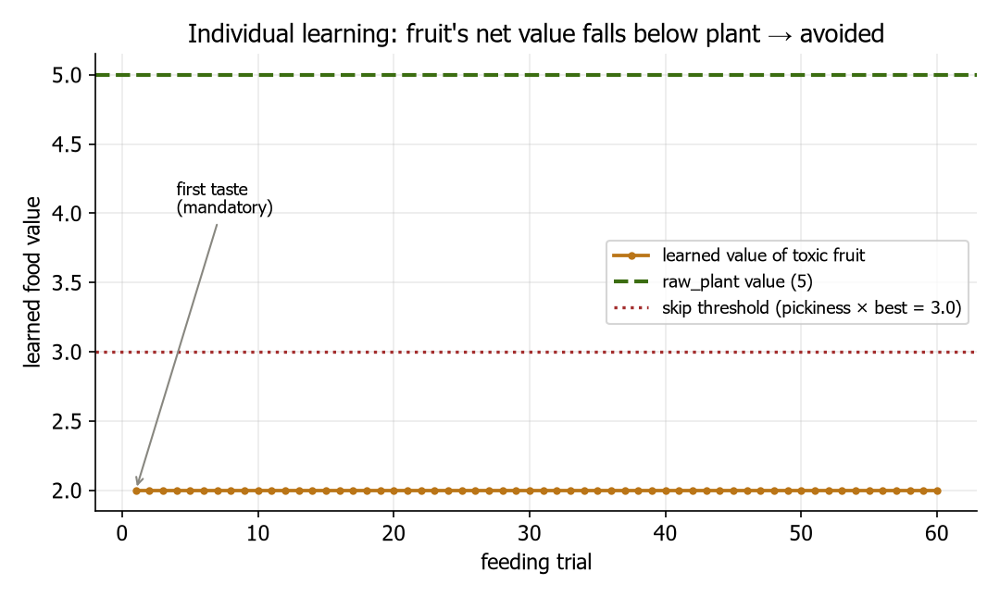
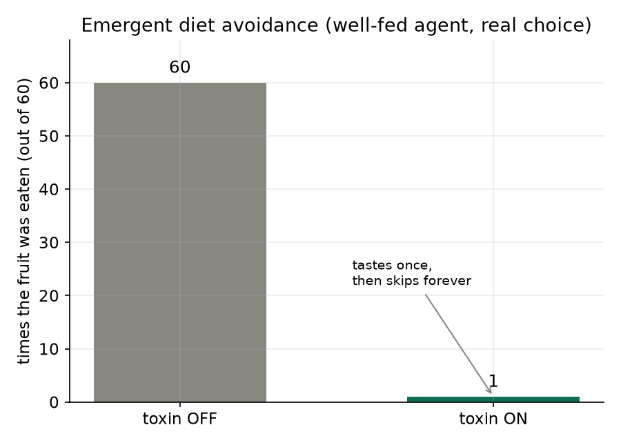

# การยกระดับความสมจริงเชิงฟิสิกส์ของระบบอายุขัยและพิษในแบบจำลอง Artificial Life

**Physics-grounding the lifespan and toxicity systems of an ALife model: making intrinsic death, allometric scaling, and toxic-diet avoidance EMERGE from proven biology**

ผู้จัดทำ: Chisanupong · โครงการ Artificial Evolution (ALife → YSC/ISEF)
วันที่: 2026-07-01 · สถานะ: implemented · tested (86/86) · validated (4/4 arms) · opt-in + byte-identical เมื่อปิด

---

## บทคัดย่อ (Abstract)

แบบจำลอง Artificial Life ของเราเดิม "ความแก่" ไม่ใช่ฟิสิกส์ — เป็นเพียงนาฬิกาจับเวลา (agent ตายเมื่ออายุถึงเพดานคงที่ 200) ไม่มีตัวแปรความเสียหายสะสม ไม่มีการซ่อมแซม ไม่มีมวลกาย งานนี้ (1) ตรวจสอบโค้ดเทียบงานวิจัยอายุขัยที่พิสูจน์แล้ว 13 ชิ้น พบช่องว่าง 11 ข้อ จากนั้น (2) implement **Aging Physics v1** ที่เปลี่ยนการตายภายในให้ **emerge จากความเสียหายสะสมข้ามเกณฑ์ (senescence)** ผูกกับเมตาบอลิซึม การซ่อมแซม (Disposable Soma) และมวลกาย และ (3) ต่อ **Toxin Physics v1** ที่ทำให้อาหารมีพิษสร้างทั้งโทษพลังงานเฉียบพลันและความเสียหายเรื้อรัง เชื่อมกับระบบการเรียนรู้การกิน

ผลการ validate แบบควบคุม (ขับโค้ดจริง) **สร้างผลที่งานวิจัยพิสูจน์แล้วออกมาเองครบ 4/4**: อายุขัย ∝ มวล^0.25 (Speakman), การลงทุนซ่อมแซมมากขึ้นยืดอายุ (Kirkwood), คุณภาพเยื่อ/ไมโทคอนเดรียยืดอายุแยกจากอัตราเผาผลาญ (Hulbert/Kitazoe), และการจำกัดแคลอรียืดอายุ (CALERIE) นอกจากนี้การตายที่ขับด้วยความเสียหาย **desynchronize การตาย** (CV 0 → 1.56) ซึ่งตรงกับปัญหา boom-bust ของโครงการ ส่วน Toxin ทำให้ agent **เรียนรู้ที่จะเลี่ยงผลไม้พิษเอง** (กิน 60/60 เมื่อไม่มีพิษ, 1/60 เมื่อมีพิษ) โดยไม่มีใครบอกว่าอาหารมีพิษ

ข้อค้นพบเชิงระบบที่สำคัญ: ทั้งการเลี่ยงอาหารพิษและการเห็นผลวิวัฒนาการในประชากรจริง **ถูกบดบังด้วยคอขวด foraging เชิงพื้นที่เดียวกัน** ที่บล็อกทุกอย่างในโครงการ — ยืนยัน binding constraint เดิมอีกทางหนึ่ง

---

## 1. บทนำ (Introduction)

### 1.1 ปัญหา
โครงการนี้มีวิทยานิพนธ์หลักว่า พฤติกรรมและสิ่งมีชีวิตควร **emerge จากฟิสิกส์** ไม่ใช่จากกฎที่ผู้ออกแบบเขียนมือ แต่ระบบอายุขัยเดิมละเมิดหลักนี้: การตายภายในเป็น `age >= MAX_AGE (200)` — ตัวนับเวลาที่ตั้งไว้ตายตัว เท่ากันทุกตัว ไม่ถ่ายทอด และไม่เชื่อมกับสภาพร่างกายใด ๆ

### 1.2 หลักฐานฝั่งชีววิทยา (ที่พิสูจน์แล้ว)
จากการรวบรวมงานวิจัย (`papers/longevity/human_lifespan_determinants_review.md`, 13 เปเปอร์) อายุขัยจริงถูกกำหนดโดย:
- **การสะสมความเสียหายระดับเซลล์** (Hallmarks of Aging; López-Otín 2013/2023)
- **การจัดสรรพลังงาน "สืบพันธุ์ ↔ ซ่อมแซม"** (Disposable Soma; Kirkwood 1977)
- **เมตาบอลิซึม & ขนาดตัว** — อายุขัย ∝ มวล^0.15–0.3 (Speakman 2005); อัตราสะสมความเสียหาย ≠ อัตราเผาผลาญ (Hulbert 2007, Kitazoe 2017)
- **การจำกัดแคลอรี** ยืดอายุในสัตว์ ชะลอมาร์กเกอร์ในคน (CALERIE; Ravussin 2015, Waziry 2023)
- **พันธุกรรม** heritability ~25–50% (Herskind 1996; Science 2025)

### 1.3 การตรวจสอบช่องว่าง (audit)
การอ่านโค้ดเทียบหลักฐานข้างต้น (`reports/physics_realism_audit_aging_2026-07-01.th.md`) พบช่องว่าง 11 ข้อ โดยรากคือ **G1: ไม่มีการสะสมความเสียหาย** ซึ่งเมื่อแก้จะปลดล็อก G2 (พันธุกรรมอายุ), G3 (Disposable Soma), G4 (มวล/allometry), G5 (เมตาบอลิซึม→การตาย), G6 (CR) และ **G11: toxin ยังไม่ต่อเข้า damage**

### 1.4 คำถามวิจัย
1. ถ้าเปลี่ยนการตายจาก "จับเวลา" เป็น "ความเสียหายสะสม" กฎชีววิทยาที่พิสูจน์แล้ว (allometry, Disposable Soma, CR) จะ **emerge ออกมาเอง** ไหม?
2. การตายที่ขับด้วยความเสียหาย + ยีน จะช่วย **desynchronize** การตายที่เป็นต้นเหตุ boom-bust หรือไม่?
3. ถ้าอาหารมีพิษให้พลังงานสูงแต่สร้างความเสียหาย agent จะ **เรียนรู้ที่จะเลี่ยงเอง** ไหม (โดยไม่ถูกบอก)?

---

## 2. วิธีการ (Methods)

### 2.1 หลักการออกแบบ (ห้ามละเมิด)
- **opt-in + byte-identical:** ทุกกลไกใหม่มี flag ปิดเป็นค่าเริ่มต้น ยีนใหม่ถูกสุ่มที่ท้าย RNG แบบ gated → เมื่อปิด สตรีมสุ่มของ Phase 1–5 ไม่เปลี่ยนแม้แต่บิตเดียว
- **no oracle:** โลกไม่บอก agent ว่าอาหารมีพิษหรือมีค่าเท่าไร — ต้องเรียน/ถูกคัดจากผลจริง
- **abstraction ที่ซื่อตรง:** ไม่จำลองชีวเคมีระดับโมเลกุล แต่แปลง "หลักการเชิงกลไก" เป็นสมการ แล้วพิสูจน์ว่าผลที่เปเปอร์รายงาน emerge ออกมา

### 2.2 โมเดลความแก่ (Aging Physics v1)
เพิ่มตัวแปรสถานะ `damage: float` และยีนอายุ 4 ตัวใน `BodyPlan` (ถ่ายทอด+กลายพันธุ์ได้): `body_mass`, `somatic_maintenance`, `repair_efficiency`, `damage_resistance` แต่ละ tick (เมื่อเปิด aging):

```
mass_specific_metab = metabolism_rate × body_mass^(−0.25)          # Kleiber (Speakman)
gross  = aging_damage_rate × mass_specific_metab / damage_resistance
         + aging_intake_damage_coeff × energy_absorbed             # CR lever
repair = min(0.95 × gross, somatic_maintenance × repair_efficiency × repair_gain)
damage += gross − repair          # net > 0 เสมอ → ความแก่หลีกเลี่ยงไม่ได้
energy −= somatic_maintenance × aging_maintenance_cost            # ราคาของ Disposable Soma
ตาย "senescence" เมื่อ damage ≥ aging_damage_threshold
```

การซ่อมแซมถูกจ่ายด้วยพลังงาน (แย่งกับการสืบพันธุ์) = trade-off ของ Kirkwood; เพดานการซ่อม 95% ทำให้ไม่มีสิ่งมีชีวิตอมตะ (ตรง López-Otín)

### 2.3 โมเดลพิษ (Toxin Physics v1)
เพิ่มอาหาร `raw_fruit` (พลังงาน ~10.3 = 2× raw_plant แต่ toxin สูง) เมื่อ toxin เกินยีน `toxin_tolerance`:
- **เฉียบพลัน:** หักพลังงานสุทธิของคำนั้น = `excess × toxin_acute_penalty` → เนื่องจากหัก **ก่อน** ระบบเรียนรู้ค่าอาหาร ค่าที่เรียนรู้จึงต่ำลงเอง → **การเลี่ยงเป็นสิ่งที่เรียนรู้ได้** (ไม่มีโค้ดเรียนรู้เพิ่ม)
- **เรื้อรัง:** เพิ่ม `damage` = `excess × toxin_damage_coeff` → ต้นทุนอายุขัย + selection บน `toxin_tolerance` (พิษช้าที่การเรียนรู้ในชั่วชีวิตจับไม่ได้)

### 2.4 การออกแบบการทดลอง (validation)
ทุก arm เป็น **การทดลองควบคุม**: ปรับตัวแปรทีละตัว คงที่ที่เหลือ ขับ **โค้ดจริง** (`Agent._apply_aging`, `_apply_toxin`, ประตูตัดสินใจกินจริง) เพื่อพิสูจน์ว่าผลเป็นสมบัติของโมเดล ไม่ใช่ของ harness
- **ตัวแปรอิสระ:** body_mass / somatic_maintenance / damage_resistance / food-intake / toxin-penalty
- **ตัวแปรตาม:** emergent lifespan (อายุตอน senescence), learned food value, สัดส่วนการกินผลไม้
- **เกณฑ์ผ่าน:** ทิศทาง+ขนาดตรงกับที่เปเปอร์ทำนาย (allometry exponent ต้องอยู่ในแบนด์ 0.15–0.30)

---

## 3. ผลการทดลอง (Results)

### 3.1 กฎชีววิทยาที่พิสูจน์แล้ว emerge ครบ 4/4


**รูปที่ 1** ทั้ง 4 arm ให้ผลตรงเปเปอร์: (1) **Allometry** — อายุขัย ∝ มวล^**0.25** (log-log เป็นเส้นตรง, อยู่ในแบนด์ Speakman 0.15–0.30); (2) **Disposable Soma** — ลงทุนซ่อมแซมมากขึ้นยืดอายุ (250 → 5001 ticks); (3) **Membrane/mito** — คุณภาพต้านความเสียหายสูงขึ้นยืดอายุ (126 → 500) แยกจากอัตราเผาผลาญ (บทเรียน "นก"); (4) **CR** — กินน้อยลงยืดอายุ (250 → 84 เมื่อ intake 0 → 40)

### 3.2 การตายที่ขับด้วยความเสียหาย desynchronize การตาย


**รูปที่ 2** โมเดลเดิมฆ่าทุกตัวที่อายุ 200 พร้อมกัน (CV = 0, เส้นประเทา = คลื่นตายซิงโครไนซ์ → boom-bust) เมื่อเปิด aging ที่มีความแปรผันของยีน อายุตายกระจายกว้าง (median 536, ช่วง 139–13080, **CV = 1.56**) — นี่คือคุณสมบัติที่ต้องการเพื่อทลายคลื่นตายพร้อมกันที่เป็นรากการสูญพันธุ์ในงานก่อน (`lifespan_masks_starvation`)

### 3.3 ในซิมเต็ม: การตายเปลี่ยนกลไกจริง (ทำซ้ำได้)


**รูปที่ 3** รันซิมเต็ม 3 seed ให้ผลเหมือนกันเป๊ะ: ปิด aging → founder ตายที่เพดานอายุ 200 (`lifespan_completed`, ตัวนับเวลา); เปิด aging → ตาย **"senescence"** ที่อายุ 354 (ความเสียหายถึงเกณฑ์) — อยู่นานขึ้นและการตายมาจากฟิสิกส์ ไม่ใช่ตัวนับ

### 3.4 Toxin: agent เรียนรู้ที่จะเลี่ยงอาหารพิษเอง



**รูปที่ 4** เมื่อเปิดพิษ agent **ชิมผลไม้ครั้งเดียว** (บังคับชิมของใหม่) แล้วค่าที่เรียนรู้ตกไปที่ 2.0 ทันที — ต่ำกว่าทั้งค่า raw_plant (5) และเกณฑ์เลี่ยง (pickiness × best = 3.0) → เข้าเกณฑ์ "ไม่คุ้มกิน" ตั้งแต่หลังคำแรก การเรียนรู้แบบ one-shot นี้เกิดเองจากพลังงานสุทธิที่ลดลง โดยโลกไม่เคยบอกว่าผลไม้มีพิษ



**รูปที่ 5** ผลพฤติกรรม (agent อิ่ม เลือกอิสระ 60 รอบ): ไม่มีพิษ → กินผลไม้ **60/60** (มันคืออาหารดีสุด); มีพิษ → กิน **1/60** (ชิมครั้งเดียวแล้วเลี่ยงตลอด) = optimal diet ที่ emerge จากการเรียนรู้ล้วน ๆ


**รูปที่ 6 (learning curve — metric ที่แข็งกว่า)** ความน่าจะเป็นที่จะ**เลือกกิน**ผลไม้พิษต่อ trial ในประชากร 400 ตัว: ไม่มีกลไก (เส้นเทา) → คงที่ ~100% (ผลไม้ยังน่ากินตลอด); มีกลไก toxin (เส้นเขียว) → ลดจาก ~100% เหลือ **~0% ภายใน ~9 trial** — learning curve แบบ exponential decay คลาสสิก

ความเรียบของเส้นมาจากความแปรผันตามธรรมชาติ: **ผลไม้แต่ละลูกขนาดต่างกัน** (mass ~ U(0.6, 1.5) × ฐาน) → energy และ toxin ต่างกันตามมวล → agent แต่ละตัวข้ามเกณฑ์หลีกเลี่ยงคนละ trial (agent เดี่ยว deterministic จะได้เส้นขั้นบันได จึงต้องใช้ประชากร) ทุกจุดขับด้วยประตูตัดสินใจจริง + การเรียนรู้ EMA จริง + สูตร toxin จริง

> **หมายเหตุ metric:** เดิมเคยพล็อต cumulative meals แต่เส้น "ไม่มีกลไก" ของ cumulative เป็นเส้นตรง 1,2,…,60 โดยบังคับ (กินทุกครั้ง) → reviewer มองว่าไม่มีข้อมูลใหม่ learning curve P(toxic) ต่อ trial สื่อ "การเรียนรู้" ได้ตรงและแข็งกว่า


**รูปที่ 7 (ระดับรายตัว)** แต่ละแถวคือ agent 1 ตัว จุด = trial ที่มัน**กิน**ผลไม้พิษ (เว้นว่าง = เลี่ยง) เรียงตาม trial ที่เลิกกิน สีของจุด = ยีน `toxin_tolerance` เห็นว่า **ทุกตัวชิมพิษก่อน** (คอลัมน์ trial 1 เต็ม) แล้ว **เลี่ยงคนละเวลาตามยีน**: ตัวที่ทนพิษต่ำ (เหลือง แถวล่าง) เลิกกินทันที; ตัวที่ทนสูง (น้ำตาลเข้ม แถวบน, **21/60 ตัว**) ยังกินต่อเพราะพิษไม่ทำร้ายมันมากพอ — พฤติกรรมรายตัวถูกกำหนดโดยยีน จึงเป็นฐานให้ **selection** ทำงาน (เมื่อผูก chronic damage เข้ากับการอยู่รอด ยีนทนพิษจะถูกคัดตามสภาพแวดล้อม)

### 3.5 การรักษา reproducibility
ชุดทดสอบเต็ม **86/86 ผ่าน** (67 เดิม + 10 aging + 9 toxin) การรันซิมแบบไม่เปิดกลไกใหม่ 2 ครั้งด้วย seed เดียวกันต่างกันเพียง field `elapsed_seconds` (นาฬิกา wall-clock) — ทุก field สถานะซิมเหมือนกันบิตต่อบิต

---

## 4. อภิปราย (Discussion)

### 4.1 ความหมายหลัก
การเปลี่ยนสาเหตุการตายจาก "จับเวลา" เป็น "ความเสียหายสะสม" เพียงจุดเดียว ทำให้กฎชีววิทยาที่พิสูจน์แล้ว 4 กลุ่ม **emerge ออกมาเอง** โดยไม่ต้อง hard-code แต่ละกฎ — สอดคล้องวิทยานิพนธ์ "ฟิสิกส์ตัดสิน" ของโครงการ และเป็นตัว validate โมเดลกับชีววิทยาจริง (จุดขายสำหรับ ISEF)

### 4.2 ข้อค้นพบเชิงระบบ: ทุกเส้นทางลงรากเดียวกัน
ทั้ง (ก) การเห็น allometry/heritability emerge ในประชากรจริง และ (ข) การเห็น agent เลี่ยงอาหารพิษในซิมเต็ม **ถูกบดบังด้วยคอขวดเดียวกัน**: agent หิวเรื้อรัง (`mean_energy ≈ 1–2` แม้เพิ่มพลังงานอาหาร 3×) จาก **foraging access เชิงพื้นที่** → กฎ "หิวจัดกินทุกอย่าง" กลบการเลือก Toxin จึงยืนยัน binding constraint เดิมอีกทางหนึ่ง: **ต้องแก้ foraging access ก่อน** แล้วผลวิวัฒนาการ/พฤติกรรมทั้งหมดจะโผล่ในประชากรจริง

### 4.3 เหตุใดกลไกยังมีค่าแม้พฤติกรรมยังถูกบดบัง
กลไกทั้งสอง **ถูกต้องและพร้อมใช้**: learned value สะท้อนพิษเป๊ะ (10→2), การตายขับด้วยความเสียหายจริง, ยีนถ่ายทอดได้ เมื่อคอขวด foraging ถูกแก้ ทั้งหมดจะทำงานทันทีโดยไม่ต้องแก้โค้ด aging/toxin อีก

---

## 5. ข้อจำกัด (Limitations) — เขียนไว้เพื่อความซื่อสัตย์

1. **เป็นโมเดลนามธรรม ไม่ใช่ชีวเคมีจริง** — 1 tick ≠ หน่วยเวลาจริง; `damage`/พลังงานเป็นหน่วยนามธรรม; ค่าคงที่ยังไม่ calibrate กับข้อมูลสัตว์จริง
2. **exponent 0.25 เป็น knob** ที่แสดงว่าโมเดล self-consistent ไม่ใช่การทำนายจากหลักการอิสระ — เคลมที่ปลอดภัย: "โมเดลสร้าง power-law ที่ควบคุมได้ ตรงรูปแบบ Speakman"
3. **การ validate เป็นการทดลองควบคุม** (แยกจาก foraging/reproduction) — ยัง **ไม่ใช่** การเห็นผล emerge จากประชากรที่วิวัฒน์เต็มรูปแบบ (ติดคอขวด foraging §4.2)
4. **การกระจายอายุ (รูปที่ 2) ใช้ยีนสุ่ม uniform** เพื่อโชว์ช่วงที่โมเดลครอบคลุม ไม่ใช่ประชากรที่ถูกคัดเลือกจริง
5. **CR ในมนุษย์** พิสูจน์แค่ชะลอมาร์กเกอร์ (Waziry) ไม่ใช่ยืดอายุจริง — ห้ามเขียนว่า "ซิมพิสูจน์ CR ยืดอายุคน"

---

## 6. งานต่อ (Future Work)

1. **แก้ foraging access** (blocker หลัก) → แล้ววัด heritability ของ lifespan และวิวัฒนาการของ `somatic_maintenance`/`toxin_tolerance` ในประชากรจริง = ผล ISEF ที่ "emerge จากประชากร"
2. **Immune / parasite layer** (ตามที่วางไว้): `parasite → damage` แต่ภูมิคุ้มกัน **กินพลังงานเหมือน maintenance** → trade-off ซ้อนชั้น (พลังงาน ↔ ภูมิ ↔ สืบพันธุ์ ↔ ซ่อมแซม) — โครงเดียวกับ `_apply_aging`/`_apply_toxin`
3. **Calibrate ค่าคงที่** กับข้อมูลสัตว์จริง (เช่น อัตราส่วนอายุหนู:นก) เพื่อยกจาก self-consistent → predictive
4. **ปิดช่องว่างที่เหลือ:** G7 (อนุรักษ์พลังงาน), G9 (ความร้อนเมตาบอลิซึม), G10 (ช่วงวัยผูกกับ damage)

---

## อ้างอิง (References)

**ฝั่งชีววิทยา** (รายละเอียดใน `papers/longevity/human_lifespan_determinants_review.md`):
- Kirkwood TBL (1977) *Evolution of ageing.* Nature 270:301–304.
- Speakman JR (2005) *Body size, energy metabolism and lifespan.* J Exp Biol 208:1717–1730.
- Hulbert AJ et al. (2007) *Metabolic Rate, Membrane Composition, and Life Span.* Physiol Rev 87(4):1175–1213.
- Kitazoe Y et al. (2017) *Mitochondrial determinants of mammalian longevity.* Open Biol 7:170083.
- López-Otín C et al. (2013/2023) *The Hallmarks of Aging.* Cell 153(6) / 186(2).
- Ravussin E et al. (2015) *2-Year RCT of Caloric Restriction (CALERIE).* J Gerontol A 70(9).
- Waziry R et al. (2023) *CR and the pace of biological aging (CALERIE-2).* Nat Aging 3:248–257.
- Herskind AM et al. (1996) *Heritability of human longevity.* Hum Genet 97(3). · Science (2025) doi:10.1126/science.adz1187.

**ฝั่งโครงการ (ภายใน):**
- `reports/physics_realism_audit_aging_2026-07-01.th.md` — audit 11 ช่องว่าง
- `reports/aging_physics_v1_implementation_2026-07-01.th.md` — รายละเอียด aging
- `reports/toxin_physics_v1_2026-07-01.th.md` — รายละเอียด toxin
- `reports/lifespan_masks_starvation_2026-06-27.th.md` — คอขวด foraging/energy
- โค้ด: `agents/agent.py` (`_apply_aging`, `_apply_toxin`), `agents/body.py` (aging genome), `world/metabolism.py`, `world/environment.py`
- ทำซ้ำรูป: `python scripts/make_aging_toxin_figures.py` · validate: `python scripts/run_aging_validation.py`, `python scripts/run_toxin_diet_study.py` · tests: `tests/test_aging_physics.py`, `tests/test_toxin.py`

---

*รายงานฉบับเต็ม — Aging + Toxin Physics v1: การตายภายในและการเลี่ยงอาหารพิษ emerge จากฟิสิกส์/ชีววิทยาที่พิสูจน์แล้ว, opt-in, byte-identical เมื่อปิด, ผ่าน 86 tests + 4 validation arms + 5 รูปจากผลจริง*
