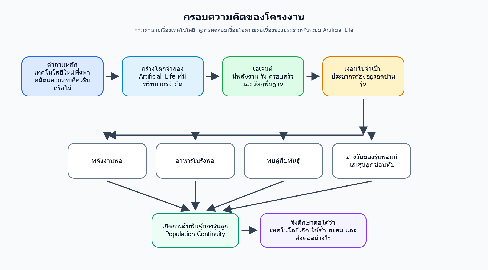

# Concept Proposal

## 1) ชื่อโครงงาน

**การศึกษาปัจจัยที่ส่งผลต่อการอยู่รอดข้ามรุ่นของประชากรในระบบ Artificial Life**

**Investigating Cross-Generational Survival in Artificial Life Simulations**

ประเภทโครงงาน: สาขาวิทยาศาสตร์ประยุกต์  
คำสำคัญ: Artificial Life, Artificial Evolution, Agent-Based Simulation, Population Continuity, Technology Emergence

หมายเหตุสำหรับจัดรูปแบบเอกสาร: เมื่อจัดส่งตามแบบฟอร์ม ให้ใช้ฟอนต์ TH SarabunPSK ขนาด 16 และปรับความยาวรวมไม่เกิน 5 หน้า

---

## 2) สมาชิก

หัวหน้าทีม  
ชื่อ ................................................ นามสกุล ................................................  
ระดับชั้น ................ โรงเรียน ................................................

สมาชิก  
ชื่อ ................................................ นามสกุล ................................................  
ระดับชั้น ................ โรงเรียน ................................................

ชื่อ ................................................ นามสกุล ................................................  
ระดับชั้น ................ โรงเรียน ................................................

อาจารย์ที่ปรึกษา  
ชื่อ ................................................ นามสกุล ................................................  
สังกัด ................................................................................................................

---

## 3) ความเป็นมาและเหตุผล

เทคโนโลยีในปัจจุบันไม่ได้เกิดขึ้นอย่างโดดเดี่ยว แต่เกิดจากการต่อยอดความรู้ เครื่องมือ และกรอบความคิดจากอดีต โครงงานนี้เริ่มจากคำถามว่า เทคโนโลยีใหม่ ๆ เป็นการสร้างสิ่งใหม่จริง หรือส่วนใหญ่เป็นการเรียนแบบและต่อยอดจากกรอบความคิดเดิม คำถามนี้มีความสำคัญ เพราะถ้าต้องการเข้าใจการเกิดเทคโนโลยี จำเป็นต้องเข้าใจด้วยว่า ความรู้และพฤติกรรมถูกสะสมและส่งต่อระหว่างรุ่นได้อย่างไร

เพื่อศึกษาคำถามนี้อย่างเป็นระบบ โครงงานใช้แนวทาง Artificial Life หรือการจำลองสิ่งมีชีวิตประดิษฐ์ โดยสร้างโลกจำลองที่มีเอเจนต์อาศัยอยู่ภายใต้ทรัพยากรจำกัด เอเจนต์มีพลังงาน ร่างกาย พฤติกรรมพื้นฐาน การสร้างรัง การเก็บเสบียง การดูแลลูก การสืบพันธุ์ และการใช้วัตถุหรือเครื่องมือพื้นฐาน โลกจำลองลักษณะนี้ช่วยให้สามารถทดลองได้ว่า ภายใต้ข้อจำกัดของสภาพแวดล้อม ประชากรจะอยู่รอดและค่อย ๆ สะสมพฤติกรรมหรือเทคโนโลยีได้หรือไม่

อย่างไรก็ตาม ก่อนจะตอบคำถามใหญ่เรื่องการเกิดเทคโนโลยีได้ ต้องแก้คำถามพื้นฐานก่อน คือประชากรในโลกจำลองต้องอยู่รอดข้ามรุ่นได้พอสมควร หากประชากรสูญพันธุ์เร็วเกินไป จะไม่มีเวลามากพอให้เกิดการทดลองซ้ำ การใช้เครื่องมือ การเรียนรู้จากรุ่นก่อน หรือการส่งต่อสิ่งที่ค้นพบไปยังรุ่นถัดไป ดังนั้น ความต่อเนื่องของประชากรจึงเป็นเงื่อนไขสำคัญของการศึกษาการเกิดเทคโนโลยีระยะยาว

จากการพัฒนาและทดลองเบื้องต้น ระบบสามารถทำให้เอเจนต์เกิดลูก สร้างรัง เก็บอาหาร และทำให้ลูกบางส่วนเติบโตได้แล้ว แต่ประชากรยังมีแนวโน้มสูญพันธุ์ในระยะยาว แม้บางช่วงจะมีทรัพยากรสะสมอยู่ ปัญหาจึงอาจไม่ได้อยู่ที่การไม่มีอาหารหรือไม่มีการสืบพันธุ์เลย แต่อาจอยู่ที่เงื่อนไขหลายอย่างไม่พร้อมพร้อมกัน เช่น พลังงานไม่พอ อาหารในรังไม่พอ ไม่พบคู่ หรือช่วงวัยของรุ่นพ่อแม่และรุ่นลูกไม่ซ้อนทับกันพอ งานวิจัยนี้จึงมุ่งศึกษาว่าปัจจัยใดทำให้ประชากรในระบบ Artificial Life สามารถต่อรุ่นได้อย่างต่อเนื่องมากขึ้น

### คำถามวิจัย

ปัจจัยใดเป็นคอขวดสำคัญที่ทำให้ประชากรในระบบ Artificial Life ไม่สามารถอยู่รอดข้ามรุ่นได้อย่างต่อเนื่อง

---

## 4) วัตถุประสงค์

1. เพื่อพัฒนาและใช้แบบจำลอง Artificial Life สำหรับศึกษาการอยู่รอดข้ามรุ่นของประชากรภายใต้ทรัพยากรจำกัด
2. เพื่อศึกษาปัจจัยที่เป็นคอขวดของการสืบพันธุ์และการอยู่รอดข้ามรุ่นของเอเจนต์
3. เพื่อสร้างตัวชี้วัดสำหรับประเมินความต่อเนื่องของประชากร เช่น ระยะเวลาที่อยู่รอด จำนวนการเกิด จำนวนลูกที่เติบโต และอัตราการสูญพันธุ์

### สมมติฐานการวิจัย

ประชากรในระบบ Artificial Life ไม่ได้สูญพันธุ์เพราะขาดอาหารเพียงอย่างเดียว แต่เกิดจากการที่เงื่อนไขสำคัญของการสืบพันธุ์ เช่น พลังงาน อาหารในรัง การพบคู่ และช่วงวัย ไม่พร้อมกันในช่วงเวลาที่เหมาะสม

---

## 5) กรอบความคิด

แนวคิดของโครงงานคือ การศึกษาการเกิดเทคโนโลยีในโลกจำลองต้องเริ่มจากการทำให้ประชากรอยู่รอดข้ามรุ่นได้ก่อน เพราะการเกิด ใช้ซ้ำ สะสม และส่งต่อเทคโนโลยีต้องอาศัยเวลาและความต่อเนื่องของประชากร

### ตัวแปรต้น

- ปริมาณอาหารและทรัพยากรในโลกจำลอง
- พลังงานเริ่มต้นและอัตราการใช้พลังงานของเอเจนต์
- เงื่อนไขการสืบพันธุ์ เช่น พลังงานขั้นต่ำ อาหารในรัง การพบคู่ และช่วงวัยที่เหมาะสม

### ตัวแปรตาม

- ระยะเวลาที่ประชากรอยู่รอด
- จำนวนการเกิดของเอเจนต์
- จำนวนลูกที่เติบโตถึงวัยสืบพันธุ์
- การสูญพันธุ์หรือไม่สูญพันธุ์ของประชากร
- ช่วงเวลาที่เริ่มเกิดการใช้วัตถุหรือเครื่องมือพื้นฐาน

### ตัวแปรควบคุม

- ขนาดโลกจำลอง
- กฎพื้นฐานของการเกิดอาหารและทรัพยากร
- จำนวนประชากรเริ่มต้น
- ระยะเวลาการทดลอง
- seed ที่ใช้ในการรันซ้ำ

### วิธีดำเนินงานโดยสรุป

1. สร้างหรือใช้โลกจำลอง Artificial Life ที่มีเอเจนต์ ทรัพยากร พลังงาน รัง และการสืบพันธุ์
2. กำหนดเงื่อนไขทดลอง เช่น จำนวนประชากรเริ่มต้น ปริมาณอาหาร และเงื่อนไขการสืบพันธุ์
3. รันการทดลองหลายครั้งโดยควบคุมตัวแปรสำคัญและเปลี่ยนเฉพาะปัจจัยที่ต้องการศึกษา
4. เก็บข้อมูลผลลัพธ์ เช่น ระยะเวลาที่อยู่รอด จำนวนการเกิด จำนวนลูกที่เติบโต และสาเหตุการสูญพันธุ์
5. วิเคราะห์ว่าปัจจัยใดสัมพันธ์กับความต่อเนื่องของประชากร และปัจจัยใดเป็นคอขวดที่ทำให้ประชากรสูญพันธุ์
6. ใช้ผลที่ได้เป็นฐานสำหรับการศึกษาต่อว่า เมื่อประชากรอยู่รอดได้นานขึ้น เทคโนโลยีหรือการใช้เครื่องมือจะเกิด ใช้ซ้ำ และส่งต่อได้อย่างไร

---

## 6) ประโยชน์ที่คาดว่าจะได้รับ

1. ได้แบบจำลองคอมพิวเตอร์สำหรับศึกษาการอยู่รอดของประชากรในระบบ Artificial Life
2. ได้ความเข้าใจว่าปัจจัยใดทำให้ประชากรในโลกจำลองสามารถอยู่รอดข้ามรุ่นหรือสูญพันธุ์
3. ได้ตัวชี้วัดที่ใช้ประเมินความต่อเนื่องของประชากรอย่างเป็นระบบ
4. ได้พื้นฐานสำหรับต่อยอดไปศึกษาการเกิด การใช้ซ้ำ การสะสม และการส่งต่อเทคโนโลยีในโลกจำลอง
5. ได้ฝึกกระบวนการวิจัยเชิงวิทยาศาสตร์ ตั้งแต่การตั้งคำถาม การควบคุมตัวแปร การรันซ้ำ การเก็บข้อมูล และการวิเคราะห์ผล
